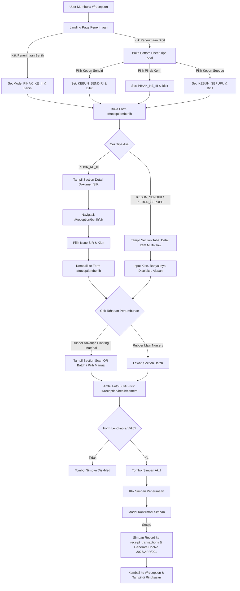

# AUDIT KHUSUS PENERIMAAN (FOKUS: PENERIMAAN BIBIT) — CURRENT STATE
**Dokumen Status**: Strict Read-Only Audit  
**Waktu Audit**: 2026-09-11  
**Repositori**: `d:\PROJECT SOCFINDO\DATA SOCFIN\Project SIGMA\sigma-nursery`  
**Cakupan**: Implementasi Aktual As-Is Modul Penerimaan (`/reception`)

---

## 1. Executive Summary
Berdasarkan audit menyeluruh terhadap source code aktif:
1. **Penerimaan Benih / Biji Kelatak** dan **Penerimaan Bibit** saat ini bermuara pada **satu file form yang sama** yaitu [`js/modules/receipt/receipt-benih.js`](file:///d:/PROJECT%20SOCFINDO/DATA%20SOCFIN/Project%20SIGMA/sigma-nursery/js/modules/receipt/receipt-benih.js) (route `#/reception/benih`).
2. Perbedaan alur antara Penerimaan Benih dan Penerimaan Bibit ditentukan oleh dua state utama di `storage`:
   - `benih_jenis` (`'Benih / Biji Kelatak'` vs `'Bibit / Tanaman Muda'`).
   - `transaction_originType` (`'KEBUN_SENDIRI'`, `'PIHAK_KE_III'`, `'KEBUN_SEPUPU'` / `'LAINNYA'`).
3. Pada **Penerimaan Benih / Biji Kelatak**, pengguna langsung diarahkan ke form dengan tipe asal default `PIHAK_KE_III` (tanpa Bottom Sheet), tahapan pertumbuhan dikunci pada `Rubber Main Nursery`, dan mewajibkan pemilihan Dokumen SIR (`receipt-sir.js`).
4. Pada **Penerimaan Bibit**, pengguna wajib memilih tipe asal melalui **Bottom Sheet Tipe Asal** (`Kebun Sendiri`, `Pihak Ke-III`, `Kebun Sepupu`). Jika memilih `Kebun Sendiri` / `Kebun Sepupu`, form akan menampilkan **Tabel Detail Penerimaan Multi-Row** (Klon, Banyaknya, Diseleksi, Alasan) dan menyembunyikan Dokumen SIR. Jika memilih `Rubber Advance Planting Material (APM)`, muncul section tambahan **Scan QR Batch / Pilih Manual**.

---

## 2. Scope Audit & File Terkait
Audit ini memeriksa secara eksklusif implementasi aktual dari file-file berikut tanpa melakukan modifikasi apapun:
- [`js/modules/receipt/receipt-landing.js`](file:///d:/PROJECT%20SOCFINDO/DATA%20SOCFIN/Project%20SIGMA/sigma-nursery/js/modules/receipt/receipt-landing.js) — Landing Page Penerimaan (`#/reception`)
- [`js/modules/receipt/receipt-benih.js`](file:///d:/PROJECT%20SOCFINDO/DATA%20SOCFIN/Project%20SIGMA/sigma-nursery/js/modules/receipt/receipt-benih.js) — Form Input Penerimaan (`#/reception/benih`)
- [`js/modules/receipt/receipt-sir.js`](file:///d:/PROJECT%20SOCFINDO/DATA%20SOCFIN/Project%20SIGMA/sigma-nursery/js/modules/receipt/receipt-sir.js) — Sub-flow Pemilihan Dokumen SIR (`#/reception/benih/sir`)
- [`js/modules/receipt/receipt-camera.js`](file:///d:/PROJECT%20SOCFINDO/DATA%20SOCFIN/Project%20SIGMA/sigma-nursery/js/modules/receipt/receipt-camera.js) — Sub-flow Pengambilan Foto Bukti Fisik (`#/reception/benih/camera`)
- [`js/modules/receipt/receipt-summary.js`](file:///d:/PROJECT%20SOCFINDO/DATA%20SOCFIN/Project%20SIGMA/sigma-nursery/js/modules/receipt/receipt-summary.js) — Detail Rincian Dokumen Penerimaan (`#/reception/summary`)
- [`js/core/router.js`](file:///d:/PROJECT%20SOCFINDO/DATA%20SOCFIN/Project%20SIGMA/sigma-nursery/js/core/router.js) & [`js/app.js`](file:///d:/PROJECT%20SOCFINDO/DATA%20SOCFIN/Project%20SIGMA/sigma-nursery/js/app.js) — Registrasi Route & Router Guard
- [`js/core/permissions.js`](file:///d:/PROJECT%20SOCFINDO/DATA%20SOCFIN/Project%20SIGMA/sigma-nursery/js/core/permissions.js) — Hak Akses Role
- [`js/modules/history/nursery-history.js`](file:///d:/PROJECT%20SOCFINDO/DATA%20SOCFIN/Project%20SIGMA/sigma-nursery/js/modules/history/nursery-history.js) — Riwayat Transaksi (`#/history`)
- [`js/modules/review/review-workspace.js`](file:///d:/PROJECT%20SOCFINDO/DATA%20SOCFIN/Project%20SIGMA/sigma-nursery/js/modules/review/review-workspace.js) — Katalog & Reviu Transaksi

---

## 3. Landing Page Penerimaan (`receipt-landing.js`)

### Identifikasi Teknis:
- **Renderer Function**: `renderReceiptLanding()`
- **File**: `js/modules/receipt/receipt-landing.js`
- **Route**: `#/reception`
- **Container Target**: `#app`

### Struktur Aktual DOM / Layout:
```text
Penerimaan (#/reception)
├── Header (56px)
│   ├── #btn-back (Navigasi ke #/home)
│   ├── Judul: "Penerimaan"
│   ├── #btn-sync (Animasi spin & re-render halaman)
│   └── #btn-calendar (Navigasi ke #/history)
│
├── Content Body (Main Scrollable)
│   ├── Grid Menu 2 Card (1 Baris, Sisi Kiri):
│   │   ├── #btn-biji (Card: Penerimaan Benih / Biji Kelatak)
│   │   └── #btn-bibit (Card: Penerimaan Bibit)
│   │
│   └── Section Ringkasan Penerimaan (Daftar Kartu Transaksi Masuk):
│       ├── Header: "Ringkasan Penerimaan (N)"
│       └── Kartu-kartu Transaksi (No. Dokumen e.g. 2026/APR/001, Klon, Asal, Tanggal, dll.)
│           └── Tombol .btn-card-menu -> Popover (.card-popover)
│               ├── .btn-popover-lihat (Lihat Data -> #/reception/summary)
│               ├── .btn-popover-edit / .btn-popover-locked (Edit Dokumen -> #/reception/benih)
│               └── .btn-popover-hapus / .btn-popover-locked (Hapus Dokumen dari storage)
│
└── Modal & Bottom Sheet Elements
    ├── #origin-type-overlay
    └── #origin-type-sheet (Tentukan Tipe Asal Penerimaan)
        ├── Radio origin_type (KEBUN_SENDIRI, PIHAK_KE_III, KEBUN_SEPUPU)
        ├── #btn-sheet-kembali
        └── #btn-sheet-lanjut
```

---

## 4. Penerimaan Benih / Biji Kelatak (Kondisi Aktual)

### Alur Eksekusi:
1. **Trigger**: Klik tombol `#btn-biji` pada landing page.
2. **State yang Diset**:
   - `storage.set('transaction_originType', 'PIHAK_KE_III')`
   - `storage.set('benih_jenis', 'Benih / Biji Kelatak')`
   - `storage.set('benih_tahapan', 'Rubber Main Nursery')`
3. **Pembersihan State Sesi Sebelumnya**:
   - Menghapus: `editing_transaction_index`, `benih_program_id`, `benih_program_code`, `benih_source_id`, `benih_source_name`, `receipt_photos`, `selected_sir`, `selected_klon`, `benih_table_rows`, `benih_batch_code`.
4. **Navigasi Langsung**:
   - Navigasi langsung ke `#/reception/benih` **tanpa Bottom Sheet**.
5. **Karakteristik di Form (`receipt-benih.js`)**:
   - Judul Header: `"Penerimaan Benih / Biji Kelatak"`
   - Tahapan Pertumbuhan: Terkunci di `Rubber Main Nursery` (disabled, abu-abu `#EFEFEF`).
   - Section Dokumen SIR (`#section-detail-sir`): **Tampil (Wajib)**.
   - Section Tabel Detail (`#section-detail-table`): **Tersembunyi**.
   - Section Scan QR Batch (`#section-qr-batch`): **Tersembunyi**.
   - Tombol Tambah Foto (`#btn-tambah-foto`): Navigasi ke `#/reception/benih/camera`.

---

## 5. Penerimaan Bibit (Fokus Utama)

### Alur Eksekusi Lengkap:
```text
[Landing Page: #/reception]
   ↓
Klik Card "#btn-bibit"
   ↓
Buka Bottom Sheet "#origin-type-sheet" (Pilih Tipe Asal)
   ├── Opsi 1: "Kebun Sendiri"  (value: "KEBUN_SENDIRI")
   ├── Opsi 2: "Pihak Ke-III"   (value: "PIHAK_KE_III")
   └── Opsi 3: "Kebun Sepupu"   (value: "KEBUN_SEPUPU")
   ↓
Pilih Radio Button → Tombol "#btn-sheet-lanjut" Aktif (Warna Hijau #116834)
   ↓
Klik "#btn-sheet-lanjut"
   ↓
Simpan State:
   - transaction_originType = [Selected Value]
   - benih_jenis = "Bibit / Tanaman Muda"
   - benih_tahapan = "Rubber Main Nursery" (Default awal)
   - Bersihkan state sesi lama
   ↓
Navigasi ke Form: "#/reception/benih"
   ↓
[Form Input: receipt-benih.js]
   ├── Header: "Penerimaan Bibit"
   ├── Info Mantri & Tanggal Hari Ini
   ├── Jenis Penerimaan: "Bibit / Tanaman Muda" (Locked)
   ├── Tahapan Pertumbuhan: "Rubber Main Nursery" / "Rubber Advance Planting Material" (Dapat Diklik)
   ├── Program Pembibitan: Bottom sheet pilih program (e.g. PRG/NUR/01/2026)
   ├── Tipe Asal: Sesuai pilihan di Bottom Sheet (Read-only)
   ├── Sumber / Rekanan: Bottom sheet dinamis sesuai Tipe Asal
   │
   ├── [BRANCH A: KEBUN_SENDIRI / KEBUN_SEPUPU]
   │   └── Tampil Section "#section-detail-table" (Tabel Klon, Banyaknya, Diseleksi, Alasan)
   │
   ├── [BRANCH B: PIHAK_KE_III]
   │   └── Tampil Section "#section-detail-sir" (Tambah Dokumen SIR via #/reception/benih/sir)
   │
   ├── [CONDITIONAL: Jika Tahapan == Rubber Advance Planting Material]
   │   └── Tampil Section "#section-qr-batch" (Scan QR Kamera Simulasi atau Pilih Batch Manual)
   │
   ├── Section Foto: Wajib ambil minimal 1 foto via "#/reception/benih/camera"
   ↓
Validasi Form Selesai → Tombol "#btn-simpan" Aktif (Hijau #116834)
   ↓
Klik "#btn-simpan" → Muncul Modal Konfirmasi Simpan ("#sheet-konfirmasi")
   ↓
Klik "#btn-konfirm-simpan"
   ↓
- Generate Nomor Dokumen Standar: "2026/APR/001" (Unik otomatis)
- Simpan record transaksi ke storage key: "receipt_transactions"
- Hapus temporary storage keys
- Tampilkan toast/banner "Data berhasil disimpan"
- Navigasi kembali ke "#/reception"
```

---

## 6. Audit Bottom Sheet Tipe Asal

### Tabel Pemetaan Pilihan Asal:
| Label UI | Internal Value | Route Tujuan | State yang Diset | Perilaku Form di `receipt-benih.js` |
| :--- | :--- | :--- | :--- | :--- |
| **Kebun Sendiri** | `KEBUN_SENDIRI` | `#/reception/benih` | `transaction_originType = 'KEBUN_SENDIRI'`<br>`benih_jenis = 'Bibit / Tanaman Muda'` | - Sumber: Divisi I, II, III, Kantor, Pabrik.<br>- **Tabel Detail Penerimaan Aktif**.<br>- **Dokumen SIR Sembunyi**. |
| **Pihak Ke-III** | `PIHAK_KE_III` | `#/reception/benih` | `transaction_originType = 'PIHAK_KE_III'`<br>`benih_jenis = 'Bibit / Tanaman Muda'` | - Sumber: UD Rekanan (Ganang Jaya, Semesta, dll).<br>- **Dokumen SIR Wajib (Aktif)**.<br>- **Tabel Detail Sembunyi**. |
| **Kebun Sepupu** | `KEBUN_SEPUPU` | `#/reception/benih` | `transaction_originType = 'KEBUN_SEPUPU'`<br>`benih_jenis = 'Bibit / Tanaman Muda'` | - Sumber: Kebun Socfindo lain (AL, AP, BB, LB, MP, NL, SL, SG, SY, SSPL, TB, TG).<br>- **Tabel Detail Penerimaan Aktif**.<br>- **Dokumen SIR Sembunyi**. |

### Validasi Tombol Lanjut:
- Default tombol `#btn-sheet-lanjut`: `disabled = true`, background abu-abu `#B0B0B0`.
- Event `change` pada radio button mengaktifkan tombol: `disabled = false`, background hijau `#116834`.
- Tombol `#btn-sheet-kembali` menutup modal overlay tanpa melakukan navigasi dan tanpa mengubah state.

---

## 7. Form & Field Map (`receipt-benih.js`)

| # | Bagian Form | ID / Selector Elemen | Tipe Elemen | Sumber Data / Storage Key | Validasi Wajib | Kondisi Tampil |
| :- | :--- | :--- | :--- | :--- | :--- | :--- |
| 1 | **Header Title** | `#header-title` | Text Header | `state.jenisPenerimaan` | - | Selalu tampil |
| 2 | **Info Mantri** | Hardcoded/Session | Info Text | `session.get()` | - | Selalu tampil |
| 3 | **Tanggal Penerimaan** | Text | Info Text | `formatDate(new Date())` | - | Selalu tampil |
| 4 | **Jenis Penerimaan** | `#btn-jenis`, `#label-jenis` | Button / Label | `storage: benih_jenis` | Wajib | Read-only / disabled click |
| 5 | **Tahapan Pertumbuhan** | `#btn-tahapan`, `#label-tahapan` | Button Dropdown | `storage: benih_tahapan` | Wajib | Klik aktif jika Bibit; locked jika Benih |
| 6 | **Program Pembibitan** | `#btn-program`, `#label-program` | Button Dropdown | `storage: benih_program_id`, `benih_program_code` | Wajib | Selalu tampil |
| 7 | **Tipe Asal** | Box Label | Static Box | `storage: transaction_originType` | Wajib | Selalu tampil (Read-only) |
| 8 | **Sumber / Rekanan** | `#btn-sumber`, `#label-sumber` | Button Dropdown | `storage: benih_source_id`, `benih_source_name` | Wajib | Selalu tampil (Data dinamis sesuai tipe asal) |
| 9 | **Detail Dokumen SIR** | `#section-detail-sir` | Section Box | `storage: selected_sir`, `selected_klon` | Wajib jika Pihak Ke-III | Hanya tampil jika `PIHAK_KE_III` |
| 10 | **Tombol Tambah SIR** | `#btn-tambah-sir` | Button Navigasi | - | - | Bagian dari section SIR |
| 11 | **Tabel Detail Penerimaan** | `#section-detail-table` | Section Table | `storage: benih_table_rows` | Wajib jika Kebun Sendiri / Sepupu | Hanya tampil jika `KEBUN_SENDIRI` atau `KEBUN_SEPUPU` |
| 12 | **Baris Klon Tabel** | `.input-klon` | `<select>` | `row.klon` | Wajib per baris | Di dalam baris tabel |
| 13 | **Baris Banyaknya Tabel** | `.input-qty` | `<input number>` | `row.qty` | Wajib > 0 | Di dalam baris tabel |
| 14 | **Baris Diseleksi Tabel** | `.input-rejected` | `<input number>` | `row.rejected` | Opsional | Di dalam baris tabel |
| 15 | **Baris Alasan Reject** | `.input-reason` | `<select>` | `row.reason` | Wajib jika rejected > 0 | Enabled hanya jika rejected > 0 |
| 16 | **Tombol Tambah Baris** | `#btn-tambah-data` | Button | `state.tableRows.push(...)` | - | Di atas tabel |
| 17 | **Section Scan QR / Batch** | `#section-qr-batch` | Section Box | `storage: benih_batch_code` | Wajib jika Tahapan == APM | Hanya tampil jika Jenis==Bibit & Tahapan==APM |
| 18 | **Tombol Scan QR Batch** | `#btn-scan-qr` | Button | Buka overlay `#qr-camera-overlay` | - | Di section batch |
| 19 | **Tombol Pilih Batch Manual** | `#btn-pilih-batch` | Button | Buka sheet `#sheet-batch` | - | Di section batch |
| 20 | **Section Tambah Foto** | `#btn-tambah-foto` | Button Navigasi | Navigasi ke `#/reception/benih/camera` | Wajib minimal 1 foto | Selalu tampil |
| 21 | **Preview Foto** | `#photo-preview-container` | Image Grid | `storage: receipt_photos` | - | Tampil jika ada foto |
| 22 | **Tombol Hapus Foto** | `.btn-hapus-foto` | Button | `state.photos.splice(idx, 1)` | - | Di pojok kartu thumbnail foto |
| 23 | **Tombol Simpan Form** | `#btn-simpan` | Button Action | Buka konfirmasi `#sheet-konfirmasi` | Disabled jika belum lengkap | Sticky di footer form |

---

## 8. Conditional UI Matrix

| Kondisi Parameter Form | Elemen yang Muncul | Elemen yang Tersembunyi / Nonaktif | Rute Terkait |
| :--- | :--- | :--- | :--- |
| `jenisPenerimaan === 'Benih / Biji Kelatak'` | - Judul "Penerimaan Benih / Biji Kelatak"<br>- Pilihan tahapan terkunci | - Dropdown tahapan dikunci ke "Rubber Main Nursery"<br>- `#section-qr-batch` tersembunyi | `#/reception/benih` |
| `jenisPenerimaan === 'Bibit / Tanaman Muda'` | - Judul "Penerimaan Bibit"<br>- Dropdown tahapan aktif (`#btn-tahapan`) | - Label jenis tetap terkunci | `#/reception/benih` |
| `tahapanPertumbuhan === 'Rubber Advance Planting Material'` (Bibit APM) | - Section Batch `#section-qr-batch` muncul (Scan QR / Manual) | - Diabaikan jika jenis benih | `#/reception/benih` |
| `originTypeRaw === 'PIHAK_KE_III'` | - Section Dokumen SIR (`#section-detail-sir`) muncul<br>- Tombol `#btn-tambah-sir` aktif | - Section Tabel Detail (`#section-detail-table`) disembunyikan | `#/reception/benih/sir` |
| `originTypeRaw === 'KEBUN_SENDIRI'` atau `'KEBUN_SEPUPU'` | - Section Tabel Detail (`#section-detail-table`) muncul<br>- Multi-row klon, qty, reject aktif | - Section Dokumen SIR (`#section-detail-sir`) disembunyikan | `#/reception/benih` |
| Baris Tabel: `rejected > 0` | - Dropdown Alasan (`.input-reason`) aktif & wajib dipilih | - Dropdown Alasan disabled dan abu-abu jika rejected == 0 | `#/reception/benih` |
| Ada transaksi penyemaian yang terhubung (`hasSeeding == true`) | - Badge "Sudah Disemai" pada kartu landing<br>- Tombol edit & hapus di landing menjadi `.btn-popover-locked` | - Aksi edit/hapus diblokir dengan pesan peringatan | `#/reception` |

---

## 9. State Management (Storage Keys Matrix)

| Storage Key | Ditulis di (Setter) | Dibaca di (Getter) | Dihapus di (Remover) | Fungsi & Keterangan |
| :--- | :--- | :--- | :--- | :--- |
| `transaction_originType` | `receipt-landing.js`, `receipt-benih.js` | `receipt-benih.js` | - | Menyimpan tipe asal: `KEBUN_SENDIRI`, `PIHAK_KE_III`, `KEBUN_SEPUPU` |
| `benih_jenis` | `receipt-landing.js`, `receipt-benih.js` | `receipt-benih.js` | `receipt-benih.js` (saat simpan/batal) | `'Benih / Biji Kelatak'` atau `'Bibit / Tanaman Muda'` |
| `benih_tahapan` | `receipt-landing.js`, `receipt-benih.js` | `receipt-benih.js` | `receipt-benih.js` (saat simpan/batal) | `'Rubber Main Nursery'` atau `'Rubber Advance Planting Material'` |
| `benih_program_id` | `receipt-benih.js` | `receipt-benih.js` | `receipt-landing.js`, `receipt-benih.js` | ID program pembibitan terpilih (e.g. `'1'`) |
| `benih_program_code` | `receipt-benih.js` | `receipt-benih.js` | `receipt-landing.js`, `receipt-benih.js` | Kode program (e.g. `'PRG/NUR/01/2026'`) |
| `benih_source_id` | `receipt-benih.js` | `receipt-benih.js` | `receipt-landing.js`, `receipt-benih.js` | ID sumber / rekanan terpilih |
| `benih_source_name` | `receipt-benih.js` | `receipt-benih.js` | `receipt-landing.js`, `receipt-benih.js` | Nama rekanan (e.g. `'UD Ganang Jaya'`, `'Divisi I'`) |
| `benih_batch_code` | `receipt-benih.js` | `receipt-benih.js` | `receipt-landing.js`, `receipt-benih.js` | Kode batch pada penerimaan APM (e.g. `'Batch-03'`) |
| `benih_table_rows` | `receipt-benih.js` | `receipt-benih.js` | `receipt-landing.js`, `receipt-benih.js` | Array baris tabel item `{ klon, qty, rejected, reason }` |
| `selected_sir` | `receipt-sir.js` | `receipt-benih.js` | `receipt-landing.js`, `receipt-benih.js` | Object dokumen SIR terpilih `{ issueNo, alokasi, item, qty, date }` |
| `selected_klon` | `receipt-sir.js` | `receipt-benih.js` | `receipt-landing.js`, `receipt-benih.js` | Object klon yang dipilih pada alur SIR `{ id, title, desc }` |
| `receipt_photos` | `receipt-camera.js`, `receipt-benih.js` | `receipt-benih.js`, `receipt-summary.js` | `receipt-landing.js`, `receipt-benih.js` | Array string dataURL / base64 foto lampiran |
| `receipt_transactions` | `receipt-benih.js`, `review-workspace.js` | `receipt-landing.js`, `receipt-summary.js`, `seeding-landing.js`, `selection-landing.js`, `nursery-history.js`, `review-workspace.js` | `receipt-landing.js` (hapus record) | **Master Array Transaksi Penerimaan** yang aktif di client |
| `editing_transaction_index` | `receipt-landing.js` | `receipt-benih.js` | `receipt-benih.js`, `receipt-landing.js` | Index integer transaksi yang sedang diedit |
| `viewing_transaction_index` | `receipt-landing.js` | `receipt-summary.js` | - | Index integer transaksi yang dilihat detailnya |
| `summary_back_url` | `nursery-history.js` | `receipt-summary.js` | `receipt-summary.js` | URL tujuan tombol back pada summary (default `#/reception`) |

---

## 10. Data Storage & Schema Transaksi

Saat transaksi disimpan di `receipt-benih.js`, struktur record yang terbentuk adalah:
```javascript
{
  id: "2026/APR/001",
  docNo: "2026/APR/001",
  nomorDokumen: "2026/APR/001",
  jenis: "Bibit / Tanaman Muda", // atau "Benih / Biji Kelatak"
  tahapan: "Rubber Main Nursery", // atau "Rubber Advance Planting Material"
  program: "PRG/NUR/01/2026",
  klon: "GT1",
  tanggal: "11/09/2026",
  tipeAsal: "Kebun Sendiri", // atau "Pihak Ke-III" / "Kebun Sepupu"
  sumber: "Divisi I",
  sir: "-", // atau "ISSUE/2026/01/347"
  qty: 2500, // atau "39250 BUTIR"
  rawState: {
    originTypeRaw: "KEBUN_SENDIRI",
    jenisPenerimaan: "Bibit / Tanaman Muda",
    tahapanPertumbuhan: "Rubber Main Nursery",
    programNurseryId: "1",
    programNurseryCode: "PRG/NUR/01/2026",
    sourceId: "DIV1",
    sourceName: "Divisi I",
    photos: ["data:image/jpeg;base64,..."],
    tableRows: [
      { klon: "GT1", qty: "2500", rejected: "50", reason: "Afkir" }
    ],
    batchCode: null,
    selectedSir: null,
    selectedKlon: null
  }
}
```

---

## 11. Navigation Map

```text
[ Beranda #/home ]
   │
   ▼
[ Landing Penerimaan #/reception ] (receipt-landing.js)
   ├── Klik "Penerimaan Benih" ──► [ Form Input #/reception/benih ] (receipt-benih.js)
   │
   ├── Klik "Penerimaan Bibit" ──► [ Bottom Sheet Tipe Asal ]
   │                                   │
   │                                   ▼ Klik "Lanjut"
   │                               [ Form Input #/reception/benih ] (receipt-benih.js)
   │                                   │
   │                                   ├──► Klik "Tambah Dokumen SIR" ──► [ Pilih SIR #/reception/benih/sir ] (receipt-sir.js)
   │                                   │                                      │ (Simpan)
   │                                   │                                      ▼
   │                                   │                                 Kembali ke Form
   │                                   │
   │                                   └──► Klik "Tambah Foto" ─────────► [ Kamera #/reception/benih/camera ] (receipt-camera.js)
   │                                                                          │ (Ambil Foto)
   │                                                                          ▼
   │                                                                     Kembali ke Form
   │
   ├── Klik "Lihat Data" (di kartu) ──► [ Summary Rincian #/reception/summary ] (receipt-summary.js)
   │
   └── Klik Ikon Kalender di Header ──► [ Riwayat Transaksi #/history ] (nursery-history.js)
```

---

## 12. Role Access (`permissions.js`)

Berdasarkan pemeriksaan pada `js/core/permissions.js`:
- **Role yang Dapat Mengakses `#/reception`**:
  - `MANTRI_TANAMAN` (Mantri Bibitan) — Memiliki kapabilitas `transaction:create`, `transaction:edit-before-submit`, `transaction:delete-before-submit`, `transaction:submit`.
  - `ASISTEN` & `ASISTEN_BIBITAN` — Memiliki kapabilitas `transaction:view-submitted`, `transaction:open-detail`, `transaction:correct-allowed-fields`, `transaction:approve`.
  - `ASKEP`, `PENGURUS`, `TEKNIKER_I`, `KTU` — Memiliki kapabilitas `transaction:view`.
- **Eksekusi Pembuatan Transaksi**: Hanya dilakukan oleh Role `MANTRI_TANAMAN`.

---

## 13. History & Summary Integration

1. **Detail Summary (`receipt-summary.js`)**:
   - Membaca record dari `storage.get('receipt_transactions')` berdasarkan `viewing_transaction_index`.
   - Menampilkan seluruh metadata field: No. Dokumen, Tanggal, Jenis, Tahapan, Program, Tipe Asal, Rekanan, No SIR, Qty Total, QR Batch, serta perincian per item jika berasal dari Kebun Sendiri/Sepupu.
2. **Riwayat Lengkap (`nursery-history.js`)**:
   - Menampilkan kategori `RECEPTION` (*Penerimaan Benih* atau *Penerimaan APM*).
   - Membedakan stok masuk antara **Rubber Main Nursery (RMN)** dan **Rubber Advance Planting Material (APM)**.
3. **Locking State**:
   - Jika transaksi penerimaan telah diproses pada modul Penyemaian (`seeding_transactions`), transaksi penerimaan dikunci otomatis (*read-only*) dan tombol Edit/Hapus menampilkan dialog proteksi.

---

## 14. Implemented Logic vs Assumptions

### ✅ IMPLEMENTED LOGIC (Faktual Ada di Kode):
- Validasi wajib isi: Program, Tipe Asal, Sumber, minimal 1 Foto.
- Validasi tabel multi-row (Klon harus dipilih, Qty > 0, jika Rejected > 0 maka Reason wajib dipilih).
- Validasi batch code jika tahapan adalah `Rubber Advance Planting Material`.
- Auto-generate sequence nomor dokumen standar `2026/APR/001` dengan pencegahan duplikasi.
- Auto-lock transaksi penerimaan jika sudah diproses pada tahap `seeding`.
- Pengalihan alur input antara SIR (Pihak Ke-III) dan Tabel Multi-Row (Kebun Sendiri/Sepupu).

### ❌ BUSINESS REQUIREMENT / NOT IMPLEMENTED IN CURRENT SOURCE:
- *Form khusus terpisah untuk Penerimaan Bibit*: **Tidak ditemukan pada source**. Form Penerimaan Bibit saat ini masih menumpang dan berbagi logic dengan `receipt-benih.js`.
- *Validasi GPS koordinat lokasi penerimaan*: **Tidak ditemukan pada source**.
- *Koneksi real-time API server untuk validasi nomor SIR*: **Tidak ditemukan pada source** (masih menggunakan dataset dummy lokal di `receipt-sir.js`).
- *Otomatisasi pemotongan kuota DO pengirim*: **Tidak ditemukan pada source**.

---

## 15. Dependency Map

```text
receipt-landing.js
   ├── import router.js (navigate)
   ├── import storage.js (storage)
   └── import utils.js (formatStandardDocNo)

receipt-benih.js
   ├── import router.js (navigate)
   ├── import storage.js (storage)
   ├── import session.js (session)
   ├── import utils.js (formatDate, generateUniqueDocNo)
   ├── navigasi ke receipt-sir.js (#/reception/benih/sir)
   ├── navigasi ke receipt-camera.js (#/reception/benih/camera)
   └── memodifikasi storage key "receipt_transactions"

receipt-sir.js
   ├── import router.js (navigate)
   └── import storage.js (storage)

receipt-camera.js
   ├── import router.js (navigate)
   └── import storage.js (storage)

receipt-summary.js
   ├── import router.js (navigate)
   ├── import storage.js (storage)
   └── import utils.js (formatStandardDocNo)
```

---

## 16. Klasifikasi Risiko Perombakan

| Komponen | Tingkat Risiko | Klasifikasi | Alasan Teknis |
| :--- | :---: | :---: | :--- |
| **Card Menu & Layout Landing (`receipt-landing.js`)** | 🟢 | **UI-Only** | Terisolasi pada tampilan landing page; tidak mempengaruhi struktur data transaksi yang tersimpan. |
| **Pilihan Tipe Asal & Bottom Sheet** | 🟡 | **Flow** | Mempengaruhi state `transaction_originType` yang menentukan apakah form membuka flow SIR atau flow Tabel Detail. |
| **Struktur Form Penerimaan Bibit** | 🟡 | **Flow** | Jika dipisahkan dari `receipt-benih.js` menjadi form mandiri (misal `receipt-bibit.js`), perlu registrasi route baru di `router.js` dan `app.js`. |
| **State Key `receipt_transactions`** | 🔴 | **High Risk** | Master array transaksi penerimaan dibaca secara langsung oleh 5 modul hilir: `seeding-landing.js`, `selection-landing.js`, `nursery-history.js`, `review-workspace.js`, dan `transaction-manager.js`. Struktur key record (`id`, `docNo`, `jenis`, `tahapan`, `klon`, `qty`) wajib dipertahankan konsistensinya. |
| **Nomor Dokumen Standar (`2026/APR/xxx`)** | 🔴 | **High Risk** | Menjadi referensi `sourceDocNo` dan `receiptDocNo` bagi modul penyemaian, seleksi, dan okulasi. |

---

## 17. Current Flow Diagram (Mermaid)



---

## 18. Evidence Source Index

| Fitur / Logic | File Sumber | Baris Kode |
| :--- | :--- | :--- |
| **Grid Menu 2 Card & Header Handler** | `js/modules/receipt/receipt-landing.js` | Lines 43–82, 178–198 |
| **Penerimaan Benih Direct ke Pihak Ke-III** | `js/modules/receipt/receipt-landing.js` | Lines 207–224 |
| **Bottom Sheet Tipe Asal & Handler Bibit** | `js/modules/receipt/receipt-landing.js` | Lines 90–148, 227–266 |
| **Render Ringkasan Transaksi & Popover Action** | `js/modules/receipt/receipt-landing.js` | Lines 85–144, 269–323 |
| **Form Shared Benih & Bibit** | `js/modules/receipt/receipt-benih.js` | Lines 29–48, 77–128 |
| **Conditional Section SIR vs Tabel Detail** | `js/modules/receipt/receipt-benih.js` | Lines 131–198, 846–854 |
| **Conditional Batch QR pada APM** | `js/modules/receipt/receipt-benih.js` | Lines 201–223, 451–466 |
| **Kamera & Snapshot Foto** | `js/modules/receipt/receipt-camera.js` | Lines 63–126 |
| **Pilihan Dokumen SIR & Klon** | `js/modules/receipt/receipt-sir.js` | Lines 11–28, 93–145 |
| **Generate No. Dokumen Standar & Save Record** | `js/modules/receipt/receipt-benih.js` | Lines 935–1015 |
| **Proteksi Transaksi Sudah Disemai (Locking)** | `js/modules/receipt/receipt-landing.js`<br>`js/modules/receipt/receipt-benih.js` | Lines 89–98, 297–310 (`landing`)<br>Lines 12–20 (`benih`) |
| **Hak Akses Role MANTRI_TANAMAN** | `js/core/permissions.js` | Lines 34–40, 102–110 |

---

## 19. Kesimpulan As-Is
1. **Arsitektur Saat Ini**: Modul Penerimaan menggabungkan alur *Benih* dan *Bibit* dalam satu form renderer (`receipt-benih.js`) yang mengontrol tampilan berdasarkan nilai `benih_jenis` dan `transaction_originType`.
2. **Kesiapan Redesign Penerimaan Bibit**:
   - Jika nantinya *Penerimaan Bibit* akan dibuatkan form/modul khusus tersendiri (misalnya `receipt-bibit.js`), hal ini sangat aman dilakukan (risiko 🟡 Flow / 🟢 UI-Only) asalkan output penyimpanan record ke `receipt_transactions` tetap mempertahankan format schema objek dan standar nomor dokumen `2026/APR/001`.
   - Modul hilir (`seeding`, `selection`, `history`, `review`) akan tetap berjalan normal tanpa gangguan selama struktur data output tidak diubah.
