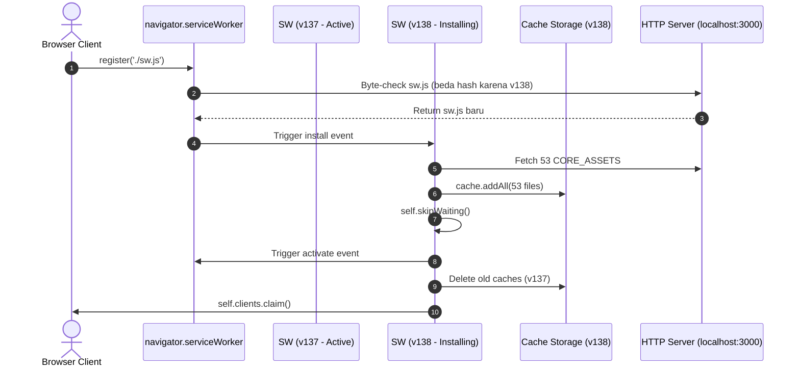
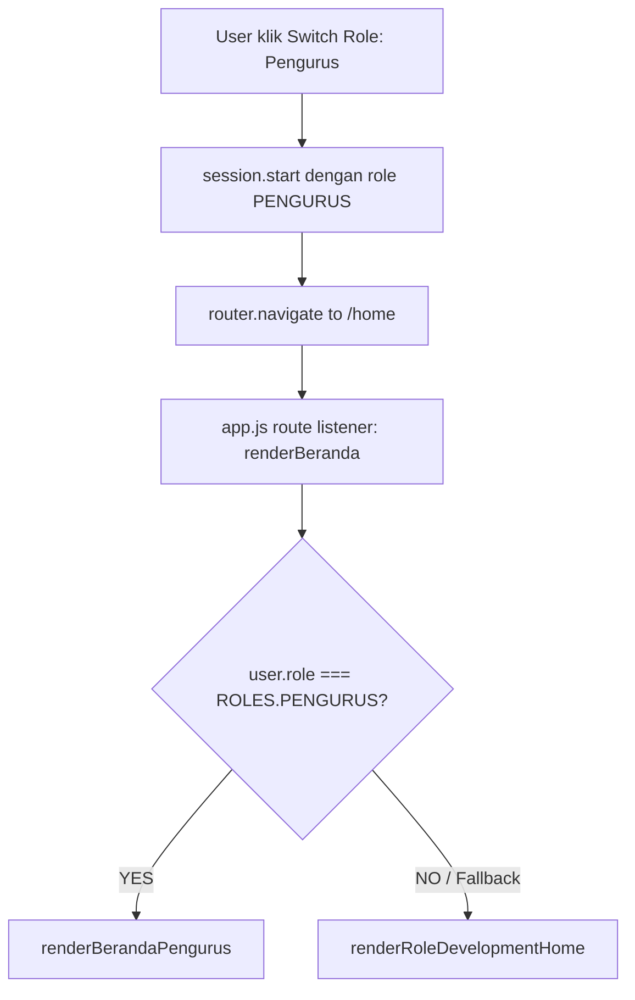

# AUDIT RUNTIME SERVICE WORKER & ROLE DISPLAY LABEL CONSISTENCY

**Tanggal Audit:** 12 September 2026  
**Mode Audit:** READ-ONLY / DIAGNOSTIC ONLY  
**Target Proyek:** `sigma-nursery` (Prototype Mobile Frame HP)  
**Dokumen Referensi:** [sw.js](file:///d:/PROJECT%20SOCFINDO/DATA%20SOCFIN/Project%20SIGMA/sigma-nursery/sw.js), [permissions.js](file:///d:/PROJECT%20SOCFINDO/DATA%20SOCFIN/Project%20SIGMA/sigma-nursery/js/core/permissions.js), [drawer.js](file:///d:/PROJECT%20SOCFINDO/DATA%20SOCFIN/Project%20SIGMA/sigma-nursery/js/components/drawer.js), [login.js](file:///d:/PROJECT%20SOCFINDO/DATA%20SOCFIN/Project%20SIGMA/sigma-nursery/js/modules/auth/login.js), [beranda.js](file:///d:/PROJECT%20SOCFINDO/DATA%20SOCFIN/Project%20SIGMA/sigma-nursery/js/modules/dashboard/beranda.js), [demo-data.js](file:///d:/PROJECT%20SOCFINDO/DATA%20SOCFIN/Project%20SIGMA/sigma-nursery/js/data/demo-data.js), [master-data.js](file:///d:/PROJECT%20SOCFINDO/DATA%20SOCFIN/Project%20SIGMA/sigma-nursery/js/data/master-data.js)

---

## 1. Executive Summary

Audit ini dilakukan untuk mendiagnosis dua permasalahan teknis runtime yang dilaporkan:

1. **Service Worker & Beranda Pengurus:**
   - Setelah `CACHE_NAME` pada [sw.js](file:///d:/PROJECT%20SOCFINDO/DATA%20SOCFIN/Project%20SIGMA/sigma-nursery/sw.js#L7) dinaikkan dari `sigma-nursery-v137` ke `sigma-nursery-v138`, Beranda Pengurus dilaporkan masih menampilkan placeholder lama (*"DALAM PENGEMBANGAN"*).
   - Selain itu, terjadi degradasi performa (loading runtime browser terasa jauh lebih lambat).
2. **Inkonsistensi Role Display Label:**
   - Ditemukan perbedaan teks label role `ASISTEN_BIBITAN` antara modal Switch User Login (*"Asisten Bibitan"*) dan Drawer Menu (*"Ast. Bibitan"*).

### Ringkasan Temuan Kunci
- **Source Code Logic 100% Benar:** Logika [beranda.js](file:///d:/PROJECT%20SOCFINDO/DATA%20SOCFIN/Project%20SIGMA/sigma-nursery/js/modules/dashboard/beranda.js#L157-L162) dan [permissions.js](file:///d:/PROJECT%20SOCFINDO/DATA%20SOCFIN/Project%20SIGMA/sigma-nursery/js/core/permissions.js#L1-L28) sudah valid. Tidak ada bug logika pada routing atau dispatch role `PENGURUS`.
- **Penyebab Beranda Masih Placeholder:** Kenaikan `CACHE_NAME` hanya memperbarui Cache Storage Service Worker, namun **tidak membatalkan HTTP Browser Cache / Module Graph Memory Cache** pada browser client aktif dan server lokal (`localhost:3000`). Modul ES6 (`import ...`) sering kali di-cache oleh HTTP memory cache browser sebelum Service Worker fetch handler atau sebelum worker baru mengambil alih (*client controlling delay*).
- **Penyebab Loading Melambat:** Perubahan `CACHE_NAME` memicu event `install` Service Worker baru yang mengeksekusi `cache.addAll(CORE_ASSETS)`. Terdapat **53 file aset** yang diunduh secara paralel melalui koneksi lokal, membebani thread network dan I/O browser saat inisialisasi awal.
- **Penyebab Label "Ast. Bibitan":** File [drawer.js](file:///d:/PROJECT%20SOCFINDO/DATA%20SOCFIN/Project%20SIGMA/sigma-nursery/js/components/drawer.js#L161) melakukan hardcoding string array `{ role: 'ASISTEN_BIBITAN', label: 'Ast. Bibitan' }` dan tidak menggunakan single source of truth `ROLE_LABELS` dari [permissions.js](file:///d:/PROJECT%20SOCFINDO/DATA%20SOCFIN/Project%20SIGMA/sigma-nursery/js/core/permissions.js#L20-L28).

---

## 2. Service Worker Lifecycle & Registration

### Analisis [sw.js](file:///d:/PROJECT%20SOCFINDO/DATA%20SOCFIN/Project%20SIGMA/sigma-nursery/sw.js)



### Lifecycle Details
1. **Registrasi ([app.js](file:///d:/PROJECT%20SOCFINDO/DATA%20SOCFIN/Project%20SIGMA/sigma-nursery/js/app.js#L50-L55)):**
   - Menggunakan `navigator.serviceWorker.register('./sw.js')`. Scope default adalah `./` (root).
2. **Event `install` ([sw.js](file:///d:/PROJECT%20SOCFINDO/DATA%20SOCFIN/Project%20SIGMA/sigma-nursery/sw.js#L61-L66)):**
   - `caches.open(CACHE_NAME).then(cache => cache.addAll(CORE_ASSETS))`
   - `self.skipWaiting()` dipanggil langsung.
3. **Event `activate` ([sw.js](file:///d:/PROJECT%20SOCFINDO/DATA%20SOCFIN/Project%20SIGMA/sigma-nursery/sw.js#L68-L76)):**
   - Menghapus semua cache yang namanya `!== CACHE_NAME`.
   - `self.clients.claim()` mengambil alih client seketika.
4. **Event `fetch` ([sw.js](file:///d:/PROJECT%20SOCFINDO/DATA%20SOCFIN/Project%20SIGMA/sigma-nursery/sw.js#L87-L105)):**
   - Strategi: **Network-First** dengan Fallback ke Cache:
     ```javascript
     event.respondWith(
       fetch(event.request)
         .then(response => {
           if (response && response.status === 200 && response.type === 'basic') {
             const responseToCache = response.clone();
             caches.open(CACHE_NAME).then(cache => cache.put(event.request, responseToCache));
           }
           return response;
         })
         .catch(() => caches.match(event.request))
     );
     ```

---

## 3. Cache Storage Analysis (v137 vs v138)

| Komponen | Status v137 | Status v138 | Efek Runtime |
|:---|:---|:---|:---|
| `CACHE_NAME` | `sigma-nursery-v137` | `sigma-nursery-v138` | Memicu instalasi worker baru |
| `CORE_ASSETS` item count | 53 assets | 53 assets | 53 network requests simultan saat install |
| Entry `beranda.js` | `./js/modules/dashboard/beranda.js` | `./js/modules/dashboard/beranda.js` | Masuk dalam precache |
| Purge Old Cache | Menghapus v136 | Menghapus v137 | Cache v137 terhapus dari CacheStorage API |

---

## 4. Runtime Trace: `/home` Rendering Path untuk Role Pengurus

Alur eksekusi saat memilih Pengurus:



### Trace Verifikasi Kode
1. **Pemicu Sesi:**
   - [drawer.js](file:///d:/PROJECT%20SOCFINDO/DATA%20SOCFIN/Project%20SIGMA/sigma-nursery/js/components/drawer.js#L173-L177): `session.start({ id: 'PGS001', name: 'Bpk. Hendra Gunawan', role: 'PENGURUS', ... })`
   - [login.js](file:///d:/PROJECT%20SOCFINDO/DATA%20SOCFIN/Project%20SIGMA/sigma-nursery/js/modules/auth/login.js#L182-L188): Mengambil akun demo `PENGURUS` dari [demo-data.js](file:///d:/PROJECT%20SOCFINDO/DATA%20SOCFIN/Project%20SIGMA/sigma-nursery/js/data/demo-data.js#L73-L80).
2. **Konstanta Role:**
   - [permissions.js](file:///d:/PROJECT%20SOCFINDO/DATA%20SOCFIN/Project%20SIGMA/sigma-nursery/js/core/permissions.js#L8): `PENGURUS: 'PENGURUS'`
3. **Dispatch Handler di [beranda.js](file:///d:/PROJECT%20SOCFINDO/DATA%20SOCFIN/Project%20SIGMA/sigma-nursery/js/modules/dashboard/beranda.js#L157-L162):**
   ```javascript
   if (user?.role === ROLES.PENGURUS) {
       renderBerandaPengurus(main);
       return;
   }
   ```
4. **Renderer [beranda.js](file:///d:/PROJECT%20SOCFINDO/DATA%20SOCFIN/Project%20SIGMA/sigma-nursery/js/modules/dashboard/beranda.js#L261-L325):**
   - Merender 3 Action Card: Permintaan Bibit, Monitoring Bibitan, Laporan Kebun.

**Kesimpulan Trace:** Kode sumber di disk **100% sinkron dan siap**. Tidak ada percabangan kode yang salah.

---

## 5. Loading Performance Degradation Analysis

Mengapa setelah menaikkan `CACHE_NAME` dari v137 ke v138 aplikasi terasa lambat?

1. **Precache Burst Overload (53 Assets):**
   Saat `CACHE_NAME` berubah, event `install` memanggil `cache.addAll(CORE_ASSETS)`. Browser memproses 53 HTTP requests secara serentak ke server lokal.
2. **Network Contention:**
   Karena strategi Service Worker adalah *Network-First* ([sw.js](file:///d:/PROJECT%20SOCFINDO/DATA%20SOCFIN/Project%20SIGMA/sigma-nursery/sw.js#L88)), request navigasi halaman runtime bersaing dengan 53 request precache background yang sedang di-download oleh event `install`.
3. **Double Fetch Latency:**
   Setiap modul JS yang diminta saat runtime di-fetch via network terlebih dahulu, lalu di-clone dan ditulis ke cache storage (`cache.put()`), menambah overhead CPU dan memory disk I/O.

---

## 6. Mengapa Bumping Cache Name v138 Belum Cukup?

Ada 3 lapisan caching di browser modern:
```
[ 1. Memory / ES Module Graph Cache ]  <-- PALING AGRESIF (Tidak tersentuh SW)
               ↓
[ 2. HTTP Browser Disk Cache (304/200) ] <-- Bergantung Header Server
               ↓
[ 3. Service Worker CacheStorage API ] <-- Yang diupdate oleh v138
```

1. **ES Module Dynamic Import & Memory Cache:**
   Browser Chromium/V8 menyimpan representasi terkompilasi dari file ES Module (`import ... from './beranda.js'`) di memory cache tab. Sekalipun Cache Storage SW dihapus, jika tab browser tidak dilakukan **Hard Refresh** (`Ctrl+F5` atau `Disable cache` di DevTools) atau Service Worker `Update on reload`, instance modul JS lama tetap tertahan di RAM window browser.
2. **HTTP Cache Header dari Local Server:**
   Jika web server lokal (`http-server`, `live-server`, atau Node) menyajikan aset dengan header default atau `ETag`/`304 Not Modified`, browser dapat menggunakan respons disk cache sebelum Service Worker fetch handler menyelesaikan network-first pipeline.
3. **Client Race Condition Saat Transisi Worker:**
   Meskipun ada `clients.claim()`, halaman yang sudah di-load dengan bundle script lama tidak akan me-reload modul internalnya sampai terjadi *full page navigation* atau reload tab.

---

## 7. Role Display Label Mapping Matrix

Berikut adalah perbandingan komprehensif teks label role di seluruh codebase:

| Role Key (`ROLES`) | Master Data Label | `ROLE_LABELS` ([permissions.js](file:///d:/PROJECT%20SOCFINDO/DATA%20SOCFIN/Project%20SIGMA/sigma-nursery/js/core/permissions.js#L20-L28)) | Login Switch Modal ([login.js](file:///d:/PROJECT%20SOCFINDO/DATA%20SOCFIN/Project%20SIGMA/sigma-nursery/js/modules/auth/login.js#L176)) | Drawer Pills ([drawer.js](file:///d:/PROJECT%20SOCFINDO/DATA%20SOCFIN/Project%20SIGMA/sigma-nursery/js/components/drawer.js#L156-L167)) | Demo Data Label ([demo-data.js](file:///d:/PROJECT%20SOCFINDO/DATA%20SOCFIN/Project%20SIGMA/sigma-nursery/js/data/demo-data.js#L228)) | Status Konsistensi |
|:---|:---|:---|:---|:---|:---|:---|
| `MANTRI_TANAMAN` | Mantri Bibitan | `Mantri Bibitan` | `Mantri Bibitan` | `Mantri Bibitan` | `Mantri Bibitan` | ✅ **KONSISTEN** |
| `ASISTEN_BIBITAN` | Asisten Bibitan | `Asisten Bibitan` | `Asisten Bibitan` | **`Ast. Bibitan`** *(Hardcoded)* | `Asisten Bibitan` | ❌ **INKONSISTEN** |
| `ASISTEN` | Asisten Divisi | `Asisten` | `Asisten` | `Asisten` | `Asisten` | ⚠️ Beda dgn Master |
| `ASKEP` | Asisten Kepala | `Askep` | `Askep` | `Askep` | `Askep` | ⚠️ Beda dgn Master |
| `TEKNIKER_I` | Tekniker I | `Tekniker I` | `Tekniker I` | `Tekniker I` | `Tekniker I` | ✅ **KONSISTEN** |
| `PENGURUS` | Pengurus Kebun Peminta | `Pengurus` | `Pengurus` | `Pengurus` | `Pengurus` | ⚠️ Beda dgn Master |
| `KTU` | KTU | `KTU` | `KTU` | `KTU` | `KTU` | ✅ **KONSISTEN** |

---

## 8. Inconsistency Analysis

### 1. Masalah Utama: `Ast. Bibitan` vs `Asisten Bibitan`
- **Lokasi Inkonsistensi:** [drawer.js Line 161](file:///d:/PROJECT%20SOCFINDO/DATA%20SOCFIN/Project%20SIGMA/sigma-nursery/js/components/drawer.js#L161):
  ```javascript
  // AKTUAL di drawer.js:
  { role: 'ASISTEN_BIBITAN', label: 'Ast. Bibitan' }
  ```
- **Penyebab:** Pengembang sebelumnya membuat array literal manual di dalam [drawer.js](file:///d:/PROJECT%20SOCFINDO/DATA%20SOCFIN/Project%20SIGMA/sigma-nursery/js/components/drawer.js#L156) dengan singkatan (*"Ast."*), bukannya memanggil `ROLE_LABELS[role]` dari [permissions.js](file:///d:/PROJECT%20SOCFINDO/DATA%20SOCFIN/Project%20SIGMA/sigma-nursery/js/core/permissions.js#L22).
- **Dampak:** Pengguna melihat *"Asisten Bibitan"* saat di Login Switch User, namun melihat *"Ast. Bibitan"* di Quick Switch Drawer.

### 2. Variasi Terhadap Master Data
- Beberapa role menggunakan nama singkat di UI prototype:
  - `ASISTEN`: Master *"Asisten Divisi"*, UI *"Asisten"*
  - `ASKEP`: Master *"Asisten Kepala"*, UI *"Askep"*
  - `PENGURUS`: Master *"Pengurus Kebun Peminta"*, UI *"Pengurus"*
- Variasi ini konsisten di seluruh UI (Login & Drawer sama-sama menampilkan nama pendek), sehingga yang merupakan bug inkonsistensi murni antar-komponen UI hanyalah `ASISTEN_BIBITAN`.

---

## 9. Root Cause 1: Service Worker & Asset Staleness / Slow Loading

1. **Asset Staleness (Beranda Masih Placeholder):**
   - `sw.js` v138 sudah aktif di background, namun browser window/client belum mengeksekusi *hard reload* untuk memperbarui ES Module cache graph `beranda.js` yang tersimpan di RAM browser.
2. **Slow Loading Performance:**
   - Penambahan versi baru memicu unduhan serial/paralel massal dari 53 file aset `CORE_ASSETS` melalui `cache.addAll()`, sementara runtime bersamaan mengeksekusi network-first fetch handler yang menggandakan beban jaringan lokal.

---

## 10. Root Cause 2: Role Label Inconsistency

- Terjadi duplikasi definisi data (tidak mematuhi *Don't Repeat Yourself / DRY*).
- [login.js](file:///d:/PROJECT%20SOCFINDO/DATA%20SOCFIN/Project%20SIGMA/sigma-nursery/js/modules/auth/login.js#L176) secara benar mengimpor dan menggunakan `ROLE_LABELS` dari [permissions.js](file:///d:/PROJECT%20SOCFINDO/DATA%20SOCFIN/Project%20SIGMA/sigma-nursery/js/core/permissions.js).
- [drawer.js](file:///d:/PROJECT%20SOCFINDO/DATA%20SOCFIN/Project%20SIGMA/sigma-nursery/js/components/drawer.js#L156-L167) mendefinisikan array objek role tersendiri secara hardcoded dan salah menuliskan label menjadi `"Ast. Bibitan"`.

---

## 11. Recommended Fix Plan

> **Catatan:** Sesuai instruksi READ-ONLY / AUDIT ONLY, perbaikan berikut **TIDAK** diimplementasikan sekarang dan hanya sebagai rekomendasi langkah perbaikan formal berikutnya.

### Rencana Perbaikan A: Role Display Label Consistency
1. Buka [drawer.js](file:///d:/PROJECT%20SOCFINDO/DATA%20SOCFIN/Project%20SIGMA/sigma-nursery/js/components/drawer.js).
2. Import `ROLE_LABELS` dari `../core/permissions.js` atau ubah baris 161 dari:
   ```javascript
   { role: 'ASISTEN_BIBITAN', label: 'Ast. Bibitan' }
   ```
   menjadi:
   ```javascript
   { role: 'ASISTEN_BIBITAN', label: 'Asisten Bibitan' }
   ```
   *(Atau secara dinamis memetakan `roles` menggunakan `ROLE_LABELS`)*.

### Rencana Perbaikan B: Service Worker & Caching Buster
1. **Untuk Developer / Pengujian Runtime:**
   - Lakukan `Hard Reload` di browser: `Ctrl + Shift + R` (Windows) atau centang *"Disable cache"* pada tab Network DevTools.
   - Pada panel Application > Service Workers di DevTools, klik *"Unregister"* atau centang *"Update on reload"*.
2. **Untuk Produksi / Automated Cache Invalidation:**
   - Tambahkan strategi cache busting otomatis pada import query string (misal: `import './beranda.js?v=138'`) jika diperlukan pembaruan instan tanpa hard refresh.
   - Kurangi `CORE_ASSETS` hanya pada file kritis (App Shell), sedangkan modul dinamis di-cache on-demand saat diakses pertama kali via fetch handler untuk mencegah lonjakan loading saat instalasi worker baru.

---

## 12. Conclusion & Verification Checklist

| Item Verifikasi | Status Kode Saat Ini | Tindakan yang Dibutuhkan |
|:---|:---:|:---|
| Implementasi `renderBerandaPengurus()` | ✅ Lengkap & Valid di [beranda.js](file:///d:/PROJECT%20SOCFINDO/DATA%20SOCFIN/Project%20SIGMA/sigma-nursery/js/modules/dashboard/beranda.js#L261) | Tidak perlu ubah logic |
| Routing `/home` untuk Role Pengurus | ✅ Valid di [beranda.js](file:///d:/PROJECT%20SOCFINDO/DATA%20SOCFIN/Project%20SIGMA/sigma-nursery/js/modules/dashboard/beranda.js#L157) | Tidak perlu ubah logic |
| Service Worker Version di `sw.js` | ✅ `sigma-nursery-v138` | Butuh browser hard refresh |
| Konsistensi Label `ASISTEN_BIBITAN` di Drawer | ❌ Masih `Ast. Bibitan` | Butuh update di [drawer.js](file:///d:/PROJECT%20SOCFINDO/DATA%20SOCFIN/Project%20SIGMA/sigma-nursery/js/components/drawer.js#L161) |
| Konsistensi Label di `login.js` | ✅ Sesuai `ROLE_LABELS` | Sudah benar |
