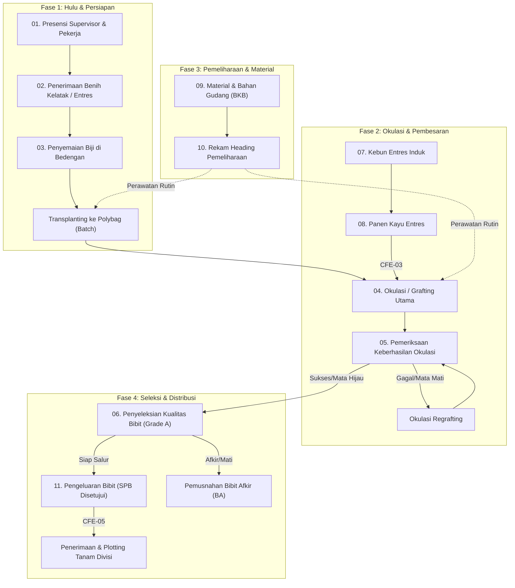

# DAK — SIGMA RUBBER NURSERY
## Dokumen Analisis Kebutuhan Sistem (Software Requirements Document)

**Nama Sistem:** SIGMA Mobile Rubber Nursery (Sistem Informasi & Manajemen Operasional Pembibitan Karet)  
**Nomor Dokumen:** DAK-SIGMA-RN-2026-V1.0-FINAL  
**Versi:** 1.0.0 (Baseline 172 Final)  
**Status:** FINAL / FOR REVIEW  
**Tanggal Penerbitan:** 7 September 2026  
**Klasifikasi:** Dokumen Resmi Korporat (Official Technical Document)  

| Parameter | Identitas Personel |
| :--- | :--- |
| **Prepared By** | Lead System Architect & Business Process Analyst (Task 10 & 12 QA Team) |
| **Reviewed By** | TBD (Head of Agronomy & Nursery Technical Specialist) |
| **Approved By** | TBD (Head of Plantation & IT Project Steering Committee) |

---

# B. DOCUMENT CONTROL

### Riwayat Perubahan Dokumen (Document History)

| Versi | Tanggal | Author | Status | Ringkasan Perubahan |
| :---: | :---: | :--- | :---: | :--- |
| **v0.1.0** | 2026-08-15 | System Analyst | Draft Awal | Baseline awal 165 requirement dari user stories lapangan. |
| **v0.5.0** | 2026-08-28 | QA & Dev Team | Review | Pemetaan alur flow Phase 4E/4F dan canonical cross-flow edges. |
| **v0.9.0** | 2026-09-06 | Business Analyst | Reconciled | Rekonsiliasi Task 9: 28 revisi, 14 requirement baru, 7 depresiasi, 3 merger. |
| **v1.0.0** | 2026-09-07 | System Architect | **FINAL / FOR REVIEW** | **Finalisasi 172 Active Requirements, 18 Business Rules, 175 Flow Nodes, 156 Edges, 5 CFE, dan 100% RTM Traceability.** |

---

# C. EXECUTIVE SUMMARY

Sistem Informasi Manajemen Pembibitan Karet (**SIGMA Rubber Nursery**) adalah platform aplikasi mobile berbasis PWA *(Progressive Web App)* yang terintegrasi dengan portal manajemen operasional. Sistem dirancang untuk memastikan tata kelola, keterlacakan (*traceability*), dan akuntabilitas siklus hidup bibit tanaman karet secara *end-to-end* di seluruh kebun dan divisi PT Socfin Indonesia (Socfindo).

Ruang lingkup operasional sistem mencakup **11 modul inti** mulai dari pencatatan presensi berpagar GPS (*geofencing*), penerimaan benih kelatak bermutu, penyemaian bedengan, pembesaran seedling polybag, okulasi grafting utama dan regrafting, inspeksi keberhasilan okulasi, penyeleksian kualitas bibit batch (Grade A, tunda, afkir), pengelolaan kebun pohon induk entres, panen kayu entres klonal, penarikan & rekonsiliasi bahan kimia/pupuk gudang, rekam jam kerja heading pemeliharaan, hingga pengeluaran bibit berbasis SPB dan konfirmasi tanam polygon di divisi.

Seluruh kebutuhan bisnis (**172 Active Requirements**) telah terpetakan secara utuh ke dalam **21 Alur Fitur Bisnis**, **175 Interactive Flow Nodes**, **156 Directed Edges**, **5 Canonical Cross-Flow Edges**, dan **18 Canonical Business Rules**, dengan tingkat keterlacakan **100.00% (Zero Gap)**.

---

# D. SCOPE

## 1. In Scope (11 Modul Operasional Aktif)
1. **01-presensi:** Presensi Harian Supervisor (Face ID/GPS Perimeter) & Pekerja Bibitan.
2. **02-penerimaan:** Penerimaan Biji Benih Kelatak, Bibit Kebun Sepupu, dan Kayu Entres Sepupu.
3. **03-penyemaian:** Penyemaian Biji Kelatak Bedengan & Transplanting ke Polybag (Batch Management).
4. **04-okulasi:** Okulasi Grafting Utama, Kalibrasi QC Irisan, dan Regrafting Batang Bawah.
5. **05-pemeriksaan:** Pemeriksaan Keberhasilan Okulasi & Buka Lilitan Plastik.
6. **06-penyeleksian:** Penyeleksian Kualitas Batch Bibit (Grade A/Tunda/Afkir), Review RKAP Askep, & Pemusnahan BA.
7. **07-kebun-entres:** Pemeliharaan & Sensus Pohon Induk Kayu Entres Klonal.
8. **08-panen-mata-entres:** Panen, Pemotongan, dan Pengikatan Kayu Mata Entres.
9. **09-material-bahan:** Penarikan BKB Material Gudang & Rekonsiliasi Konsumsi Bahan Lapangan.
10. **10-rekam-pemeliharaan:** Pencatatan Heading Kerja Pemeliharaan Harian & Universal Audit Trail.
11. **11-pengeluaran:** Otorisasi SPB Alokasi Bibit, Pemuatan Armada, Plotting Polygon Tanam, & Konfirmasi Terima Divisi.

## 2. Out of Scope (7 Deprecated / Archived Requirements)
1. `RN-PRS-004`: Presensi manual batch pekerja tanpa koordinat geolokasi GPS *(Deprecated — bertentangan dengan governance anti-fraud GPS)*.
2. `RN-RCV-001`: Pemindaian barcode non-standar vendor luar *(Deprecated — digantikan verifikasi BKB standar SIGMA)*.
3. `RN-OKL-000`: Inisialisasi batch polybag campuran multi-klon *(Deprecated — klon wajib tunggal murni per batch)*.
4. `RN-SEL-002`: Pemilihan format dokumen non-standar *(Deprecated — distandardisasi dokumen resmi SIGMA)*.
5. `RN-ENT-001`: Perhitungan rasio pemakaian entres tanpa validasi klon *(Deprecated — validasi klon mandatory)*.
6. `RN-EXP-005`: Dokumentasi foto pengeluaran non-geotagged *(Deprecated — foto mandatory geotagged)*.
7. `RN-EXP-006`: Pemuatan armada melebihi kapasitas tanpa persetujuan *(Deprecated — dibatasi kuota armada SPB)*.

---

# E. ROLE & RESPONSIBILITY

Dokumen ini mendefinisikan secara ketat **7 Peran Master Pengguna** berdasarkan kewenangan yang termaktub pada baseline requirement:

| No | Peran Master | Tanggung Jawab Operasional & Kewenangan | Modul Terkait | Req Count |
| :---: | :--- | :--- | :--- | :---: |
| 1 | **Mantri Bibitan** | Pelaksana operasional harian pembibitan, entri transaksi presensi, terima benih, semai, okulasi, periksa, seleksi, rawat entres, panen entres, rekam heading kerja, dan muat bibit. | Seluruh 11 Modul | **133** |
| 2 | **Asisten Bibitan** | Verifikasi fisik & persetujuan supervisi lapangan, approval BKB material, validasi presensi pekerja, verifikasi seleksi bibit afkir, approval transfer tahap pertumbuhan, dan approval rekap pemeliharaan. | Modul 01, 02, 03, 04, 06, 09, 10 | **11** |
| 3 | **Asisten Divisi** | Pengajuan SPB alokasi bibit kebun sendiri, plotting polygon areal tanam di divisi, dan verifikasi fisik penerimaan bibit di divisi peminta. | Modul 11 | **5** |
| 4 | **Asisten Kepala** | Otorisasi kuota SPB pengeluaran bibit, pemeriksaan berkala ketersediaan stok bibit Siap Salur vs RKAP divisi, dan persetujuan Berita Acara pemusnahan bibit afkir. | Modul 06, 11 | **8** |
| 5 | **Tekniker I** | Pengendalian mutu (*Quality Control*), kalibrasi standar irisan juru okulasi, uji kemurnian klon kayu entres, dan sertifikasi visual mutu benih kelatak. | Modul 02, 04, 07 | **3** |
| 6 | **Pengurus Kebun Peminta** | Persetujuan SPB alokasi bibit antar-kebun / kebun sepupu, otorisasi penerimaan entres sepupu, dan penandatanganan Berita Acara pemusnahan bibit. | Modul 02, 06, 11 | **6** |
| 7 | **KTU (Kepala Tata Usaha)** | Verifikasi integritas rekonsiliasi material gudang terhadap laporan biaya, rekonsiliasi payroll presensi pekerja, dan audit pencatatan BKB pengeluaran bibit. | Modul 01, 09, 11 | **3** |
| * | *Sistem Terotomasi* | *Kalkulasi otomatis saldo batch, auto-deduction populasi, dan matching formula.* | *Modul 04, 09* | *3* |

---

# F. BUSINESS PROCESS OVERVIEW

Siklus hidup operasional pembibitan karet Socfindo berjalan secara terstruktur dan saling terkait:

---

# G. PROCESS FLOW PER MODULE

## Modul 01: Presensi
**ID Modul:** `01-presensi` | **Peran Utama:** Mantri Bibitan | **Peran Terkait:** Asisten Bibitan

*Deskripsi Modul:* Pencatatan kehadiran harian Supervisor melalui Face ID (dengan fallback foto manual) dan verifikasi daftar kehadiran pekerja bibitan sebelum transaksi harian dimulai.

### Fitur: Presensi Supervisor
- **ID Fitur:** `presensi-supervisor`

### Fitur: Presensi Pekerja Bibitan
- **ID Fitur:** `presensi-pekerja`

## Modul 02: Penerimaan
**ID Modul:** `02-penerimaan` | **Peran Utama:** Mantri Bibitan | **Peran Terkait:** Asisten Bibitan, Asisten Divisi, Asisten Kepala

*Deskripsi Modul:* Penerimaan material biologis pembibitan dari pihak ke-3 (biji kelatak), kebun sendiri (cross-role dengan Asisten Divisi/Kepala), dan kebun sepupu dengan dokumentasi foto dan timestamp.

### Fitur: Penerimaan Benih / Biji Kelatak
- **ID Fitur:** `terima-benih`

### Fitur: Penerimaan Bibit - Kebun Sendiri
- **ID Fitur:** `terima-kebun-sendiri`

### Fitur: Penerimaan Bibit - Kebun Sepupu
- **ID Fitur:** `terima-kebun-sepupu`

### Fitur: Penerimaan Mata Entres
- **ID Fitur:** `terima-mata-entres`

## Modul 03: Penyemaian
**ID Modul:** `03-penyemaian` | **Peran Utama:** Mantri Bibitan | **Peran Terkait:** Asisten Bibitan (Verifikasi)

*Deskripsi Modul:* Proses penaburan benih ke Bedengan berdasarkan dokumen penerimaan benih, pemeliharaan ±12–15 hari, hingga transplanting 2 benih/bibit per polybag dan konsolidasi Batch.

### Fitur: Penyemaian ke Bedengan
- **ID Fitur:** `semai-bedengan`

### Fitur: Transplanting ke Polybag (Batch)
- **ID Fitur:** `transplanting-polybag`

## Modul 04: Okulasi
**ID Modul:** `04-okulasi` | **Peran Utama:** Mantri Bibitan | **Peran Terkait:** Asisten Bibitan (Verifikasi)

*Deskripsi Modul:* Proses perbanyakan tanaman karet dengan metode okulasi, mencakup grafting dan regrafting, termasuk penggunaan mata entres, pencatatan hasil, dan verifikasi oleh Asisten Bibitan.

### Fitur: Grafting (Okulasi Utama)
- **ID Fitur:** `grafting`

### Fitur: Okulasi Janda / Regrafting
- **ID Fitur:** `regrafting`

## Modul 05: Pemeriksaan
**ID Modul:** `05-pemeriksaan` | **Peran Utama:** Mantri Bibitan | **Peran Terkait:** Asisten Bibitan (Verifikasi)

*Deskripsi Modul:* Pemeriksaan berkala hasil okulasi secara dinamis dan bertahap. Bibit yang gagal dapat ditentukan untuk Regrafting berulang kali atau dinyatakan Reject oleh Mantri Bibitan.

### Fitur: Pemeriksaan Bertahap Grafting
- **ID Fitur:** `periksa-grafting`

### Fitur: Pemeriksaan Regrafting
- **ID Fitur:** `periksa-regrafting`

## Modul 06: Penyeleksian
**ID Modul:** `06-penyeleksian` | **Peran Utama:** Mantri Bibitan | **Peran Terkait:** Asisten Bibitan (Pemeriksaan Fisik & Verifikasi)

*Deskripsi Modul:* Penyeleksian bibit afkir/mati secara dinamis berulang. Hasil deklarasi Mantri tidak langsung mengurangi populasi Batch sampai Asisten Bibitan melakukan verifikasi fisik.

### Fitur: Seleksi Kualitas Bibit Batch
- **ID Fitur:** `seleksi-batch`

## Modul 07: Kebun Entres
**ID Modul:** `07-kebun-entres` | **Peran Utama:** Mantri Bibitan | **Peran Terkait:** Asisten Bibitan (Verifikasi)

*Deskripsi Modul:* Pemeliharaan pokok induk entres pada Plot Entres melalui aktivitas Menunas dan Topping dengan perhitungan rasio perisai/cabang dan perisai/meter.

### Fitur: Menunas Plot Entres
- **ID Fitur:** `entres-menunas`

### Fitur: Topping Plot Entres
- **ID Fitur:** `entres-topping`

## Modul 08: Panen Mata Entres
**ID Modul:** `08-panen-mata-entres` | **Peran Utama:** Mantri Bibitan | **Peran Terkait:** Asisten Bibitan (Verifikasi)

*Deskripsi Modul:* Pemanenan cabang entres per Plot Entres + Clone. Perhitungan estimasi vs input mata entres aktual, yang akan menambah stok resmi setelah diverifikasi Asisten Bibitan.

### Fitur: Panen Mata Entres
- **ID Fitur:** `panen-entres`

## Modul 09: Material & Bahan
**ID Modul:** `09-material-bahan` | **Peran Utama:** Mantri Bibitan | **Peran Terkait:** Asisten Bibitan (Verifikasi), Petugas Gudang

*Deskripsi Modul:* Pengawasan saldo mutasi stok mata entres (+ panen terverifikasi, - okulasi/pengeluaran) serta pelekatan dokumen pengeluaran gudang material matching 1 Heading Kerja.

### Fitur: Monitoring Mutasi Stok Mata Entres
- **ID Fitur:** `monitoring-stok-entres`

### Fitur: Matching Material Dokumen Gudang
- **ID Fitur:** `material-gudang-matching`

## Modul 10: Rekam Pemeliharaan
**ID Modul:** `10-rekam-pemeliharaan` | **Peran Utama:** Mantri Bibitan | **Peran Terkait:** Asisten Bibitan (Verifikasi)

*Deskripsi Modul:* Pencatatan aktivitas perawatan dinamis berbasis Grup Heading dan Heading Kerja terhadap objek Batch, Bedengan, Plot Entres, atau Blok dengan auto-match Dokumen Gudang.

### Fitur: Rekam Aktivitas Pemeliharaan
- **ID Fitur:** `pemeliharaan-heading`

## Modul 11: Pengeluaran
**ID Modul:** `11-pengeluaran` | **Peran Utama:** Mantri Bibitan | **Peran Terkait:** Asisten Bibitan, Asisten Divisi Peminta, Pengurus

*Deskripsi Modul:* Pengeluaran bibit (ke kebun sendiri/komersil) dan mata entres berdasarkan dokumen permintaan (SPB/DO) yang telah disetujui, tervalidasi QR, foto, dan verifikasi Asisten.

### Fitur: Pengeluaran Bibit (SPB Disetujui)
- **ID Fitur:** `pengeluaran-bibit`

### Fitur: Pengeluaran Mata Entres
- **ID Fitur:** `pengeluaran-mata-entres`

# H. REQUIREMENT SPECIFICATION (172 ACTIVE REQUIREMENTS)

Tabel spesifikasi lengkap seluruh 172 kebutuhan bisnis aktif:

| No | ID Requirement | Judul Kebutuhan Bisnis | Peran Pelaksana | Modul | Fitur | Status |
| :---: | :--- | :--- | :--- | :--- | :--- | :---: |
| 1 | `RN-PRS-001` | Presensi Datang supervisor wajib selesai sebelum transaksi harian lain. | Mantri Bibitan | Presensi | Presensi Supervisor | Confirmed |
| 2 | `RN-PRS-002` | Pembacaan waktu otomatis untuk Presensi Datang/Pulang. | Mantri Bibitan | Presensi | Presensi Supervisor | Confirmed |
| 3 | `RN-PRS-003` | Verifikasi biometrik wajah supervisor sebagai metode utama presensi. | Mantri Bibitan | Presensi | Presensi Supervisor | Confirmed |
| 4 | `RN-PRS-005` | Pemeriksaan radius koordinat GPS berada di dalam perimeter Areal Bibitan. | Mantri Bibitan | Presensi | Presensi Supervisor | Confirmed |
| 5 | `RN-PRS-006` | Sistem mencatat data presensi lengkap supervisor setelah divalidasi dengan radius perimeter GPS. | Mantri Bibitan | Presensi | Presensi Supervisor | Confirmed |
| 6 | `RN-PRS-007` | Mantri Bibitan menyelesaikan presensi datang supervisor sebagai prasyarat pembukaan transaksi harian. | Mantri Bibitan | Presensi | Presensi Supervisor | Confirmed |
| 7 | `RN-PWP-001` | Mantri membuka modul presensi pekerja setelah presensi supervisor selesai. | Mantri Bibitan | Presensi | Presensi Pekerja Bibitan | Confirmed |
| 8 | `RN-PWP-002` | Mantri menandai pekerja yang hadir dan membuang pekerja tidak hadir. | Mantri Bibitan | Presensi | Presensi Pekerja Bibitan | Confirmed |
| 9 | `RN-PWP-003` | Menambahkan pekerja bantuan antar afdeling jika belum ada di daftar reguler. | Mantri Bibitan | Presensi | Presensi Pekerja Bibitan | Confirmed |
| 10 | `RN-PWP-004` | Mengonfirmasi daftar final kehadiran pekerja beserta timestamp dan kirim verifikasi. | Mantri Bibitan | Presensi | Presensi Pekerja Bibitan | Confirmed |
| 11 | `RN-PWP-005` | Pekerja siap dialokasikan pada transaksi teknis pembibitan karet. | Mantri Bibitan | Presensi | Presensi Pekerja Bibitan | Confirmed |
| 12 | `RN-RCV-002` | Mantri Bibitan memverifikasi surat jalan/BKB vendor dan mencocokkan kuantitas fisik benih kelatak. | Mantri Bibitan | Penerimaan | Penerimaan Benih / Biji Kelatak | Confirmed |
| 13 | `RN-RCV-003` | Mantri mencatat jumlah fisik benih kelatak riil yang dibongkar dan diterima. | Mantri Bibitan | Penerimaan | Penerimaan Benih / Biji Kelatak | Confirmed |
| 14 | `RN-RCV-004` | Foto fisik karung/kotak benih dan surat jalan dengan stempel waktu ISO. | Mantri Bibitan | Penerimaan | Penerimaan Benih / Biji Kelatak | Confirmed |
| 15 | `RN-RCV-005` | Menyimpan berkas penerimaan dan disetujui Asisten Bibitan; resmi masuk database produksi. | Asisten Bibitan | Penerimaan | Penerimaan Benih / Biji Kelatak | Confirmed |
| 16 | `RN-RCV-006` | Dokumen penerimaan siap digunakan sebagai sumber alokasi pada modul Penyemaian. | Mantri Bibitan | Penerimaan | Penerimaan Benih / Biji Kelatak | Confirmed |
| 17 | `RN-RCV-KS01` | Asisten Divisi peminta mengajukan SPB bibit karet untuk penanaman di kebun. | Asisten Divisi | Penerimaan | Penerimaan Bibit - Kebun Sendiri | Confirmed |
| 18 | `RN-RCV-KS02` | Asisten Kepala meninjau permintaan bibit dan memeriksa ketersediaan stok bibit siap salur. | Asisten Kepala | Penerimaan | Penerimaan Bibit - Kebun Sendiri | Confirmed |
| 19 | `RN-RCV-KS03` | Stok cukup: Approve & teruskan ke Asisten Bibitan; Stok tidak cukup: Koreksi/Batalkan. | Asisten Kepala | Penerimaan | Penerimaan Bibit - Kebun Sendiri | Confirmed |
| 20 | `RN-RCV-KS04` | Asisten Bibitan menindaklanjuti; Mantri Bibitan mengeksekusi muat dan pengeluaran bibit. | Mantri Bibitan | Penerimaan | Penerimaan Bibit - Kebun Sendiri | Confirmed |
| 21 | `RN-RCV-KS05` | Asisten Divisi peminta menerima bibit di lokasi tanam, memeriksa fisik, dan mengonfirmasi penerimaan. | Asisten Divisi | Penerimaan | Penerimaan Bibit - Kebun Sendiri | Confirmed |
| 22 | `RN-RCV-KS06` | Seluruh tahapan permohonan hingga penerimaan bibit kebun sendiri selesai terverifikasi. | Asisten Divisi | Penerimaan | Penerimaan Bibit - Kebun Sendiri | Confirmed |
| 23 | `RN-SEM-001` | Satu dokumen penerimaan benih dapat dialokasikan ke beberapa Bedengan. | Mantri Bibitan | Penyemaian | Penyemaian ke Bedengan | Confirmed |
| 24 | `RN-SEM-002` | Memindai QR Code fisik pada plang bedengan perkecambahan pasir. | Mantri Bibitan | Penyemaian | Penyemaian ke Bedengan | Confirmed |
| 25 | `RN-SEM-003` | Mantri menginput jumlah butir benih yang disemai dan jumlah benih afkir/rusak. | Mantri Bibitan | Penyemaian | Penyemaian ke Bedengan | Confirmed |
| 26 | `RN-SEM-004` | Foto bukti fisik benih reject/rusak dengan watermark timestamp ISO dan GPS. | Mantri Bibitan | Penyemaian | Penyemaian ke Bedengan | Confirmed |
| 27 | `RN-SEM-005` | Asisten menyetujui penaburan bedengan; periode perkecambahan berlangsung ±12–15 hari. | Mantri Bibitan | Penyemaian | Penyemaian ke Bedengan | Confirmed |
| 28 | `RN-SEM-006` | Transplanting ke polybag menggunakan rasio 1 Polybag = 2 Benih/Bibit. | Mantri Bibitan | Penyemaian | Penyemaian ke Bedengan | Confirmed |
| 29 | `RN-SEM-007` | Satu Batch bibitan dapat dikonsolidasi dari beberapa Bedengan. | Mantri Bibitan | Penyemaian | Penyemaian ke Bedengan | Confirmed |
| 30 | `RN-SEM-008` | Batch polybag telah terdaftar dan siap dipelihara hingga mencapai ukuran okulasi. | Mantri Bibitan | Penyemaian | Penyemaian ke Bedengan | Confirmed |
| 31 | `RN-OKL-001` | Mantri Bibitan memilih Batch tanaman bawah (seedling) yang telah memenuhi kriteria diameter siap okulasi. | Mantri Bibitan | Okulasi | Grafting (Okulasi Utama) | Confirmed |
| 32 | `RN-OKL-002` | Validasi QR Code plang Batch polybag wajib dilakukan sebelum penempelan mata entres. | Mantri Bibitan | Okulasi | Grafting (Okulasi Utama) | Confirmed |
| 33 | `RN-OKL-003` | Menampilkan saldo populasi aktif dan batas maksimum okulasi harian pada batch terpilih. | Mantri Bibitan | Okulasi | Grafting (Okulasi Utama) | Confirmed |
| 34 | `RN-OKL-004` | Mantri Bibitan mencatat identitas Juru Okulasi, jumlah okulasi sukses, dan penggunaan entres. | Mantri Bibitan | Okulasi | Grafting (Okulasi Utama) | Confirmed |
| 35 | `RN-OKL-005` | Validasi kesesuaian varietas clone kayu entres terhadap rencana penempelan batch. | Mantri Bibitan | Okulasi | Grafting (Okulasi Utama) | Confirmed |
| 36 | `RN-OKL-006` | Perhitungan otomatis rasio pemakaian mata entres per batang seedling yang diokulasi. | Mantri Bibitan | Okulasi | Grafting (Okulasi Utama) | Confirmed |
| 37 | `RN-OKL-007` | Mata entres aktual menjadi pengurang stok setelah verifikasi. | Mantri Bibitan | Okulasi | Grafting (Okulasi Utama) | Confirmed |
| 38 | `RN-OKL-008` | Menginput jumlah batang/cabang kayu entres yang diambil dari plot. | Mantri Bibitan | Okulasi | Grafting (Okulasi Utama) | Confirmed |
| 39 | `RN-OKL-009` | Sistem menghitung dan menampilkan estimasi perolehan mata entres. | Mantri Bibitan | Okulasi | Grafting (Okulasi Utama) | Confirmed |
| 40 | `RN-OKL-010` | Mencatat kuantitas mata entres aktual yang berhasil ditempelkan. | Mantri Bibitan | Okulasi | Grafting (Okulasi Utama) | Confirmed |
| 41 | `RN-OKL-011` | Pengambilan foto dokumentasi fisik kegiatan okulasi beserta watermark timestamp. | Mantri Bibitan | Okulasi | Grafting (Okulasi Utama) | Confirmed |
| 42 | `RN-OKL-012` | Mengirim berkas transaksi okulasi ke antrean verifikasi Asisten. | Mantri Bibitan | Okulasi | Grafting (Okulasi Utama) | Confirmed |
| 43 | `RN-OKL-013` | Pemeriksaan lapangan dan persetujuan transaksi oleh Asisten Bibitan. | Asisten Bibitan | Okulasi | Grafting (Okulasi Utama) | Confirmed |
| 44 | `RN-OKL-014` | Pengurangan stok mata entres terverifikasi pada Plot Entres + Clone. | Sistem Database | Okulasi | Grafting (Okulasi Utama) | Confirmed |
| 45 | `RN-OKL-015` | Transaksi okulasi grafting berhasil diselesaikan dan masuk basis data produksi. | Mantri Bibitan | Okulasi | Grafting (Okulasi Utama) | Confirmed |
| 46 | `RN-REG-000` | Inisialisasi transaksi okulasi ulang (regrafting) untuk bibit yang gagal pada pemeriksaan. | Mantri Bibitan | Okulasi | Okulasi Janda / Regrafting | Confirmed |
| 47 | `RN-REG-001` | Memilih batch dan dokumen hasil pemeriksaan yang memiliki tindak lanjut regrafting. | Mantri Bibitan | Okulasi | Okulasi Janda / Regrafting | Confirmed |
| 48 | `RN-REG-002` | Validasi fisik QR Code Batch sebelum melakukan regrafting. | Mantri Bibitan | Okulasi | Okulasi Janda / Regrafting | Confirmed |
| 49 | `RN-REG-003` | Memeriksa jumlah batang bibit gagal yang berhak menerima penempelan ulang. | Mantri Bibitan | Okulasi | Okulasi Janda / Regrafting | Confirmed |
| 50 | `RN-REG-004` | Menginput jumlah bibit yang diokulasi ulang dan pekerja pelaksana. | Mantri Bibitan | Okulasi | Okulasi Janda / Regrafting | Confirmed |
| 51 | `RN-REG-005` | Memilih plot kebun entres dan memindai QR fisik plot penyedia mata tunas. | Mantri Bibitan | Okulasi | Okulasi Janda / Regrafting | Confirmed |
| 52 | `RN-REG-006` | Mencatat jumlah mata entres aktual yang digunakan untuk regrafting. | Mantri Bibitan | Okulasi | Okulasi Janda / Regrafting | Confirmed |
| 53 | `RN-REG-007` | Pengambilan foto dokumentasi ikatan regrafting dan watermark timestamp. | Mantri Bibitan | Okulasi | Okulasi Janda / Regrafting | Confirmed |
| 54 | `RN-REG-008` | Mengirimkan berkas regrafting ke antrean verifikasi Asisten Bibitan. | Mantri Bibitan | Okulasi | Okulasi Janda / Regrafting | Confirmed |
| 55 | `RN-REG-009` | Pemeriksaan mutu tempelan ulang dan persetujuan oleh Asisten Bibitan. | Asisten Bibitan | Okulasi | Okulasi Janda / Regrafting | Confirmed |
| 56 | `RN-REG-010` | Pemotongan stok resmi mata entres pada Plot Entres + Clone. | Sistem Database | Okulasi | Okulasi Janda / Regrafting | Confirmed |
| 57 | `RN-REG-011` | Regrafting selesai dan siap diperiksa pada jadwal pemeriksaan berikutnya. | Mantri Bibitan | Okulasi | Okulasi Janda / Regrafting | Confirmed |
| 58 | `RN-CHK-001` | Pemeriksaan bersifat dinamis dan dapat dilakukan bertahap. | Mantri Bibitan | Pemeriksaan | Pemeriksaan Bertahap Grafting | Confirmed |
| 59 | `RN-CHK-002` | Bibit gagal dapat ditentukan untuk Regrafting ulang atau Reject. | Mantri Bibitan | Pemeriksaan | Pemeriksaan Bertahap Grafting | Confirmed |
| 60 | `RN-CHK-003` | Validasi fisik QR Code Batch yang diperiksa. | Mantri Bibitan | Pemeriksaan | Pemeriksaan Bertahap Grafting | Confirmed |
| 61 | `RN-CHK-004` | Menginput jumlah batang yang diperiksa pada sesi ini (misal 600 dari 1.000). | Mantri Bibitan | Pemeriksaan | Pemeriksaan Bertahap Grafting | Confirmed |
| 62 | `RN-CHK-005` | Mencatat jumlah mata tempelan yang hijau (berhasil) vs hitam/mati (gagal). | Mantri Bibitan | Pemeriksaan | Pemeriksaan Bertahap Grafting | Confirmed |
| 63 | `RN-CHK-006` | Mantri menentukan tindak lanjut bibit yang gagal: Regrafting atau Reject. | Mantri Bibitan | Pemeriksaan | Pemeriksaan Bertahap Grafting | Confirmed |
| 64 | `RN-CHK-007` | Foto bukti fisik mata tempelan berhasil dan gagal beserta watermark. | Mantri Bibitan | Pemeriksaan | Pemeriksaan Bertahap Grafting | Confirmed |
| 65 | `RN-CHK-008` | Mengirim hasil pemeriksaan ke Asisten Bibitan untuk disetujui. | Mantri Bibitan | Pemeriksaan | Pemeriksaan Bertahap Grafting | Confirmed |
| 66 | `RN-CHK-009` | Pemeriksaan tuntas; bibit berhasil lanjut tumbuh, bibit gagal siap diregrafting. | Mantri Bibitan | Pemeriksaan | Pemeriksaan Bertahap Grafting | Confirmed |
| 67 | `RN-SEL-001` | Hasil seleksi Mantri berstatus usulan afkir dan wajib diverifikasi fisik oleh Asisten Bibitan. | Mantri Bibitan | Penyeleksian | Seleksi Kualitas Bibit Batch | Confirmed |
| 68 | `RN-SEL-003` | Pemindaian QR Code Batch untuk membuka form penilaian kualitas visual bibit. | Mantri Bibitan | Penyeleksian | Seleksi Kualitas Bibit Batch | Confirmed |
| 69 | `RN-SEL-004` | Sistem menyajikan populasi awal, persentase keberhasilan okulasi, dan riwayat seleksi. | Mantri Bibitan | Penyeleksian | Seleksi Kualitas Bibit Batch | Confirmed |
| 70 | `RN-SEL-005` | Mantri menginput jumlah bibit Siap Salur (Grade A), Ditunda (Under-size), dan Afkir (Mati/Cacat). | Mantri Bibitan | Penyeleksian | Seleksi Kualitas Bibit Batch | Confirmed |
| 71 | `RN-SEL-006` | Foto dokumentasi fisik bibit reject/afkir yang dikumpulkan beserta tanda air. | Mantri Bibitan | Penyeleksian | Seleksi Kualitas Bibit Batch | Confirmed |
| 72 | `RN-SEL-007` | Mengirimkan berkas seleksi ke status Menunggu Verifikasi Asisten. | Mantri Bibitan | Penyeleksian | Seleksi Kualitas Bibit Batch | Confirmed |
| 73 | `RN-SEL-008` | Asisten Bibitan turun ke lapangan melakukan pemeriksaan fisik batch langsung. | Asisten Bibitan | Penyeleksian | Seleksi Kualitas Bibit Batch | Confirmed |
| 74 | `RN-SEL-009` | Memverifikasi apakah kuantitas afkir di sistem sama dengan fisik lapangan. | Asisten Bibitan | Penyeleksian | Seleksi Kualitas Bibit Batch | Confirmed |
| 75 | `RN-SEL-010` | Asisten menyetujui transaksi; nilai terverifikasi resmi memotong populasi Batch. | Asisten Bibitan | Penyeleksian | Seleksi Kualitas Bibit Batch | Confirmed |
| 76 | `RN-SEL-011` | Penyeleksian tuntas; populasi batch di database kini mencerminkan bibit hidup riil. | Mantri Bibitan | Penyeleksian | Seleksi Kualitas Bibit Batch | Confirmed |
| 77 | `RN-ENT-002` | Validasi QR Code plang fisik plot entres yang dirawat. | Mantri Bibitan | Kebun Entres | Menunas Plot Entres | Confirmed |
| 78 | `RN-ENT-003` | Sistem menyajikan data clone dan jumlah pokok tanaman induk per plot. | Mantri Bibitan | Kebun Entres | Menunas Plot Entres | Confirmed |
| 79 | `RN-ENT-004` | Mantri menginput Tanggal, Jumlah Perisai/Mata Tunas, Jumlah Cabang, dan Panjang Meter. | Mantri Bibitan | Kebun Entres | Menunas Plot Entres | Confirmed |
| 80 | `RN-ENT-005` | Sistem menghitung Rata-rata Perisai/Cabang dan Rata-rata Perisai/Meter. | Mantri Bibitan | Kebun Entres | Menunas Plot Entres | Confirmed |
| 81 | `RN-ENT-006` | Foto dokumentasi plot setelah ditunas beserta timestamp, diteruskan ke Asisten Bibitan. | Mantri Bibitan | Kebun Entres | Menunas Plot Entres | Confirmed |
| 82 | `RN-ENT-007` | Plot entres terawat optimal dan siap menghasilkan kayu entres berkualitas. | Mantri Bibitan | Kebun Entres | Menunas Plot Entres | Confirmed |
| 83 | `RN-HAR-001` | Panen mata entres menambah saldo stok resmi hanya setelah diverifikasi Asisten. | Mantri Bibitan | Panen Mata Entres | Panen Mata Entres | Confirmed |
| 84 | `RN-HAR-002` | Validasi fisik QR Code Plot Entres yang dipanen. | Mantri Bibitan | Panen Mata Entres | Panen Mata Entres | Confirmed |
| 85 | `RN-HAR-003` | Menginput jumlah cabang entres yang dipotong dan rata-rata mata entres per cabang. | Mantri Bibitan | Panen Mata Entres | Panen Mata Entres | Confirmed |
| 86 | `RN-HAR-004` | Sistem menghitung nilai estimasi perolehan mata entres. | Mantri Bibitan | Panen Mata Entres | Panen Mata Entres | Confirmed |
| 87 | `RN-HAR-005` | Mantri mencatat jumlah mata entres riil/aktual yang siap digunakan/disimpan. | Mantri Bibitan | Panen Mata Entres | Panen Mata Entres | Confirmed |
| 88 | `RN-HAR-006` | Foto ikatan cabang kayu entres yang dipanen beserta watermark timestamp ISO. | Mantri Bibitan | Panen Mata Entres | Panen Mata Entres | Confirmed |
| 89 | `RN-HAR-007` | Asisten Bibitan memeriksa fisik kayu entres dan menyetujui transaksi; stok resmi bertambah. | Asisten Bibitan | Panen Mata Entres | Panen Mata Entres | Confirmed |
| 90 | `RN-HAR-008` | Mata entres siap dialokasikan untuk Grafting, Regrafting, atau Permintaan bibitan. | Mantri Bibitan | Panen Mata Entres | Panen Mata Entres | Confirmed |
| 91 | `RN-MAT-001` | Dokumen gudang material wajib matching 1 Heading Kerja pemeliharaan. | Mantri Bibitan | Material & Bahan | Monitoring Mutasi Stok Mata Entres | Confirmed |
| 92 | `RN-MAT-002` | Memilih kombinasi plot entres dan jenis klon untuk ditinjau mutasi stoknya. | Mantri Bibitan | Material & Bahan | Monitoring Mutasi Stok Mata Entres | Confirmed |
| 93 | `RN-MAT-003` | Audit penambahan (+ Panen Terverifikasi) vs pengurangan (- Okulasi, - Regrafting, - Pengeluaran). | Mantri Bibitan | Material & Bahan | Monitoring Mutasi Stok Mata Entres | Confirmed |
| 94 | `RN-MAT-004` | Menarik dokumen pengeluaran gudang untuk pupuk, pestisida, dan plastik okulasi. | Mantri Bibitan | Material & Bahan | Monitoring Mutasi Stok Mata Entres | Confirmed |
| 95 | `RN-MAT-005` | Sistem memverifikasi kecocokan Heading Kerja dokumen gudang dengan rekam pemeliharaan. | Sistem | Material & Bahan | Monitoring Mutasi Stok Mata Entres | Confirmed |
| 96 | `RN-MAT-006` | Notifikasi Mantri berhasil; dokumen material melekat pada rekam pemeliharaan. | Mantri Bibitan | Material & Bahan | Monitoring Mutasi Stok Mata Entres | Confirmed |
| 97 | `RN-MAT-007` | Seluruh material dan mutasi stok tercatat rapi dan dapat dipertanggungjawabkan. | Mantri Bibitan | Material & Bahan | Monitoring Mutasi Stok Mata Entres | Confirmed |
| 98 | `RN-MNT-001` | Mantri Bibitan membuka form rekam pemeliharaan harian tanaman pembibitan. | Mantri Bibitan | Rekam Pemeliharaan | Rekam Aktivitas Pemeliharaan | Confirmed |
| 99 | `RN-MNT-002` | Memilih Master Heading Kerja pemeliharaan (Penyiraman, Penyiangan, Pemupukan, Pengendalian HPT). | Mantri Bibitan | Rekam Pemeliharaan | Rekam Aktivitas Pemeliharaan | Confirmed |
| 100 | `RN-MNT-003` | Memilih target blok/bedengan/plot entres dan memindai QR Code lokasi kerja. | Mantri Bibitan | Rekam Pemeliharaan | Rekam Aktivitas Pemeliharaan | Confirmed |
| 101 | `RN-MNT-004` | Merekam daftar pekerja pelaksana, jam kerja, dan output volume fisik yang diselesaikan. | Mantri Bibitan | Rekam Pemeliharaan | Rekam Aktivitas Pemeliharaan | Confirmed |
| 102 | `RN-MNT-005` | Foto dokumentasi pelaksanaan aktivitas di lapangan dengan geotagging koordinat dan timestamp. | Mantri Bibitan | Rekam Pemeliharaan | Rekam Aktivitas Pemeliharaan | Confirmed |
| 103 | `RN-MNT-006` | Mengaitkan nomor BKB pemakaian bahan kimia/pupuk ke dalam laporan heading kerja terkait. | Mantri Bibitan | Rekam Pemeliharaan | Rekam Aktivitas Pemeliharaan | Confirmed |
| 104 | `RN-MNT-007` | Mengirim rekapitulasi pekerjaan harian ke Asisten Bibitan untuk approval pembebanan biaya. | Mantri Bibitan | Rekam Pemeliharaan | Rekam Aktivitas Pemeliharaan | Confirmed |
| 105 | `RN-MNT-008` | Aktivitas pemeliharaan selesai dan tercatat resmi pada riwayat objek tanaman. | Mantri Bibitan | Rekam Pemeliharaan | Rekam Aktivitas Pemeliharaan | Confirmed |
| 106 | `RN-EXP-001` | Asisten Divisi mengajukan SPB alokasi bibit kebun sendiri yang telah disetujui Asisten Kepala. | Asisten Divisi | Pengeluaran | Pengeluaran Bibit (SPB Disetujui) | Confirmed |
| 107 | `RN-EXP-002` | Mantri memilih dokumen SPB yang akan dimuat ke armada transportasi. | Mantri Bibitan | Pengeluaran | Pengeluaran Bibit (SPB Disetujui) | Confirmed |
| 108 | `RN-EXP-003` | Validasi fisik QR Code Batch bibit di petak yang siap salur. | Mantri Bibitan | Pengeluaran | Pengeluaran Bibit (SPB Disetujui) | Confirmed |
| 109 | `RN-EXP-004` | Mantri Bibitan merekam jumlah batang bibit muat dan memverifikasi nomor polisi armada pengangkut. | Mantri Bibitan | Pengeluaran | Pengeluaran Bibit (SPB Disetujui) | Confirmed |
| 110 | `RN-EXP-007` | Armada berangkat menuju divisi tanam; transaksi pengeluaran bibit selesai. | Mantri Bibitan | Pengeluaran | Pengeluaran Bibit (SPB Disetujui) | Confirmed |
| 111 | `RN-EXM-001` | Pengeluaran mata entres berdasarkan dokumen permintaan yang telah disetujui. | Mantri Bibitan | Pengeluaran | Pengeluaran Mata Entres | Confirmed |
| 112 | `RN-EXM-002` | Validasi fisik QR Code Plot Entres penyedia clone terkait (Bukan Batch). | Mantri Bibitan | Pengeluaran | Pengeluaran Mata Entres | Confirmed |
| 113 | `RN-EXM-003` | Menginput jumlah cabang dan kuantitas mata entres aktual yang dipotong untuk dikirim. | Mantri Bibitan | Pengeluaran | Pengeluaran Mata Entres | Confirmed |
| 114 | `RN-EXM-004` | Foto ikatan cabang kayu entres dan verifikasi persetujuan oleh Asisten Bibitan. | Mantri Bibitan | Pengeluaran | Pengeluaran Mata Entres | Confirmed |
| 115 | `RN-EXM-005` | Mata entres siap dikirim ke unit peminta; siklus pengeluaran entres tuntas. | Mantri Bibitan | Pengeluaran | Pengeluaran Mata Entres | Confirmed |
| 116 | `RN-RCV-KSP016` | Pengurus Kebun Peminta mengajukan SPB bibit karet untuk penanaman di kebun. | Pengurus Kebun Peminta | Penerimaan | Penerimaan Bibit - Kebun Sepupu | Confirmed |
| 117 | `RN-RCV-KSP017` | Asisten Kepala meninjau permintaan bibit dan memeriksa ketersediaan stok bibit siap salur. | Asisten Kepala | Penerimaan | Penerimaan Bibit - Kebun Sepupu | Confirmed |
| 118 | `RN-RCV-KSP018` | Stok cukup: Approve & teruskan ke Asisten Bibitan; Stok tidak cukup: Koreksi/Batalkan. | Asisten Kepala | Penerimaan | Penerimaan Bibit - Kebun Sepupu | Confirmed |
| 119 | `RN-RCV-KSP019` | Mantri Bibitan mengeksekusi muat bibit kebun sepupu sesuai kuota SPB yang diteruskan Asisten. | Mantri Bibitan | Penerimaan | Penerimaan Bibit - Kebun Sepupu | Confirmed |
| 120 | `RN-RCV-KSP020` | Pengurus Kebun Peminta menerima bibit di lokasi tanam, memeriksa fisik, dan mengonfirmasi penerimaan. | Pengurus Kebun Peminta | Penerimaan | Penerimaan Bibit - Kebun Sepupu | Confirmed |
| 121 | `RN-RCV-KSP021` | Seluruh tahapan permohonan hingga penerimaan bibit kebun sepupu selesai terverifikasi. | Pengurus Kebun Peminta | Penerimaan | Penerimaan Bibit - Kebun Sepupu | Confirmed |
| 122 | `RN-RCV-ME022` | Pengurus Kebun Peminta mengajukan SPB mata entres karet untuk penanaman di kebun. | Pengurus Kebun Peminta | Penerimaan | Penerimaan Mata Entres | Confirmed |
| 123 | `RN-RCV-ME023` | Asisten Kepala meninjau permintaan mata entres dan memeriksa ketersediaan stok mata entres siap salur. | Asisten Kepala | Penerimaan | Penerimaan Mata Entres | Confirmed |
| 124 | `RN-RCV-ME024` | Stok cukup: Approve & teruskan ke Asisten Bibitan; Stok tidak cukup: Koreksi/Batalkan. | Asisten Kepala | Penerimaan | Penerimaan Mata Entres | Confirmed |
| 125 | `RN-RCV-ME025` | Mantri Bibitan memotong dan mengemas mata entres kebun sepupu berdasarkan otorisasi Asisten. | Mantri Bibitan | Penerimaan | Penerimaan Mata Entres | Confirmed |
| 126 | `RN-RCV-ME026` | Pengurus Kebun Peminta menerima mata entres di lokasi tanam, memeriksa fisik, dan mengonfirmasi penerimaan. | Pengurus Kebun Peminta | Penerimaan | Penerimaan Mata Entres | Confirmed |
| 127 | `RN-RCV-ME027` | Seluruh tahapan permohonan hingga penerimaan mata entres kebun sepupu selesai terverifikasi. | Pengurus Kebun Peminta | Penerimaan | Penerimaan Mata Entres | Confirmed |
| 128 | `RN-SEM-TP028` | Satu dokumen penerimaan benih dapat dialokasikan ke beberapa polybag. | Mantri Bibitan | Penyemaian | Transplanting ke Polybag (Batch) | Confirmed |
| 129 | `RN-SEM-TP029` | Memindai QR Code fisik pada plang polybag pembibitan. | Mantri Bibitan | Penyemaian | Transplanting ke Polybag (Batch) | Confirmed |
| 130 | `RN-SEM-TP030` | Mantri menginput jumlah butir benih yang ditransplanting dan jumlah benih afkir/rusak. | Mantri Bibitan | Penyemaian | Transplanting ke Polybag (Batch) | Confirmed |
| 131 | `RN-SEM-TP031` | Foto bukti fisik benih reject/rusak dengan watermark timestamp ISO dan GPS. | Mantri Bibitan | Penyemaian | Transplanting ke Polybag (Batch) | Confirmed |
| 132 | `RN-SEM-TP032` | Asisten menyetujui pemindahan benih kecambah dari bedengan ke polybag. | Mantri Bibitan | Penyemaian | Transplanting ke Polybag (Batch) | Confirmed |
| 133 | `RN-SEM-TP033` | Transplanting ke polybag menggunakan rasio 1 Polybag = 2 Benih/Bibit. | Mantri Bibitan | Penyemaian | Transplanting ke Polybag (Batch) | Confirmed |
| 134 | `RN-SEM-TP034` | Satu Batch bibitan dapat dikonsolidasi dari beberapa polybag. | Mantri Bibitan | Penyemaian | Transplanting ke Polybag (Batch) | Confirmed |
| 135 | `RN-SEM-TP035` | Batch polybag telah terdaftar dan siap dipelihara hingga mencapai ukuran okulasi. | Mantri Bibitan | Penyemaian | Transplanting ke Polybag (Batch) | Confirmed |
| 136 | `RN-CHK-RG036` | Pemeriksaan bersifat dinamis dan dapat dilakukan bertahap. | Mantri Bibitan | Pemeriksaan | Pemeriksaan Regrafting | Confirmed |
| 137 | `RN-CHK-RG037` | Bibit gagal dapat ditentukan untuk Regrafting kembali atau Reject. | Mantri Bibitan | Pemeriksaan | Pemeriksaan Regrafting | Confirmed |
| 138 | `RN-CHK-RG038` | Validasi fisik QR Code Batch yang diperiksa. | Mantri Bibitan | Pemeriksaan | Pemeriksaan Regrafting | Confirmed |
| 139 | `RN-CHK-RG039` | Menginput jumlah batang yang diperiksa pada sesi ini (misal 600 dari 1.000). | Mantri Bibitan | Pemeriksaan | Pemeriksaan Regrafting | Confirmed |
| 140 | `RN-CHK-RG040` | Mencatat jumlah mata tempelan yang hijau (berhasil) vs hitam/mati (gagal). | Mantri Bibitan | Pemeriksaan | Pemeriksaan Regrafting | Confirmed |
| 141 | `RN-CHK-RG041` | Mantri menentukan tindak lanjut bibit yang gagal: Regrafting kembali atau Reject. | Mantri Bibitan | Pemeriksaan | Pemeriksaan Regrafting | Confirmed |
| 142 | `RN-CHK-RG042` | Foto bukti fisik mata tempelan berhasil dan gagal beserta watermark. | Mantri Bibitan | Pemeriksaan | Pemeriksaan Regrafting | Confirmed |
| 143 | `RN-CHK-RG043` | Mengirim hasil pemeriksaan ke Asisten Bibitan untuk disetujui. | Mantri Bibitan | Pemeriksaan | Pemeriksaan Regrafting | Confirmed |
| 144 | `RN-CHK-RG044` | Pemeriksaan tuntas; bibit berhasil lanjut tumbuh, bibit gagal siap di-Regrafting kembali atau di-Reject. | Mantri Bibitan | Pemeriksaan | Pemeriksaan Regrafting | Confirmed |
| 145 | `RN-ENT-TOP045` | Aktivitas topping menghitung rasio Perisai/Kayu dan Perisai/Meter. | Mantri Bibitan | Kebun Entres | Topping Plot Entres | Confirmed |
| 146 | `RN-ENT-TOP046` | Validasi QR Code plang fisik plot entres yang dirawat. | Mantri Bibitan | Kebun Entres | Topping Plot Entres | Confirmed |
| 147 | `RN-ENT-TOP047` | Sistem menyajikan data clone dan jumlah pokok tanaman induk per plot. | Mantri Bibitan | Kebun Entres | Topping Plot Entres | Confirmed |
| 148 | `RN-ENT-TOP048` | Mantri menginput Tanggal, Jumlah Kayu Okulasi, Total Panjang Meter, dan Jumlah Perisai. | Mantri Bibitan | Kebun Entres | Topping Plot Entres | Confirmed |
| 149 | `RN-ENT-TOP049` | Sistem menghitung Rata-rata Perisai/Kayu dan Rata-rata Perisai/Meter. | Mantri Bibitan | Kebun Entres | Topping Plot Entres | Confirmed |
| 150 | `RN-ENT-TOP050` | Foto dokumentasi plot setelah ditopping beserta timestamp, diteruskan ke Asisten Bibitan. | Mantri Bibitan | Kebun Entres | Topping Plot Entres | Confirmed |
| 151 | `RN-ENT-TOP051` | Plot entres terawat optimal dan siap menghasilkan kayu entres berkualitas. | Mantri Bibitan | Kebun Entres | Topping Plot Entres | Confirmed |
| 152 | `RN-MAT-MMG052` | Dokumen gudang material wajib matching 1 Heading Kerja pemeliharaan. | Mantri Bibitan | Material & Bahan | Matching Material Dokumen Gudang | Confirmed |
| 153 | `RN-MAT-MMG053` | Memilih rentang waktu dan jenis material gudang untuk ditinjau rekonsiliasinya. | Mantri Bibitan | Material & Bahan | Matching Material Dokumen Gudang | Confirmed |
| 154 | `RN-MAT-MMG054` | Pencocokan nomor BKB material gudang terhadap realisasi aplikasi pemeliharaan berbasis Heading Kerja. | Mantri Bibitan | Material & Bahan | Matching Material Dokumen Gudang | Confirmed |
| 155 | `RN-MAT-MMG055` | Menarik alokasi pupuk, herbisida, fungisida, dan plastik okulasi yang telah dikeluarkan gudang. | Mantri Bibitan | Material & Bahan | Matching Material Dokumen Gudang | Confirmed |
| 156 | `RN-MAT-MMG056` | Validasi rekonsiliasi material memastikan kuantitas pemakaian tidak melebihi alokasi BKB. | Mantri Bibitan | Material & Bahan | Matching Material Dokumen Gudang | Confirmed |
| 157 | `RN-MAT-MMG057` | Notifikasi Mantri berhasil; dokumen material melekat pada rekam pemeliharaan. | Mantri Bibitan | Material & Bahan | Matching Material Dokumen Gudang | Confirmed |
| 158 | `RN-MAT-MMG058` | Seluruh material dan mutasi stok tercatat rapi dan dapat dipertanggungjawabkan. | Mantri Bibitan | Material & Bahan | Matching Material Dokumen Gudang | Confirmed |
| 159 | `RN-PWP-006` | Verifikasi Presensi & HK Harian Tenaga Kerja oleh Asisten Bibitan | Asisten Bibitan | Presensi | Presensi Pekerja Bibitan | Confirmed |
| 160 | `RN-MAT-MMG059` | Approval Rekonsiliasi Dokumen Gudang Material oleh Asisten Bibitan | Asisten Bibitan | Material & Bahan | Material Gudang Matching | Confirmed |
| 161 | `RN-EXP-008` | Plotting Polygon Lokasi Tanam Bibit & Konfirmasi Terima di Divisi | Asisten Divisi | Pengeluaran | Pengeluaran Bibit SPB Disetujui | Confirmed |
| 162 | `RN-SEL-012` | Otorisasi Berita Acara Pemusnahan Bibit Afkir oleh Asisten Kepala | Asisten Kepala | Penyeleksian | Seleksi Batch Polybag | Confirmed |
| 163 | `RN-ENT-008` | Audit Kemurnian Clone Tanaman Induk Entres oleh Tekniker I | Tekniker I | Kebun Entres | Menunas Plot Entres | Confirmed |
| 164 | `RN-OKL-029` | Kalibrasi & Uji Petik Standar Juru Okulasi oleh Tekniker I | Tekniker I | Okulasi | Okulasi Grafting Utama | Confirmed |
| 165 | `RN-RCV-028` | Uji Mutu & Daya Kecambah Benih Kelatak oleh Tekniker I | Tekniker I | Penerimaan | Penerimaan Benih Kelapa Sawit | Confirmed |
| 166 | `RN-EXP-009` | Rekonsiliasi Buku Stok Bibitan & SPPB Bulanan oleh KTU | KTU | Pengeluaran | Pengeluaran Bibit SPB Disetujui | Confirmed |
| 167 | `RN-MAT-MMG060` | Audit Biaya Material & Bukti Pengeluaran Barang oleh KTU | KTU | Material & Bahan | Material Gudang Matching | Confirmed |
| 168 | `RN-PWP-007` | Verifikasi Rekapitulasi HK & Upah Pekerja Bibitan oleh KTU | KTU | Presensi | Presensi Pekerja Bibitan | Confirmed |
| 169 | `RN-MNT-009` | Pencatatan Audit Trail Koreksi Transaksi Pembibitan | Mantri Bibitan | Rekam Pemeliharaan | Pencatatan Heading Kerja | Confirmed |
| 170 | `RN-SEM-TP036` | Transfer Tahap Pertumbuhan Seedling ke Okulasi oleh Asisten Bibitan | Asisten Bibitan | Penyemaian | Transplanting Polybag | Confirmed |
| 171 | `RN-SEL-013` | Verifikasi Transfer Batch Bibitan oleh Asisten Bibitan | Asisten Bibitan | Penyeleksian | Seleksi Batch Polybag | Confirmed |
| 172 | `RN-SEL-014` | Pemeriksaan Berkala Stok Bibit Siap Salur vs RKAP oleh Asisten Kepala | Asisten Kepala | Penyeleksian | Seleksi Batch Polybag | Confirmed |

# I. REVISED REQUIREMENTS (28 REQUIREMENTS)

Daftar 28 kebutuhan yang direvisi pada Task 9 untuk memastikan kesesuaian operasional:

| No | ID Requirement | Wording Kebutuhan Final | Peran | Modul | Rationale / Keterangan |
| :---: | :--- | :--- | :--- | :--- | :--- |
| 1 | `RN-PRS-006` | Sistem mencatat data presensi lengkap supervisor setelah divalidasi dengan radius perimeter GPS. | Mantri Bibitan | Presensi | Standarisasi validasi GPS perimeter 500m |
| 2 | `RN-PRS-007` | Mantri Bibitan menyelesaikan presensi datang supervisor sebagai prasyarat pembukaan transaksi harian. | Mantri Bibitan | Presensi | Gatekeeper presensi transaksi harian |
| 3 | `RN-RCV-002` | Mantri Bibitan memverifikasi surat jalan/BKB vendor dan mencocokkan kuantitas fisik benih kelatak. | Mantri Bibitan | Penerimaan | Pemeriksaan fisik kuantitas vs dokumen BKB |
| 4 | `RN-EXP-001` | Asisten Divisi mengajukan SPB alokasi bibit kebun sendiri yang telah disetujui Asisten Kepala. | Asisten Divisi | Pengeluaran | Penyesuaian inisiator SPB divisi |
| 5 | `RN-EXP-004` | Mantri Bibitan merekam jumlah batang bibit muat dan memverifikasi nomor polisi armada pengangkut. | Mantri Bibitan | Pengeluaran | Verifikasi nopol truk pengangkut bibit |
| 6 | `RN-RCV-KSP019` | Mantri Bibitan mengeksekusi muat bibit kebun sepupu sesuai kuota SPB yang diteruskan Asisten. | Mantri Bibitan | Penerimaan | Pelaksanaan muat bibit kirim sepupu |
| 7 | `RN-RCV-ME025` | Mantri Bibitan memotong dan mengemas mata entres kebun sepupu berdasarkan otorisasi Asisten. | Mantri Bibitan | Penerimaan | Pemotongan & kemas kayu entres sepupu |
| 8 | `RN-OKL-001` | Mantri Bibitan memilih Batch tanaman bawah (seedling) yang telah memenuhi kriteria diameter siap okulasi. | Mantri Bibitan | Okulasi | Filter seedling diameter >= 10mm |
| 9 | `RN-OKL-002` | Validasi QR Code plang Batch polybag wajib dilakukan sebelum penempelan mata entres. | Mantri Bibitan | Okulasi | Scan QR batch polybag di bedengan |
| 10 | `RN-OKL-003` | Menampilkan saldo populasi aktif dan batas maksimum okulasi harian pada batch terpilih. | Mantri Bibitan | Okulasi | Tampilan saldo sisa seedling siap tempel |
| 11 | `RN-OKL-004` | Mantri Bibitan mencatat identitas Juru Okulasi, jumlah okulasi sukses, dan penggunaan entres. | Mantri Bibitan | Okulasi | Akuntabilitas prestasi juru okulasi |
| 12 | `RN-OKL-005` | Validasi kesesuaian varietas clone kayu entres terhadap rencana penempelan batch. | Mantri Bibitan | Okulasi | Pencegahan percampuran klon |
| 13 | `RN-OKL-006` | Perhitungan otomatis rasio pemakaian mata entres per batang seedling yang diokulasi. | Mantri Bibitan | Okulasi | Kalkulasi rasio konsumsi entres |
| 14 | `RN-SEL-001` | Hasil seleksi Mantri berstatus usulan afkir dan wajib diverifikasi fisik oleh Asisten Bibitan. | Mantri Bibitan | Penyeleksian | Segregasi penetapan afkir berjenjang |
| 15 | `RN-SEL-003` | Pemindaian QR Code Batch untuk membuka form penilaian kualitas visual bibit. | Mantri Bibitan | Penyeleksian | Scan QR pembukaan seleksi |
| 16 | `RN-SEL-004` | Sistem menyajikan populasi awal, persentase keberhasilan okulasi, dan riwayat seleksi. | Mantri Bibitan | Penyeleksian | Riwayat data seleksi batch |
| 17 | `RN-SEL-005` | Mantri menginput jumlah bibit Siap Salur (Grade A), Ditunda (Under-size), dan Afkir (Mati/Cacat). | Mantri Bibitan | Penyeleksian | Klasifikasi standar 3 kategori seleksi |
| 18 | `RN-MAT-MMG054` | Pencocokan nomor BKB material gudang terhadap realisasi aplikasi pemeliharaan berbasis Heading Kerja. | Mantri Bibitan | Material & Bahan | Pencocokan BKB vs Heading pemeliharaan |
| 19 | `RN-MAT-MMG055` | Menarik alokasi pupuk, herbisida, fungisida, dan plastik okulasi yang telah dikeluarkan gudang. | Mantri Bibitan | Material & Bahan | Tarik BKB otomatis dari gudang |
| 20 | `RN-MAT-MMG056` | Validasi rekonsiliasi material memastikan kuantitas pemakaian tidak melebihi alokasi BKB. | Mantri Bibitan | Material & Bahan | Batas maksimum konsumsi bahan |
| 21 | `RN-MNT-001` | Mantri Bibitan membuka form rekam pemeliharaan harian tanaman pembibitan. | Mantri Bibitan | Rekam Pemeliharaan | Form pembukaan rawat harian |
| 22 | `RN-MNT-002` | Memilih Master Heading Kerja pemeliharaan (Penyiraman, Penyiangan, Pemupukan, Pengendalian HPT). | Mantri Bibitan | Rekam Pemeliharaan | Pilihan 4 master heading kerja |
| 23 | `RN-MNT-003` | Memilih target blok/bedengan/plot entres dan memindai QR Code lokasi kerja. | Mantri Bibitan | Rekam Pemeliharaan | Validasi QR lokasi kerja |
| 24 | `RN-MNT-004` | Merekam daftar pekerja pelaksana, jam kerja, dan output volume fisik yang diselesaikan. | Mantri Bibitan | Rekam Pemeliharaan | Perekaman HK & output pekerja |
| 25 | `RN-MNT-005` | Foto dokumentasi pelaksanaan aktivitas di lapangan dengan geotagging koordinat dan timestamp. | Mantri Bibitan | Rekam Pemeliharaan | Foto wajib watermark & GPS |
| 26 | `RN-MNT-006` | Mengaitkan nomor BKB pemakaian bahan kimia/pupuk ke dalam laporan heading kerja terkait. | Mantri Bibitan | Rekam Pemeliharaan | Tautkan nomor BKB pada rawat |
| 27 | `RN-MNT-007` | Mengirim rekapitulasi pekerjaan harian ke Asisten Bibitan untuk approval pembebanan biaya. | Mantri Bibitan | Rekam Pemeliharaan | Kirim approval biaya pemeliharaan |
| 28 | `RN-MNT-008` | Aktivitas pemeliharaan selesai dan tercatat resmi pada riwayat objek tanaman. | Mantri Bibitan | Rekam Pemeliharaan | Pencatatan riwayat kartu rawat |

# J. NEW ACCEPTED REQUIREMENTS (14 REQUIREMENTS)

Daftar 14 kebutuhan bisnis baru yang diadopsi resmi ke baseline permanen:

| Permanent ID | Original Proposed ID | Judul Kebutuhan Bisnis Baru | Peran | Modul |
| :--- | :---: | :--- | :--- | :--- |
| `RN-PWP-006` | `PROPOSED-001` | Verifikasi & Validasi Presensi Pekerja oleh Asisten Bibitan | Asisten Bibitan | Presensi |
| `RN-MAT-MMG059` | `PROPOSED-002` | Approval Rekonsiliasi Penggunaan Material oleh Asisten Bibitan | Asisten Bibitan | Material & Bahan |
| `RN-EXP-008` | `PROPOSED-003` | Plotting Polygon Lokasi Tanam Bibit & Konfirmasi Terima di Divisi | Asisten Divisi | Pengeluaran |
| `RN-SEL-012` | `PROPOSED-004` | Persetujuan Berita Acara (BA) Pemusnahan Bibit Afkir oleh Asisten Kepala | Asisten Kepala | Penyeleksian |
| `RN-ENT-008` | `PROPOSED-005` | QC Kemurnian Klon & Sertifikasi Kayu Entres oleh Tekniker I | Tekniker I | Kebun Entres |
| `RN-OKL-029` | `PROPOSED-006` | Kalibrasi & Uji Petik Standar Juru Okulasi oleh Tekniker I | Tekniker I | Okulasi |
| `RN-RCV-028` | `PROPOSED-007` | Pemeriksaan Mutu & Standar Fisik Biji Kelatak oleh Tekniker I | Tekniker I | Penerimaan |
| `RN-EXP-009` | `PROPOSED-008` | Verifikasi Dokumen BKB & Pengeluaran Bibit oleh KTU | KTU | Pengeluaran |
| `RN-MAT-MMG060` | `PROPOSED-009` | Rekonsiliasi Material & Pembebanan Biaya Gudang oleh KTU | KTU | Material & Bahan |
| `RN-PWP-007` | `PROPOSED-010` | Verifikasi Rekapitulasi Presensi & Mandays Pekerja oleh KTU | KTU | Presensi |
| `RN-MNT-009` | `PROPOSED-011` | Pencatatan Audit Trail Koreksi Transaksi Pembibitan | Mantri Bibitan | Rekam Pemeliharaan |
| `RN-SEM-TP036` | `PROPOSED-014` | Transfer Tahap Pertumbuhan Seedling ke Okulasi oleh Asisten Bibitan | Asisten Bibitan | Penyemaian |
| `RN-SEL-013` | `PROPOSED-015` | Validasi & Otorisasi Penetapan Status Bibit Afkir oleh Asisten Bibitan | Asisten Bibitan | Penyeleksian |
| `RN-SEL-014` | `PROPOSED-016` | Pemeriksaan Berkala Stok Bibit Siap Salur vs RKAP oleh Asisten Kepala | Asisten Kepala | Penyeleksian |

# K. DEPRECATED REQUIREMENTS (7 ARCHIVED REQUIREMENTS)

| ID Lama | Judul Asli | Alasan Depresiasi / Status |
| :--- | :--- | :--- |
| `RN-PRS-004` | Presensi Manual Batch Pekerja | *Deprecated* — Wajib menggunakan presensi terverifikasi koordinat GPS. |
| `RN-RCV-001` | Scan Barcode Kotak Vendor SSPL | *Deprecated* — Standarisasi verifikasi dokumen BKB & nomor batch internal SIGMA. |
| `RN-OKL-000` | Entri Data Multi-clone dalam 1 Batch | *Deprecated* — 1 Batch polybag wajib homogen tunggal klon demi kemurnian genetik. |
| `RN-SEL-002` | Pemisahan SPB Bibit PSR Terpisah | *Deprecated* — SPB disatukan dalam alur standar pengeluaran bibit disetujui Askep. |
| `RN-ENT-001` | Formulir Emergency Transaksional Terpisah | *Deprecated* — Tidak diizinkan bypass form emergency; wajib mengikuti approval berjenjang. |
| `RN-EXP-005` | Auto-approve Transaksi Tanpa Asisten | *Deprecated* — Melanggar tata kelola pembebanan aset; segregasi tugas Asisten wajib. |
| `RN-EXP-006` | Pencatatan Jam Istirahat Mandiri Pekerja | *Deprecated* — Jam kerja dihitung otomatis berdasarkan formula output HK (7 Jam Kerja/5 Jam Jumat). |

# L. CANONICAL BUSINESS RULES (18 ATURAN BISNIS)

| Rule ID | Nama Aturan Bisnis | Kategori / Scope | Deskripsi Aturan Bisnis |
| :--- | :--- | :--- | :--- |
| `BR-GLB-001` | **Mandatory Foto Dokumentasi + Timestamp** | Global | Setiap transaksi operasional Mantri Bibitan wajib menyertakan foto fisik dokumentasi dengan watermark timestamp ISO dan geolokasi GPS yang valid. |
| `BR-GLB-002` | **Kewajiban Verifikasi Asisten Bibitan** | Global | Semua transaksi yang diinput oleh Mantri Bibitan berstatus Menunggu Verifikasi dan belum memengaruhi saldo produksi sampai disetujui oleh Asisten Bibitan. |
| `BR-GLB-003` | **Promosi ke Server Production** | Global | Hanya transaksi yang telah diverifikasi dan disetujui oleh Asisten Bibitan yang akan dikirim ke basis data Server Production. |
| `BR-PRS-001` | **Presensi Datang Sebagai Syarat Transaksi** | Presensi | Presensi Datang supervisor wajib diselesaikan terlebih dahulu di pagi hari sebelum sistem mengizinkan transaksi operasional harian lainnya. |
| `BR-PRS-003` | **Prioritas Biometrik Face ID** | Presensi | Face ID adalah metode biometrik utama untuk presensi supervisor. Foto manual hanya diizinkan sebagai fallback jika verifikasi Face ID mengalami kegagalan teknis. |
| `BR-OKL-001` | **Presensi Sebelum Okulasi** | Okulasi | Transaksi okulasi hanya dapat dibuka jika Mantri telah menyelesaikan presensi harian dan pekerja yang dialokasikan terdaftar hadir. |
| `BR-OKL-002` | **Validasi QR Code Objek Fisik** | Okulasi | Batch bibit wajib divalidasi menggunakan QR Code sebelum penginputan hasil kerja okulasi dilakukan. Pemilihan manual hanya jalur fallback. |
| `BR-OKL-005` | **Identitas Stok Mata Entres** | Okulasi | Stok mata entres dikelola berdasarkan kombinasi Plot Entres + Clone, bukan berdasarkan Batch. |
| `BR-OKL-006` | **Status Estimasi vs Stok Aktual** | Okulasi | Kalkulasi Jumlah Cabang x Rata-rata Mata Entres adalah estimasi referensi semata. Hanya mata entres aktual yang diverifikasi yang menjadi pengurang saldo stok. |
| `BR-OKL-007` | **Pengurangan Stok Pasca Verifikasi** | Okulasi | Pengurangan saldo stok mata entres terjadi secara otomatis hanya setelah berkas transaksi okulasi disetujui (diverifikasi) oleh Asisten Bibitan. |
| `BR-OKL-008` | **Regrafting Berulang Tanpa Batas Tunggal** | Okulasi | Proses regrafting pada bibit gagal tidak dibatasi hanya satu kali. Bibit yang gagal pada pemeriksaan regrafting dapat diregrafting kembali atau diputuskan reject oleh Mantri. |
| `BR-SEM-001` | **Alokasi Multi-Bedengan per Dokumen** | Penyemaian | Satu dokumen penerimaan benih dapat dialokasikan ke beberapa bedengan perkecambahan (contoh: 10.000 benih dibagi ke Bedengan 001, 002, dan 003). |
| `BR-SEM-006` | **Standar 1 Polybag = 2 Benih/Bibit** | Penyemaian | Kecambah yang ditransplanting dari bedengan ke kantong polybag wajib ditanami 2 kecambah per polybag untuk seleksi vigor selanjutnya. |
| `BR-SEM-007` | **Konsolidasi Multi-Bedengan ke 1 Batch** | Penyemaian | Satu Batch bibit siap okulasi dapat dibentuk dari gabungan beberapa bedengan semaian dengan clone yang sama. |
| `BR-SEL-001` | **Verifikasi Fisik Sebelum Pengurangan Populasi Batch** | Penyeleksian | Deklarasi bibit reject/mati pada modul penyeleksian oleh Mantri tidak langsung mengurangi populasi Batch sampai Asisten Bibitan melakukan pemeriksaan fisik langsung dan menyetujuinya. |
| `BR-MAT-001` | **Integritas 1 Dokumen Gudang = 1 Heading Kerja** | Material | Satu dokumen pengeluaran gudang hanya dapat dilekatkan pada satu aktivitas pemeliharaan dengan heading kerja yang sama (matching). |
| `BR-AUD-001` | **Audit Trail Koreksi Transaksi** | Governance | Setiap koreksi terhadap transaksi yang telah berstatus Confirmed wajib mencatat log audit trail yang berisi originalValue, correctedValue, reason, correctedBy, dan correctedAt secara immutable. |
| `BR-QAL-001` | **Quality Control & Agronomy Standard Tekniker** | Quality Control | Verifikasi agronomi teknis (uji mutu kecambah benih, kalibrasi pisau/ikatan juru okulasi, dan sertifikasi kemurnian clone kebun entres) wajib memenuhi batas toleransi standar mutu Socfindo sebelum batch disetujui. |

# M. DATA REQUIREMENTS

Struktur entitas data yang dikelola dalam SIGMA Rubber Nursery mengacu pada entitas domain baseline:
1. **Master Data:** Master Klon Kayu Entres (PB 260, IRR 112, RRIC 100, dll.), Master Bedengan, Master Blok Kebun Entres, Master Heading Kerja (Penyiraman, Penyiangan, Pemupukan, HPT), Master Juru Okulasi, Master Pekerja Bibitan, Master Armada Truk.
2. **Transaction Data:** Transaksi Presensi Harian, BKB Penerimaan Kelatak/Entres, Alokasi Batch Polybag, Catatan Okulasi & Regrafting, Kartu Pemeriksaan Okulasi, Berita Acara Seleksi & Pemusnahan Afkir, BKB Pengeluaran Bibit, Konfirmasi Polygon Tanam.
3. **Reference Data:** Ambang batas diameter batang (>= 10mm), rasio entres per seedling (1:1 s/d 1:1.2), standar persentase keberhasilan okulasi (>= 80%), formula jam kerja mandays.
4. **User & Role Data:** Kredensial 7 Peran Master, Geofence radius perimeter (500m), Hak Akses Transaksi vs Hak Approval.
5. **Audit Trail Data:** `originalValue`, `correctedValue`, `reason`, `correctedBy`, `correctedAt`, `transactionId`, `moduleCode`.
6. **Geographic / GPS Data:** Latitude, Longitude, Altitude, GPS Accuracy Circle (meter), Geotagged Watermark String, Polygon Corner Coordinates (GeoJSON).
7. **Supporting Data:** File lampiran foto fisik ber-watermark timestamp ISO 8601.

> *Catatan:* Detail skema field atribut level database yang belum tercantum secara eksplisit pada baseline requirement akan didefinisikan pada tahap Software Design Description (SDD).

# N. VALIDATION & BUSINESS LOGIC

Katalog validasi operasional yang didukung langsung oleh baseline requirement dan business rules kanonikal:
* **Geofencing GPS:** Memastikan operator berada di dalam radius <= 500 meter dari titik sentroid bibitan/kebun entres saat melakukan presensi dan transaksi penting (`BR-PRS-003`, `RN-PRS-006`).
* **Scan QR Code:** Validasi QR plang batch polybag dan bedengan memastikan tidak salah plot/varietas sebelum memulai okulasi atau perawatan (`RN-OKL-002`, `RN-SEL-003`).
* **Quantity & Balance Ceiling:** Transaksi pemakaian benih, kayu entres, pupuk, dan muat bibit tidak boleh melebihi sisa saldo populasi aktif atau kuota BKB gudang (`BR-MAT-001`, `BR-SEM-001`).
* **Segregasi Otorisasi:** Operator yang mengusulkan mutasi (Mantri) dilarang melakukan self-approval; approval wajib dieksekusi oleh Asisten Bibitan / Askep / Pengurus (`BR-GLB-003`, `BR-SEL-001`).
* **Status Lifecycle Transition:** Transisi status entitas (misal: Batch Polybag) terkunci mengikuti urutan state machine: `Persiapan` -> `Siap Okulasi` -> `Sedang Okulasi` -> `Pemeriksaan` -> `Siap Seleksi` -> `Siap Salur` -> `Selesai Salur`.

# O. STATUS & WORKFLOW

Siklus status dokumen dan transaksi operasional mengikuti transisi status aktual pada baseline data:
`Draft` $\rightarrow$ `Kirim (Submitted)` $\rightarrow$ `Menunggu Persetujuan (Pending Approval)` $\rightarrow$ `Disetujui (Approved)` $\rightarrow$ `Menunggu Verifikasi (Pending Verification)` $\rightarrow$ `Terverifikasi (Verified)` $\rightarrow$ `Terkonfirmasi (Confirmed)` $\rightarrow$ `Terpenuhi (Fulfilled)` $\rightarrow$ `Selesai (Closed)`.

# P. AUDIT TRAIL & CORRECTION GOVERNANCE

Berdasarkan requirement **`RN-MNT-009`** dan aturan tata kelola **`BR-AUD-001`**, setiap perbaikan atau koreksi terhadap transaksi yang berstatus *Confirmed / Approved* wajib merekam 5 parameter audit mandatory:
* `originalValue` : Nilai angka atau data sebelum dilakukan perbaikan.
* `correctedValue` : Nilai angka atau data baru setelah diperbaiki.
* `reason` : Alasan justifikasi operasional koreksi (minimal 15 karakter).
* `correctedBy` : User ID dan Nama Supervisor/Asisten yang melakukan koreksi.
* `correctedAt` : Timestamp waktu koreksi (ISO 8601 UTC).

Tata kelola audit trail ini bersifat lintas-modul (*cross-cutting governance*) dan berlaku untuk seluruh transaksi confirmed.

# Q. REQUIREMENTS TRACEABILITY MATRIX (RTM)

Matriks keterlacakan lengkap seluruh 172 Active Requirements:

| No | Req ID | Peran | Modul | Fitur | Flow Node | Business Rule | Status Keterlacakan |
| :---: | :--- | :--- | :--- | :--- | :--- | :--- | :---: |
| 1 | `RN-PRS-001` | Mantri Bibitan | Presensi | Presensi Supervisor | `START` | `BR-GLB-001, BR-PRS-001` | ✅ Covered |
| 2 | `RN-PRS-002` | Mantri Bibitan | Presensi | Presensi Supervisor | `P-001` | `BR-PRS-001` | ✅ Covered |
| 3 | `RN-PRS-003` | Mantri Bibitan | Presensi | Presensi Supervisor | `P-002` | `BR-PRS-003` | ✅ Covered |
| 4 | `RN-PRS-005` | Mantri Bibitan | Presensi | Presensi Supervisor | `FB-001, P-003` | `BR-GLB-001, BR-PRS-003` | ✅ Covered |
| 5 | `RN-PRS-006` | Mantri Bibitan | Presensi | Presensi Supervisor | `P-004` | `BR-GLB-001` | ✅ Covered |
| 6 | `RN-PRS-007` | Mantri Bibitan | Presensi | Presensi Supervisor | `END` | `BR-PRS-001` | ✅ Covered |
| 7 | `RN-PWP-001` | Mantri Bibitan | Presensi | Presensi Pekerja Bibitan | `START` | `BR-PRS-001` | ✅ Covered |
| 8 | `RN-PWP-002` | Mantri Bibitan | Presensi | Presensi Pekerja Bibitan | `P-001` | `BR-GLB-001` | ✅ Covered |
| 9 | `RN-PWP-003` | Mantri Bibitan | Presensi | Presensi Pekerja Bibitan | `P-002` | `BR-GLB-001` | ✅ Covered |
| 10 | `RN-PWP-004` | Mantri Bibitan | Presensi | Presensi Pekerja Bibitan | `P-003` | `BR-GLB-002` | ✅ Covered |
| 11 | `RN-PWP-005` | Mantri Bibitan | Presensi | Presensi Pekerja Bibitan | `END` | `BR-GLB-003` | ✅ Covered |
| 12 | `RN-RCV-002` | Mantri Bibitan | Penerimaan | Penerimaan Benih / Biji Kelatak | `START` | `BR-GLB-001` | ✅ Covered |
| 13 | `RN-RCV-003` | Mantri Bibitan | Penerimaan | Penerimaan Benih / Biji Kelatak | `P-003` | `BR-GLB-001` | ✅ Covered |
| 14 | `RN-RCV-004` | Mantri Bibitan | Penerimaan | Penerimaan Benih / Biji Kelatak | `P-004` | `BR-GLB-001` | ✅ Covered |
| 15 | `RN-RCV-005` | Asisten Bibitan | Penerimaan | Penerimaan Benih / Biji Kelatak | `P-005` | `BR-GLB-002` | ✅ Covered |
| 16 | `RN-RCV-006` | Mantri Bibitan | Penerimaan | Penerimaan Benih / Biji Kelatak | `END` | `BR-GLB-003, BR-SEM-001` | ✅ Covered |
| 17 | `RN-RCV-KS01` | Asisten Divisi | Penerimaan | Penerimaan Bibit - Kebun Sendiri | `CR-001` | `BR-GLB-002` | ✅ Covered |
| 18 | `RN-RCV-KS02` | Asisten Kepala | Penerimaan | Penerimaan Bibit - Kebun Sendiri | `CR-002` | `BR-GLB-002` | ✅ Covered |
| 19 | `RN-RCV-KS03` | Asisten Kepala | Penerimaan | Penerimaan Bibit - Kebun Sendiri | `CR-003` | `BR-GLB-002` | ✅ Covered |
| 20 | `RN-RCV-KS04` | Mantri Bibitan | Penerimaan | Penerimaan Bibit - Kebun Sendiri | `CR-004` | `BR-GLB-001` | ✅ Covered |
| 21 | `RN-RCV-KS05` | Asisten Divisi | Penerimaan | Penerimaan Bibit - Kebun Sendiri | `CR-005` | `BR-GLB-001` | ✅ Covered |
| 22 | `RN-RCV-KS06` | Asisten Divisi | Penerimaan | Penerimaan Bibit - Kebun Sendiri | `END` | `BR-GLB-003` | ✅ Covered |
| 23 | `RN-SEM-001` | Mantri Bibitan | Penyemaian | Penyemaian ke Bedengan | `START` | `BR-SEM-001` | ✅ Covered |
| 24 | `RN-SEM-002` | Mantri Bibitan | Penyemaian | Penyemaian ke Bedengan | `P-001` | `BR-OKL-002` | ✅ Covered |
| 25 | `RN-SEM-003` | Mantri Bibitan | Penyemaian | Penyemaian ke Bedengan | `P-002` | `BR-SEM-001` | ✅ Covered |
| 26 | `RN-SEM-004` | Mantri Bibitan | Penyemaian | Penyemaian ke Bedengan | `P-003` | `BR-GLB-001` | ✅ Covered |
| 27 | `RN-SEM-005` | Mantri Bibitan | Penyemaian | Penyemaian ke Bedengan | `P-004` | `BR-GLB-002` | ✅ Covered |
| 28 | `RN-SEM-006` | Mantri Bibitan | Penyemaian | Penyemaian ke Bedengan | `P-005` | `BR-SEM-006` | ✅ Covered |
| 29 | `RN-SEM-007` | Mantri Bibitan | Penyemaian | Penyemaian ke Bedengan | `P-006` | `BR-SEM-007` | ✅ Covered |
| 30 | `RN-SEM-008` | Mantri Bibitan | Penyemaian | Penyemaian ke Bedengan | `END` | `BR-GLB-003` | ✅ Covered |
| 31 | `RN-OKL-001` | Mantri Bibitan | Okulasi | Grafting (Okulasi Utama) | `START` | `BR-OKL-001` | ✅ Covered |
| 32 | `RN-OKL-002` | Mantri Bibitan | Okulasi | Grafting (Okulasi Utama) | `P-002` | `BR-OKL-002` | ✅ Covered |
| 33 | `RN-OKL-003` | Mantri Bibitan | Okulasi | Grafting (Okulasi Utama) | `P-003` | `BR-OKL-001` | ✅ Covered |
| 34 | `RN-OKL-004` | Mantri Bibitan | Okulasi | Grafting (Okulasi Utama) | `P-004` | `BR-OKL-001` | ✅ Covered |
| 35 | `RN-OKL-005` | Mantri Bibitan | Okulasi | Grafting (Okulasi Utama) | `P-005` | `BR-OKL-005` | ✅ Covered |
| 36 | `RN-OKL-006` | Mantri Bibitan | Okulasi | Grafting (Okulasi Utama) | `P-006` | `BR-OKL-006` | ✅ Covered |
| 37 | `RN-OKL-007` | Mantri Bibitan | Okulasi | Grafting (Okulasi Utama) | `P-007` | `BR-OKL-007` | ✅ Covered |
| 38 | `RN-OKL-008` | Mantri Bibitan | Okulasi | Grafting (Okulasi Utama) | `P-008` | `BR-OKL-006` | ✅ Covered |
| 39 | `RN-OKL-009` | Mantri Bibitan | Okulasi | Grafting (Okulasi Utama) | `P-009` | `BR-OKL-006` | ✅ Covered |
| 40 | `RN-OKL-010` | Mantri Bibitan | Okulasi | Grafting (Okulasi Utama) | `P-010` | `BR-OKL-006` | ✅ Covered |
| 41 | `RN-OKL-011` | Mantri Bibitan | Okulasi | Grafting (Okulasi Utama) | `P-011` | `BR-GLB-001` | ✅ Covered |
| 42 | `RN-OKL-012` | Mantri Bibitan | Okulasi | Grafting (Okulasi Utama) | `P-012` | `BR-GLB-002` | ✅ Covered |
| 43 | `RN-OKL-013` | Asisten Bibitan | Okulasi | Grafting (Okulasi Utama) | `P-013` | `BR-GLB-002` | ✅ Covered |
| 44 | `RN-OKL-014` | Sistem Database | Okulasi | Grafting (Okulasi Utama) | `P-014` | `BR-OKL-007` | ✅ Covered |
| 45 | `RN-OKL-015` | Mantri Bibitan | Okulasi | Grafting (Okulasi Utama) | `END` | `BR-GLB-003` | ✅ Covered |
| 46 | `RN-REG-000` | Mantri Bibitan | Okulasi | Okulasi Janda / Regrafting | `START` | `BR-OKL-008` | ✅ Covered |
| 47 | `RN-REG-001` | Mantri Bibitan | Okulasi | Okulasi Janda / Regrafting | `P-001` | `BR-OKL-008` | ✅ Covered |
| 48 | `RN-REG-002` | Mantri Bibitan | Okulasi | Okulasi Janda / Regrafting | `P-002` | `BR-OKL-002` | ✅ Covered |
| 49 | `RN-REG-003` | Mantri Bibitan | Okulasi | Okulasi Janda / Regrafting | `P-003` | `BR-OKL-008` | ✅ Covered |
| 50 | `RN-REG-004` | Mantri Bibitan | Okulasi | Okulasi Janda / Regrafting | `P-004` | `BR-OKL-001` | ✅ Covered |
| 51 | `RN-REG-005` | Mantri Bibitan | Okulasi | Okulasi Janda / Regrafting | `P-005` | `BR-OKL-005` | ✅ Covered |
| 52 | `RN-REG-006` | Mantri Bibitan | Okulasi | Okulasi Janda / Regrafting | `P-006` | `BR-OKL-006` | ✅ Covered |
| 53 | `RN-REG-007` | Mantri Bibitan | Okulasi | Okulasi Janda / Regrafting | `P-007` | `BR-GLB-001` | ✅ Covered |
| 54 | `RN-REG-008` | Mantri Bibitan | Okulasi | Okulasi Janda / Regrafting | `P-008` | `BR-GLB-002` | ✅ Covered |
| 55 | `RN-REG-009` | Asisten Bibitan | Okulasi | Okulasi Janda / Regrafting | `P-009` | `BR-GLB-002` | ✅ Covered |
| 56 | `RN-REG-010` | Sistem Database | Okulasi | Okulasi Janda / Regrafting | `P-010` | `BR-OKL-007` | ✅ Covered |
| 57 | `RN-REG-011` | Mantri Bibitan | Okulasi | Okulasi Janda / Regrafting | `END` | `BR-GLB-003` | ✅ Covered |
| 58 | `RN-CHK-001` | Mantri Bibitan | Pemeriksaan | Pemeriksaan Bertahap Grafting | `START` | `BR-OKL-008` | ✅ Covered |
| 59 | `RN-CHK-002` | Mantri Bibitan | Pemeriksaan | Pemeriksaan Bertahap Grafting | `P-001` | `BR-OKL-008` | ✅ Covered |
| 60 | `RN-CHK-003` | Mantri Bibitan | Pemeriksaan | Pemeriksaan Bertahap Grafting | `P-002` | `BR-OKL-002` | ✅ Covered |
| 61 | `RN-CHK-004` | Mantri Bibitan | Pemeriksaan | Pemeriksaan Bertahap Grafting | `P-003` | `BR-GLB-001` | ✅ Covered |
| 62 | `RN-CHK-005` | Mantri Bibitan | Pemeriksaan | Pemeriksaan Bertahap Grafting | `P-004` | `BR-GLB-001` | ✅ Covered |
| 63 | `RN-CHK-006` | Mantri Bibitan | Pemeriksaan | Pemeriksaan Bertahap Grafting | `P-005` | `BR-OKL-008` | ✅ Covered |
| 64 | `RN-CHK-007` | Mantri Bibitan | Pemeriksaan | Pemeriksaan Bertahap Grafting | `P-006` | `BR-GLB-001` | ✅ Covered |
| 65 | `RN-CHK-008` | Mantri Bibitan | Pemeriksaan | Pemeriksaan Bertahap Grafting | `P-007` | `BR-GLB-002` | ✅ Covered |
| 66 | `RN-CHK-009` | Mantri Bibitan | Pemeriksaan | Pemeriksaan Bertahap Grafting | `END` | `BR-GLB-003` | ✅ Covered |
| 67 | `RN-SEL-001` | Mantri Bibitan | Penyeleksian | Seleksi Kualitas Bibit Batch | `START` | `BR-SEL-001` | ✅ Covered |
| 68 | `RN-SEL-003` | Mantri Bibitan | Penyeleksian | Seleksi Kualitas Bibit Batch | `P-002` | `BR-OKL-002` | ✅ Covered |
| 69 | `RN-SEL-004` | Mantri Bibitan | Penyeleksian | Seleksi Kualitas Bibit Batch | `P-003` | `BR-SEL-001` | ✅ Covered |
| 70 | `RN-SEL-005` | Mantri Bibitan | Penyeleksian | Seleksi Kualitas Bibit Batch | `P-004` | `BR-SEL-001` | ✅ Covered |
| 71 | `RN-SEL-006` | Mantri Bibitan | Penyeleksian | Seleksi Kualitas Bibit Batch | `P-005` | `BR-GLB-001` | ✅ Covered |
| 72 | `RN-SEL-007` | Mantri Bibitan | Penyeleksian | Seleksi Kualitas Bibit Batch | `P-006` | `BR-GLB-002` | ✅ Covered |
| 73 | `RN-SEL-008` | Asisten Bibitan | Penyeleksian | Seleksi Kualitas Bibit Batch | `P-007` | `BR-SEL-001` | ✅ Covered |
| 74 | `RN-SEL-009` | Asisten Bibitan | Penyeleksian | Seleksi Kualitas Bibit Batch | `P-008` | `BR-SEL-001` | ✅ Covered |
| 75 | `RN-SEL-010` | Asisten Bibitan | Penyeleksian | Seleksi Kualitas Bibit Batch | `P-009` | `BR-GLB-002` | ✅ Covered |
| 76 | `RN-SEL-011` | Mantri Bibitan | Penyeleksian | Seleksi Kualitas Bibit Batch | `END` | `BR-GLB-003` | ✅ Covered |
| 77 | `RN-ENT-002` | Mantri Bibitan | Kebun Entres | Menunas Plot Entres | `START` | `BR-OKL-002` | ✅ Covered |
| 78 | `RN-ENT-003` | Mantri Bibitan | Kebun Entres | Menunas Plot Entres | `P-002` | `BR-OKL-005` | ✅ Covered |
| 79 | `RN-ENT-004` | Mantri Bibitan | Kebun Entres | Menunas Plot Entres | `P-003` | `BR-GLB-001` | ✅ Covered |
| 80 | `RN-ENT-005` | Mantri Bibitan | Kebun Entres | Menunas Plot Entres | `P-004` | `BR-GLB-001` | ✅ Covered |
| 81 | `RN-ENT-006` | Mantri Bibitan | Kebun Entres | Menunas Plot Entres | `P-005` | `BR-GLB-001, BR-GLB-002` | ✅ Covered |
| 82 | `RN-ENT-007` | Mantri Bibitan | Kebun Entres | Menunas Plot Entres | `END` | `BR-GLB-003` | ✅ Covered |
| 83 | `RN-HAR-001` | Mantri Bibitan | Panen Mata Entres | Panen Mata Entres | `START` | `BR-OKL-005, BR-OKL-007` | ✅ Covered |
| 84 | `RN-HAR-002` | Mantri Bibitan | Panen Mata Entres | Panen Mata Entres | `P-001` | `BR-OKL-002` | ✅ Covered |
| 85 | `RN-HAR-003` | Mantri Bibitan | Panen Mata Entres | Panen Mata Entres | `P-002` | `BR-OKL-006` | ✅ Covered |
| 86 | `RN-HAR-004` | Mantri Bibitan | Panen Mata Entres | Panen Mata Entres | `P-003` | `BR-OKL-006` | ✅ Covered |
| 87 | `RN-HAR-005` | Mantri Bibitan | Panen Mata Entres | Panen Mata Entres | `P-004` | `BR-OKL-006` | ✅ Covered |
| 88 | `RN-HAR-006` | Mantri Bibitan | Panen Mata Entres | Panen Mata Entres | `P-005` | `BR-GLB-001` | ✅ Covered |
| 89 | `RN-HAR-007` | Asisten Bibitan | Panen Mata Entres | Panen Mata Entres | `P-006` | `BR-GLB-002` | ✅ Covered |
| 90 | `RN-HAR-008` | Mantri Bibitan | Panen Mata Entres | Panen Mata Entres | `END` | `BR-GLB-003` | ✅ Covered |
| 91 | `RN-MAT-001` | Mantri Bibitan | Material & Bahan | Monitoring Mutasi Stok Mata Entres | `START` | `BR-MAT-001` | ✅ Covered |
| 92 | `RN-MAT-002` | Mantri Bibitan | Material & Bahan | Monitoring Mutasi Stok Mata Entres | `P-001` | `BR-OKL-005` | ✅ Covered |
| 93 | `RN-MAT-003` | Mantri Bibitan | Material & Bahan | Monitoring Mutasi Stok Mata Entres | `P-002` | `BR-OKL-007` | ✅ Covered |
| 94 | `RN-MAT-004` | Mantri Bibitan | Material & Bahan | Monitoring Mutasi Stok Mata Entres | `P-003` | `BR-MAT-001` | ✅ Covered |
| 95 | `RN-MAT-005` | Sistem | Material & Bahan | Monitoring Mutasi Stok Mata Entres | `P-004` | `BR-MAT-001` | ✅ Covered |
| 96 | `RN-MAT-006` | Mantri Bibitan | Material & Bahan | Monitoring Mutasi Stok Mata Entres | `P-005` | `BR-GLB-001` | ✅ Covered |
| 97 | `RN-MAT-007` | Mantri Bibitan | Material & Bahan | Monitoring Mutasi Stok Mata Entres | `END` | `BR-GLB-003` | ✅ Covered |
| 98 | `RN-MNT-001` | Mantri Bibitan | Rekam Pemeliharaan | Rekam Aktivitas Pemeliharaan | `START` | `BR-GLB-001` | ✅ Covered |
| 99 | `RN-MNT-002` | Mantri Bibitan | Rekam Pemeliharaan | Rekam Aktivitas Pemeliharaan | `P-001` | `BR-GLB-001` | ✅ Covered |
| 100 | `RN-MNT-003` | Mantri Bibitan | Rekam Pemeliharaan | Rekam Aktivitas Pemeliharaan | `P-002` | `BR-OKL-002` | ✅ Covered |
| 101 | `RN-MNT-004` | Mantri Bibitan | Rekam Pemeliharaan | Rekam Aktivitas Pemeliharaan | `P-003` | `BR-GLB-001` | ✅ Covered |
| 102 | `RN-MNT-005` | Mantri Bibitan | Rekam Pemeliharaan | Rekam Aktivitas Pemeliharaan | `P-004` | `BR-GLB-001` | ✅ Covered |
| 103 | `RN-MNT-006` | Mantri Bibitan | Rekam Pemeliharaan | Rekam Aktivitas Pemeliharaan | `P-005` | `BR-MAT-001` | ✅ Covered |
| 104 | `RN-MNT-007` | Mantri Bibitan | Rekam Pemeliharaan | Rekam Aktivitas Pemeliharaan | `P-006` | `BR-GLB-002` | ✅ Covered |
| 105 | `RN-MNT-008` | Mantri Bibitan | Rekam Pemeliharaan | Rekam Aktivitas Pemeliharaan | `END` | `BR-GLB-003` | ✅ Covered |
| 106 | `RN-EXP-001` | Asisten Divisi | Pengeluaran | Pengeluaran Bibit (SPB Disetujui) | `START` | `BR-GLB-002` | ✅ Covered |
| 107 | `RN-EXP-002` | Mantri Bibitan | Pengeluaran | Pengeluaran Bibit (SPB Disetujui) | `P-001` | `BR-GLB-002` | ✅ Covered |
| 108 | `RN-EXP-003` | Mantri Bibitan | Pengeluaran | Pengeluaran Bibit (SPB Disetujui) | `P-002` | `BR-OKL-002` | ✅ Covered |
| 109 | `RN-EXP-004` | Mantri Bibitan | Pengeluaran | Pengeluaran Bibit (SPB Disetujui) | `P-003` | `BR-GLB-001` | ✅ Covered |
| 110 | `RN-EXP-007` | Mantri Bibitan | Pengeluaran | Pengeluaran Bibit (SPB Disetujui) | `END` | `BR-GLB-003` | ✅ Covered |
| 111 | `RN-EXM-001` | Mantri Bibitan | Pengeluaran | Pengeluaran Mata Entres | `START` | `BR-GLB-002` | ✅ Covered |
| 112 | `RN-EXM-002` | Mantri Bibitan | Pengeluaran | Pengeluaran Mata Entres | `P-001` | `BR-OKL-002` | ✅ Covered |
| 113 | `RN-EXM-003` | Mantri Bibitan | Pengeluaran | Pengeluaran Mata Entres | `P-002` | `BR-OKL-006` | ✅ Covered |
| 114 | `RN-EXM-004` | Mantri Bibitan | Pengeluaran | Pengeluaran Mata Entres | `P-003` | `BR-GLB-001, BR-GLB-002` | ✅ Covered |
| 115 | `RN-EXM-005` | Mantri Bibitan | Pengeluaran | Pengeluaran Mata Entres | `END` | `BR-GLB-003` | ✅ Covered |
| 116 | `RN-RCV-KSP016` | Pengurus Kebun Peminta | Penerimaan | Penerimaan Bibit - Kebun Sepupu | `CR-002` | `BR-GLB-002` | ✅ Covered |
| 117 | `RN-RCV-KSP017` | Asisten Kepala | Penerimaan | Penerimaan Bibit - Kebun Sepupu | `CR-003` | `BR-GLB-002` | ✅ Covered |
| 118 | `RN-RCV-KSP018` | Asisten Kepala | Penerimaan | Penerimaan Bibit - Kebun Sepupu | `CR-005` | `BR-GLB-001` | ✅ Covered |
| 119 | `RN-RCV-KSP019` | Mantri Bibitan | Penerimaan | Penerimaan Bibit - Kebun Sepupu | `CR-004` | `BR-GLB-001` | ✅ Covered |
| 120 | `RN-RCV-KSP020` | Pengurus Kebun Peminta | Penerimaan | Penerimaan Bibit - Kebun Sepupu | `END` | `BR-GLB-003` | ✅ Covered |
| 121 | `RN-RCV-KSP021` | Pengurus Kebun Peminta | Penerimaan | Penerimaan Bibit - Kebun Sepupu | `START` | `BR-GLB-003` | ✅ Covered |
| 122 | `RN-RCV-ME022` | Pengurus Kebun Peminta | Penerimaan | Penerimaan Mata Entres | `CR-002` | `BR-GLB-002` | ✅ Covered |
| 123 | `RN-RCV-ME023` | Asisten Kepala | Penerimaan | Penerimaan Mata Entres | `CR-003` | `BR-GLB-002` | ✅ Covered |
| 124 | `RN-RCV-ME024` | Asisten Kepala | Penerimaan | Penerimaan Mata Entres | `CR-005` | `BR-GLB-001` | ✅ Covered |
| 125 | `RN-RCV-ME025` | Mantri Bibitan | Penerimaan | Penerimaan Mata Entres | `CR-004` | `BR-GLB-001` | ✅ Covered |
| 126 | `RN-RCV-ME026` | Pengurus Kebun Peminta | Penerimaan | Penerimaan Mata Entres | `END` | `BR-GLB-003` | ✅ Covered |
| 127 | `RN-RCV-ME027` | Pengurus Kebun Peminta | Penerimaan | Penerimaan Mata Entres | `START` | `BR-GLB-003` | ✅ Covered |
| 128 | `RN-SEM-TP028` | Mantri Bibitan | Penyemaian | Transplanting ke Polybag (Batch) | `START` | `BR-SEM-007` | ✅ Covered |
| 129 | `RN-SEM-TP029` | Mantri Bibitan | Penyemaian | Transplanting ke Polybag (Batch) | `P-001` | `BR-SEM-007` | ✅ Covered |
| 130 | `RN-SEM-TP030` | Mantri Bibitan | Penyemaian | Transplanting ke Polybag (Batch) | `P-002` | `BR-OKL-002` | ✅ Covered |
| 131 | `RN-SEM-TP031` | Mantri Bibitan | Penyemaian | Transplanting ke Polybag (Batch) | `P-003` | `BR-SEM-006` | ✅ Covered |
| 132 | `RN-SEM-TP032` | Mantri Bibitan | Penyemaian | Transplanting ke Polybag (Batch) | `P-006` | `BR-GLB-002` | ✅ Covered |
| 133 | `RN-SEM-TP033` | Mantri Bibitan | Penyemaian | Transplanting ke Polybag (Batch) | `P-004` | `BR-GLB-001` | ✅ Covered |
| 134 | `RN-SEM-TP034` | Mantri Bibitan | Penyemaian | Transplanting ke Polybag (Batch) | `P-005` | `BR-GLB-001` | ✅ Covered |
| 135 | `RN-SEM-TP035` | Mantri Bibitan | Penyemaian | Transplanting ke Polybag (Batch) | `END` | `BR-GLB-003` | ✅ Covered |
| 136 | `RN-CHK-RG036` | Mantri Bibitan | Pemeriksaan | Pemeriksaan Regrafting | `START` | `BR-OKL-008` | ✅ Covered |
| 137 | `RN-CHK-RG037` | Mantri Bibitan | Pemeriksaan | Pemeriksaan Regrafting | `P-001` | `BR-OKL-008` | ✅ Covered |
| 138 | `RN-CHK-RG038` | Mantri Bibitan | Pemeriksaan | Pemeriksaan Regrafting | `P-002` | `BR-OKL-002` | ✅ Covered |
| 139 | `RN-CHK-RG039` | Mantri Bibitan | Pemeriksaan | Pemeriksaan Regrafting | `P-003` | `BR-GLB-001` | ✅ Covered |
| 140 | `RN-CHK-RG040` | Mantri Bibitan | Pemeriksaan | Pemeriksaan Regrafting | `P-004` | `BR-GLB-001` | ✅ Covered |
| 141 | `RN-CHK-RG041` | Mantri Bibitan | Pemeriksaan | Pemeriksaan Regrafting | `P-005` | `BR-OKL-008` | ✅ Covered |
| 142 | `RN-CHK-RG042` | Mantri Bibitan | Pemeriksaan | Pemeriksaan Regrafting | `P-006` | `BR-GLB-001` | ✅ Covered |
| 143 | `RN-CHK-RG043` | Mantri Bibitan | Pemeriksaan | Pemeriksaan Regrafting | `P-007` | `BR-GLB-002` | ✅ Covered |
| 144 | `RN-CHK-RG044` | Mantri Bibitan | Pemeriksaan | Pemeriksaan Regrafting | `END` | `BR-GLB-003` | ✅ Covered |
| 145 | `RN-ENT-TOP045` | Mantri Bibitan | Kebun Entres | Topping Plot Entres | `START` | `BR-GLB-001` | ✅ Covered |
| 146 | `RN-ENT-TOP046` | Mantri Bibitan | Kebun Entres | Topping Plot Entres | `P-001` | `BR-OKL-002` | ✅ Covered |
| 147 | `RN-ENT-TOP047` | Mantri Bibitan | Kebun Entres | Topping Plot Entres | `P-002` | `BR-OKL-005` | ✅ Covered |
| 148 | `RN-ENT-TOP048` | Mantri Bibitan | Kebun Entres | Topping Plot Entres | `P-003` | `BR-GLB-001` | ✅ Covered |
| 149 | `RN-ENT-TOP049` | Mantri Bibitan | Kebun Entres | Topping Plot Entres | `P-004` | `BR-GLB-001` | ✅ Covered |
| 150 | `RN-ENT-TOP050` | Mantri Bibitan | Kebun Entres | Topping Plot Entres | `P-005` | `BR-GLB-001, BR-GLB-002` | ✅ Covered |
| 151 | `RN-ENT-TOP051` | Mantri Bibitan | Kebun Entres | Topping Plot Entres | `END` | `BR-GLB-003` | ✅ Covered |
| 152 | `RN-MAT-MMG052` | Mantri Bibitan | Material & Bahan | Matching Material Dokumen Gudang | `START` | `BR-MAT-001` | ✅ Covered |
| 153 | `RN-MAT-MMG053` | Mantri Bibitan | Material & Bahan | Matching Material Dokumen Gudang | `P-001` | `BR-MAT-001` | ✅ Covered |
| 154 | `RN-MAT-MMG054` | Mantri Bibitan | Material & Bahan | Matching Material Dokumen Gudang | `P-003` | `BR-MAT-001` | ✅ Covered |
| 155 | `RN-MAT-MMG055` | Mantri Bibitan | Material & Bahan | Matching Material Dokumen Gudang | `P-002` | `BR-MAT-001` | ✅ Covered |
| 156 | `RN-MAT-MMG056` | Mantri Bibitan | Material & Bahan | Matching Material Dokumen Gudang | `P-004` | `BR-MAT-001` | ✅ Covered |
| 157 | `RN-MAT-MMG057` | Mantri Bibitan | Material & Bahan | Matching Material Dokumen Gudang | `P-007` | `BR-GLB-001` | ✅ Covered |
| 158 | `RN-MAT-MMG058` | Mantri Bibitan | Material & Bahan | Matching Material Dokumen Gudang | `END` | `BR-GLB-003` | ✅ Covered |
| 159 | `RN-PWP-006` | Asisten Bibitan | Presensi | Presensi Pekerja Bibitan | `P-004` | `BR-GLB-002` | ✅ Covered |
| 160 | `RN-MAT-MMG059` | Asisten Bibitan | Material & Bahan | Material Gudang Matching | `P-005` | `BR-GLB-002, BR-MAT-001` | ✅ Covered |
| 161 | `RN-EXP-008` | Asisten Divisi | Pengeluaran | Pengeluaran Bibit (SPB Disetujui) | `P-004` | `BR-GLB-001` | ✅ Covered |
| 162 | `RN-SEL-012` | Asisten Kepala | Penyeleksian | Seleksi Kualitas Bibit Batch | `P-010` | `BR-GLB-002, BR-SEL-001` | ✅ Covered |
| 163 | `RN-ENT-008` | Tekniker I | Kebun Entres | Menunas Plot Entres | `QC-001` | `BR-QAL-001` | ✅ Covered |
| 164 | `RN-OKL-029` | Tekniker I | Okulasi | Grafting (Okulasi Utama) | `QC-001` | `BR-QAL-001` | ✅ Covered |
| 165 | `RN-RCV-028` | Tekniker I | Penerimaan | Penerimaan Benih / Biji Kelatak | `QC-001` | `BR-QAL-001` | ✅ Covered |
| 166 | `RN-EXP-009` | KTU | Pengeluaran | Pengeluaran Bibit (SPB Disetujui) | `P-005` | `BR-GLB-003` | ✅ Covered |
| 167 | `RN-MAT-MMG060` | KTU | Material & Bahan | Material Gudang Matching | `P-006` | `BR-GLB-003, BR-MAT-001` | ✅ Covered |
| 168 | `RN-PWP-007` | KTU | Presensi | Presensi Pekerja Bibitan | `P-005` | `BR-GLB-003` | ✅ Covered |
| 169 | `RN-MNT-009` | Mantri Bibitan | Rekam Pemeliharaan | Pencatatan Heading Kerja | `P-007` | `BR-AUD-001` | ✅ Covered |
| 170 | `RN-SEM-TP036` | Asisten Bibitan | Penyemaian | Transplanting ke Polybag (Batch) | `P-007` | `BR-GLB-002` | ✅ Covered |
| 171 | `RN-SEL-013` | Asisten Bibitan | Penyeleksian | Seleksi Kualitas Bibit Batch | `P-011` | `BR-SEL-001` | ✅ Covered |
| 172 | `RN-SEL-014` | Asisten Kepala | Penyeleksian | Seleksi Kualitas Bibit Batch | `P-012` | `BR-SEL-001` | ✅ Covered |

# R. CANONICAL CROSS-FLOW EDGES (5 RELASI)

| CFE ID | Alur Asal (Source) | Alur Tujuan (Target) | Tujuan Integrasi Bisnis | Requirement Terkait |
| :---: | :--- | :--- | :--- | :--- |
| **`CFE-01`** | Penerimaan Benih Kelatak (`02-penerimaan`) | Penyemaian Biji Bedengan (`03-penyemaian`) | Alokasi benih lolos QC ke bedengan semai | `RN-RCV-006`, `RN-SEM-001` |
| **`CFE-02`** | Transplanting Polybag (`03-penyemaian`) | Okulasi Grafting Utama (`04-okulasi`) | Penyerahan batch seedling siap okulasi | `RN-SEM-TP036`, `RN-OKL-001` |
| **`CFE-03`** | Panen Kayu Entres (`08-panen-mata-entres`) | Okulasi Grafting Utama (`04-okulasi`) | Suplai kayu mata entres klonal murni | `RN-ENT-008`, `RN-OKL-002` |
| **`CFE-04`** | Pemeriksaan Okulasi (`05-pemeriksaan`) | Okulasi Regrafting (`04-okulasi`) | Pengalihan bibit gagal ke alur tempel ulang | `RN-OKL-018`, `BR-OKL-006` |
| **`CFE-05`** | Pengeluaran Bibit SPB (`11-pengeluaran`) | Penerimaan & Tanam Divisi (`11-pengeluaran`) | Verifikasi fisik & plotting polygon tanam | `RN-EXP-008`, `RN-EXP-004` |

# S. REPORTING & DOCUMENTATION CAPABILITIES

Laporan yang tersedia dalam sistem mengikuti requirement fungsional dan fitur pelaporan yang didefinisikan pada baseline:
1. **Laporan Keterlacakan Persyaratan (DOC-04):** Matriks keterlacakan 172 requirement ke flow node dan business rule.
2. **Laporan Analisis Kesenjangan & Kesiapan Sistem (DOC-05):** Pemantauan status coverage alur proses (Zero Gap status).
3. **Laporan Transaksional Modul Lapangan:** Rekapitulasi presensi pekerja, kartu seleksi bibit, dan rekap heading kerja pemeliharaan.

> *Catatan:* Format dan visualisasi laporan analitik lanjutan lainnya akan diselaraskan pada modul pelaporan operasional.

# T. SECURITY & ACCESS CONTROL

Kontrol keamanan dan akses sistem berakar langsung dari pembagian wewenang peran pada baseline requirement:
* **Role-Based Access Control (RBAC):** Hak akses menu, input transaksi, dan verifikasi dibatasi secara ketat berdasarkan 7 Peran Master.
* **Segregasi Otorisasi:** Pemisahan tegas antara peran operator pembuat transaksi (Mantri) dan peran pemberi persetujuan (Asisten/Askep/Pengurus).
* **Geofence Security:** Validasi geolokasi GPS memastikan transaksi hanya dapat dieksekusi di dalam perimeter resmi pembibitan (`BR-PRS-003`).
* **Integritas Transaksi:** Transaksi berstatus Confirmed dikunci dari perubahan langsung dan wajib melalui jalur audit trail koreksi (`BR-AUD-001`).

> *Catatan Arsitektur:* Mekanisme teknis otentikasi protokol (seperti token sesi atau integrasi identity provider) belum ditentukan secara spesifik pada baseline requirement fungsional dan akan ditetapkan pada tahap Software Design Description (SDD).

# U. OFFLINE CAPABILITY & DATA SYNCHRONIZATION

Kebutuhan operasional mendukung penggunaan sistem pada kondisi konektivitas terbatas/offline sesuai kebutuhan lapangan di areal pembibitan:
* **Dukungan Operasional Offline:** Pengguna dapat melakukan entri data transaksi lapangan saat tidak tersedia koneksi internet.
* **Prinsip Sinkronisasi:** Data transaksi lokal akan disinkronisasikan ke server pusat saat konektivitas kembali tersedia.

> *Catatan Arsitektur:* Detail mekanisme penyimpanan data lokal (local cache storage), antrean pengiriman data, dan algoritma resolusi sinkronisasi ditetapkan pada tahap Software Design / implementasi teknis aplikasi mobile.

# V. NON-FUNCTIONAL REQUIREMENTS

Prinsip-prinsip non-fungsional sistem dirumuskan sebagai panduan arsitektural:
* **Performa & Waktu Respon:** Parameter performa sistem belum ditetapkan secara numerik pada baseline requirement dan perlu ditentukan pada tahap Software Design / SLA.
* **Ketersediaan Sistem (Availability):** Target availability sistem belum ditetapkan secara numerik pada baseline requirement dan perlu ditentukan pada dokumen SLA Infrastruktur/Hosting.
* **Kemudahan Penggunaan (Usability):** Antarmuka ramah lapangan dengan kontras visual memadai, ukuran tombol yang proporsional untuk operasional luar ruangan, serta alur navigasi intuitif.
* **Kompatibilitas:** Aplikasi mobile dirancang agar kompatibel dengan peramban modern pada perangkat smartphone standar yang digunakan di perkebunan.

# W. ASSUMPTIONS & LIMITATIONS

Asumsi dan batasan operasional yang didukung langsung oleh baseline requirement dan aturan bisnis:
* **Perangkat Lapangan:** Pengguna operasional (Mantri Bibitan) diasumsikan menggunakan perangkat smartphone yang dilengkapi modul GPS aktif dan kamera untuk pengambilan dokumentasi geotagged (`BR-GLB-001`, `RN-PRS-006`).
* **Standar Jam Kerja:** Perhitungan mandays tenaga kerja mengacu pada ketentuan operasional 7 jam kerja reguler dan 5 jam kerja hari Jumat sesuai formula kalkulasi output pekerjaan (`RN-MNT-004`).
* **Kemurnian Klon:** Setiap bedengan atau batch bibit polybag diasumsikan homogen (satu klon murni per batch) sesuai tata kelola pembibitan karet Socfindo (`BR-OKL-002`).

# X. REQUIREMENT CHANGE HISTORY (SUMMARY TRACE)

* **Baseline Awal:** 165 Requirements (User Stories Lapangan)
* **Requirement Reconciliation (Task 8 & 9):** Identifikasi kebutuhan manajemen, QC Tekniker I, pengeluaran divisi, dan audit trail.
* **Revisi Kebutuhan:** 28 Requirements direvisi wording & otorisasinya.
* **Penambahan Baru:** 14 Requirements baru diterima resmi (`RN-PWP-006` s/d `RN-SEL-014`).
* **Depresiasi:** 7 Requirements out-of-scope diarsipkan (`RN-PRS-004`, `RN-RCV-001`, `RN-OKL-000`, `RN-SEL-002`, `RN-ENT-001`, `RN-EXP-005`, `RN-EXP-006`).
* **Merger:** 3 Proposed Requirements dilebur ke induk (`PROPOSED-012` -> `RN-RCV-006`, `PROPOSED-013` -> `RN-SEM-007`, `PROPOSED-018` -> `RN-EXP-002`).
* **Hasil Akhir Baseline:** **172 Active Requirements (130 Retained + 28 Revised + 14 New)**.
