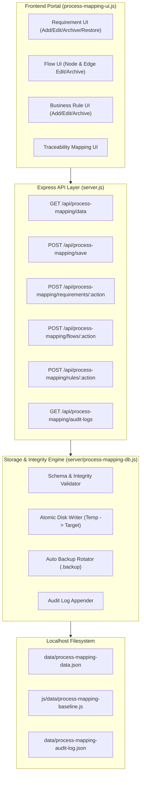

# TECHNICAL AUDIT & CRUD ARCHITECTURE DESIGN
## Portal: Pemetaan Alur Proses Aplikasi (SIGMA Rubber Nursery)
**Document Version:** 1.0.0  
**Audit Date:** 08 September 2026  
**Environment:** Localhost (`http://localhost:3000`)  
**Mode:** PLAN & AUDIT ONLY — READ-ONLY / NO CODE MUTATION  

---

## 1. Scope & Hard Boundary

### 1.1 Scope
Audit teknis dan perancangan arsitektur CRUD ini mencakup seluruh komponen sistem pada portal **"Pemetaan Alur Proses Aplikasi"** (tab `process-mapping` pada Review Workspace), meliputi:
- Struktur file, modul JavaScript, dan stylesheet portal.
- Model data eksisting pada `data/process-mapping-data.json` dan `js/data/process-mapping-baseline.js`.
- Aliran data (data flow) dari layer penyimpanan, data loader, adapter, hingga UI rendering.
- Perancangan REST API intermediary, persistence layer, audit trail logging, guardrails integritas data, rekonsiliasi baseline, dan integrasi UI.

### 1.2 Hard Boundaries & Constraints (WAJIB DIPATUHI)
| Komponen / Area | Status | Keterangan & Batasan |
|---|---|---|
| **Mobile Prototype** | 🔒 **LOCKED** | Dilarang mengubah file apa pun di `js/pages/*`, `js/components/*` (khusus mobile), dan markup screen. |
| **Mobile Core Router & App** | 🔒 **LOCKED** | Dilarang mengubah `js/app.js` dan `js/core/router.js`. |
| **Mobile Storage / IndexedDB** | 🔒 **LOCKED** | Dilarang mengubah `js/db/*`, skema IndexedDB `sigma_nursery_db`, atau cache transaksi mobile. |
| **Tab Review: Notes** | 🔒 **LOCKED** | Dilarang mengubah alur feedback catatan perbaikan `data/notes.json` dan endpoint `/api/notes`. |
| **Tab Review: Transactions** | 🔒 **LOCKED** | Dilarang mengubah fungsionalitas mock transaksi 8 modul pada tab Data Transaksi. |
| **Master Baseline Current** | 🔒 **SSOT LOCKED** | `MASTER_BASELINE_CURRENT_SIGMA_RUBBER_NURSERY.md` adalah *Business Source of Truth* absolut. Dilarang menambah requirement, rule, flow, role, atau narasi baru di luar baseline. |
| **Production Server & ERP** | 🔒 **OUT OF SCOPE** | CRUD ini khusus untuk portal review/spesifikasi pada environment LOCALHOST. Tidak ada deployment ke production server/ERP. |

---

## 2. Existing Project Structure

### 2.1 File & Directory Inventory Terkait Portal
Berikut adalah identifikasi lengkap file dan folder yang berkaitan langsung dengan Portal Pemetaan Alur Proses Aplikasi:

```
sigma-nursery/
├── index.html                                        # Shell utama (Workspace 2-kolom: Preview & Review Panel)
├── server.js                                         # Express.js backend server (Port 3000)
├── server/
│   ├── db.js                                         # Handler database JSON lokal untuk notes.json
│   └── mailer.js                                     # Layanan notifikasi email SMTP
├── data/
│   ├── process-mapping-data.json                     # Primary runtime JSON data store (279 KB, 6.854 baris)
│   ├── notes.json                                    # Store catatan review
│   └── process-mapping-data.json.backup-*            # File backup berkala
├── js/
│   ├── data/
│   │   ├── process-mapping-baseline.js               # ES Module mirror dari data JSON (279 KB)
│   │   ├── master-data.js                            # Master data statis mobile prototype (Klon, Divisi, Pekerja)
│   │   └── demo-data.js                              # Mock dataset mobile prototype
│   └── modules/
│       ├── process-mapping/
│       │   ├── process-mapping-data.js               # In-memory store, validator, adapter, revision engine (95 KB)
│       │   ├── process-mapping-ui.js                 # UI renderer, Mermaid flowchart generator, modal controller (351 KB)
│       │   ├── process-mapping-doc.js                # Document model builder (RTM, Gap Analysis, BRD, SRS, BPD) (16 KB)
│       │   └── process-mapping-doc-renderer.js       # Enterprise A4 print/PDF renderer engine (31 KB)
│       └── review/
│           └── review-workspace.js                   # Container panel kanan & tab navigation switcher (138 KB)
├── css/
│   ├── process-mapping.css                           # Styling lengkap portal mapping, grid, panel, & print media
│   └── review.css                                    # Styling panel review & workspace shell
└── MASTER_BASELINE_CURRENT_SIGMA_RUBBER_NURSERY.md   # Business Source of Truth Dokumen Spesifikasi
```

### 2.2 Fungsi Masing-Masing File Relevan
1. **`data/process-mapping-data.json`**:
   - Berkas JSON utama yang menyimpan seluruh entitas portal: metadata, 7 roles, 4 common features, 11 modules, 12 end-to-end pipeline steps, flows (nodes & edges per fitur), 140+ active requirements, 18+ business rules, functional requirements (KF), non-functional requirements (KNF), dan cross-flow edges.
2. **`js/data/process-mapping-baseline.js`**:
   - Modul JavaScript (`export const PROCESS_MAPPING_BASELINE = { ... }`) yang menyediakan data statis siap impor ke lingkungan ES Module browser tanpa memicu CORS issue pada file-server statis.
3. **`js/modules/process-mapping/process-mapping-data.js`**:
   - Berfungsi sebagai Data Access Layer (DAL) dan business logic engine frontend. Mengelola `activeStore`, validasi skema (`validateProjectData`), local draft (`localStorage`), fungsi manipulasi Requirement/Node/Edge/Rule, kalkulasi diff revisi, RTM matrix, gap analysis report, dan reconciliation catalog.
4. **`js/modules/process-mapping/process-mapping-ui.js`**:
   - View Controller utama portal. Mengelola 4 tab portal (`dashboard`, `mapping`, `reference`, `reports`), switching Mode View vs Mode Manage, rendering flowchart via Mermaid.js, filter sidebar, detail slide-over panel, form modal editor, dan export/import dialog.
5. **`js/modules/process-mapping/process-mapping-doc.js` & `process-mapping-doc-renderer.js`**:
   - Engine pembentuk dokumen resmi enterprise (DOC-04 RTM Report, DOC-05 Gap Analysis) beserta template tata letak cetak lembar kerja A4.
6. **`js/modules/review/review-workspace.js`**:
   - Mengelola tab switcher panel kanan (`tab-main-notes`, `tab-main-transactions`, `tab-main-process-mapping`) dan memanggil `renderProcessMappingPortal(container)` saat tab proses mapping aktif.

---

## 3. Existing Data Model

Berdasarkan audit langsung pada `data/process-mapping-data.json` dan `process-mapping-data.js`, berikut adalah struktur data aktual yang digunakan:

### 3.1 Entitas Requirement
```json
{
  "id": "RN-PRS-001",
  "title": "Presensi Datang supervisor wajib selesai sebelum transaksi harian lain.",
  "role": "Mantri Bibitan",
  "module": "Presensi",
  "moduleId": "01-presensi",
  "feature": "Presensi Supervisor",
  "featureId": "presensi-supervisor",
  "type": "KF",
  "process": "Login Berhasil",
  "processType": "Inisialisasi",
  "purpose": "Menjamin kehadiran sah sebelum transaksi dimulai.",
  "input": "Kredensial login, GPS, foto selfie Face ID",
  "validation": "Geofencing areal bibitan, kecocokan biometrik Face ID",
  "fallback": "Foto manual dengan mencantumkan alasan jika Face ID gagal",
  "output": "Sesi presensi aktif dan status transaksi terbuka",
  "businessRule": "BR-PRS-001: Presensi datang wajib tercatat sebelum modul operasional dibuka.",
  "ruleIds": ["BR-PRS-001", "BR-GLB-001"],
  "status": "Confirmed",
  "version": 1,
  "isArchived": false,
  "isSuperseded": false,
  "revisionOf": null,
  "supersededBy": null,
  "createdAt": "2026-09-08T00:00:00.000Z",
  "lastModified": "2026-09-08T00:00:00.000Z",
  "approvedAt": "2026-09-08T00:00:00.000Z",
  "approvedBy": "Lead Business Analyst",
  "archivedAt": null
}
```

### 3.2 Entitas Flow (Node & Edge)
Flow disimpan dalam hirarki: `flows[moduleId][featureId]`
```json
{
  "title": "Flow Proses - Presensi Supervisor",
  "nodes": [
    {
      "id": "PR_01",
      "code": "START",
      "type": "start",
      "title": "Buka Modul Presensi",
      "label": "Buka Modul Presensi",
      "summary": "Supervisor membuka modul Presensi dari beranda aplikasi.",
      "purpose": "Inisialisasi pencatatan kehadiran kerja.",
      "reqId": "RN-PRS-001",
      "role": "Mantri Bibitan",
      "module": "Presensi",
      "feature": "Presensi Supervisor",
      "processType": "Inisialisasi",
      "input": "Kredensial login & GPS",
      "process": "Sistem mendeteksi koordinat lokasi saat aplikasi dibuka.",
      "validation": "Geofencing areal bibitan.",
      "fallback": "Peringatan di luar radius nursery.",
      "output": "Koordinat GPS tervalidasi.",
      "relatedRole": "Asisten Bibitan",
      "businessRule": "BR-PRS-001: Presensi wajib sebelum transaksi.",
      "ruleIds": ["BR-PRS-001"],
      "stockImpact": "NO STOCK CHANGE",
      "populationImpact": "NO POPULATION CHANGE",
      "status": "Confirmed",
      "version": 1,
      "isArchived": false,
      "isSuperseded": false,
      "revisionOf": null
    }
  ],
  "edges": [
    {
      "id": "E_01_02",
      "from": "PR_01",
      "to": "PR_02",
      "condition": "GPS Valid",
      "label": "GPS Valid",
      "description": "Koordinat berada dalam polygon nursery",
      "status": "Confirmed",
      "version": 1,
      "isArchived": false,
      "isSuperseded": false,
      "revisionOf": null
    }
  ]
}
```

### 3.3 Entitas Business Rule
```json
{
  "id": "BR-PRS-001",
  "name": "Mandatori Presensi Sebelum Transaksi Harian",
  "title": "Mandatori Presensi Sebelum Transaksi Harian",
  "description": "Seluruh modul transaksi operasional (Penerimaan, Penyemaian, Okulasi, Pemeriksaan, Seleksi, Pemeliharaan, Pengeluaran) terkunci dan tidak dapat diakses sebelum Mantri Bibitan menyelesaikan Presensi Masuk pada hari yang sama.",
  "desc": "Seluruh modul transaksi operasional terkunci sebelum Presensi Masuk selesai.",
  "category": "Operational Governance",
  "status": "Confirmed",
  "version": 1,
  "isArchived": false
}
```

### 3.4 Entitas Role, Module, dan Metadata
- **Metadata**: `version`, `lastUpdated`, `updatedBy`, `description`.
- **Role**: `id` (e.g. `mantri-bibitan`, `asisten-bibitan`, `asisten-divisi`, `asisten-kepala`, `pengurus`, `tekniker-1`, `ktu`), `name`, `status`, `desc`.
- **Module**: `id` (`01-presensi` s.d. `11-pengeluaran`), `order`, `name`, `roleId`, `subtitle`, `desc`, `status`, `primaryRole`, `relatedRole`, `features: [{ id, name }]`.
- **Common Features**: `id` (`cf-login`, `cf-emergency`, `cf-sync`, `cf-vpn`), `name`, `icon`, `desc`.

---

## 4. Current Data Flow

Kondisi aliran data saat ini:

```
[data/process-mapping-data.json] ──(Disinkronkan manual ke)──> [js/data/process-mapping-baseline.js]
                                                                        │
                                                                        ▼ (ES Module Import)
                                                        [process-mapping-data.js]
                                                        (initProjectDataStore)
                                                                        │
                                   ┌────────────────────────────────────┴────────────────────────────────────┐
                                   ▼                                                                         ▼
                      [Jika ada Draft Lokal]                                                     [Jika Tidak Ada Draft]
                  (localStorage: PM_DRAFT_...)                                               (officialBaselineStore)
                                   │                                                                         │
                                   └────────────────────────────────────┬────────────────────────────────────┘
                                                                        ▼
                                                             [activeStore (In-Memory)]
                                                                        │
                                                                        ▼
                                                          [process-mapping-ui.js]
                                                    (renderProcessMappingPortal)
                                                                        │
                                   ┌────────────────────────────────────┼────────────────────────────────────┐
                                   ▼                                    ▼                                    ▼
                             [Tab Mapping]                       [Tab Reference]                      [Tab Reports]
                      - Flowchart (Mermaid.js)                - Requirement Catalog                 - RTM Matrix
                      - Module & Feature Selector             - Business Rules                      - Gap Analysis Doc
                      - Right Detail Panel                    - Roles Master                        - Formal Specs (BPD/SRS)
```

**Temuan Data Flow Eksisting:**
- Jika user melakukan edit data pada Manage Mode, data **hanya tersimpan sementara di `localStorage` browser** via `saveDraftToStorage()`.
- Data resmi `data/process-mapping-data.json` di server **tidak ter-update secara otomatis**.
- Untuk menerapkan perubahan ke berkas JSON asli, user saat ini harus mengunduh file hasil export (`exportProjectDataFile`) lalu mengganti file secara manual di filesystem atau mengeksekusi script Node.js ad-hoc di folder `scripts/`.

---

## 5. Existing API / Server

### 5.1 Pemeriksaan Server Eksisting (`server.js`)
Pemeriksaan pada `server.js` menunjukkan:
- **Tersedia**: Express.js server melayani static files pada port `3000`.
- **Tersedia Endpoint Notes**:
  - `GET /api/notes` — Mengambil daftar catatan review.
  - `GET /api/notes/:id` — Mengambil detail catatan review.
  - `POST /api/notes` — Menyimpan catatan review baru ke `data/notes.json` + email trigger.
  - `PATCH /api/notes/:id` — Mengubah status/data catatan review.
  - `DELETE /api/notes/:id` — Menghapus catatan review.
  - `GET /api/health` — Endpoint healthcheck server.
- **Belum Tersedia**:
  - Belum ada endpoint API untuk operasi CRUD entitas Process Mapping (`/api/process-mapping/*`).
  - Belum ada file handler controller untuk penyimpanan data process mapping dan audit log.

### 5.2 Rekomendasi Struktur API Minimal
Tidak mengubah endpoint `/api/notes`, melainkan menambahkan route modular baru:
- Router: `server/routes/process-mapping.js` atau handler modular di `server/process-mapping-db.js`.
- Handler file read/write: `server/process-mapping-db.js`.

---

## 6. CRUD Design

Desain operasi CRUD yang dirancang mengutamakan **100% reuse struktur data eksisting** tanpa merombak skema yang telah terbukti stabil.



### 6.1 Requirement CRUD
- **Create (`POST /api/process-mapping/requirements/create`)**:
  - Payload: `{ id, title, role, moduleId, featureId, type, process, input, validation, fallback, output, ruleIds, author }`
  - Logic: Auto-generate ID unik jika tidak diisi (`generateUniqueReqId`), status default `Draft` atau `Confirmed` (sesuai opsi), version = 1, `isArchived: false`.
- **Read (`GET /api/process-mapping/data`)**:
  - Mengambil seluruh requirement aktif dan terarsip beserta metadata.
- **Update (`PUT /api/process-mapping/requirements/:id`)**:
  - Payload: `{ updatedFields, author, reason }`
  - Logic: Jika status sebelumnya `Confirmed`, buat versi revisi baru (`version + 1`, `status = 'Draft'`, `isSuperseded = false`, item lama diset `isSuperseded = true`) atau in-place update jika masih `Draft`.
- **Archive (`POST /api/process-mapping/requirements/:id/archive`)**:
  - Soft-delete: `isArchived = true`, `archivedAt = ISO timestamp`, status = `Deprecated` / `Draft`.
- **Restore (`POST /api/process-mapping/requirements/:id/restore`)**:
  - Mengembalikan requirement terarsip: `isArchived = false`, `archivedAt = null`, `restoredAt = ISO timestamp`.

### 6.2 Flow (Node & Edge) CRUD
- **Create Node**:
  - Menambahkan node baru ke `flows[moduleId][featureId].nodes` dengan kode unik (`P-xxx` atau `DEC-xx`).
- **Update Node**:
  - Memperbarui atribut node (label, purpose, input, validation, fallback, output, stockImpact, reqId, ruleIds).
- **Archive Node**:
  - Menandai `isArchived = true` pada node target. Edge yang terhubung diberi tanda peringatan / diarsipkan.
- **Create / Update / Archive Edge**:
  - Menambah atau mengubah koneksi edge (`from`, `to`, `condition`, `label`). Memastikan validasi *no-self-loop* dan kedua node ada.

### 6.3 Business Rule CRUD
- **Create Rule**:
  - Menambahkan rule baru ke array `businessRules` dengan ID unik berawalan `BR-`.
- **Update Rule**:
  - Mengubah judul, deskripsi, atau kategori rule.
- **Archive Rule**:
  - Menandai rule sebagai `isArchived = true`.

### 6.4 Mapping Operations
- **Requirement ↔ Flow Node**:
  - Mengaitkan `node.reqId = reqId`.
- **Requirement / Node ↔ Business Rule**:
  - Memasukkan `ruleId` ke dalam array `req.ruleIds` dan `node.ruleIds`.

---

## 7. Persistence Design

### 7.1 Alur Persistensi
```
Browser UI (Action)
        ↓
HTTP REST API (POST/PUT/DELETE)
        ↓
Server Controller (Express)
        ↓
Schema Validation & Referential Integrity Guard
        ↓
1. Backup file eksisting (data/process-mapping-data.json.bak)
2. Tulis Atomic ke data/process-mapping-data.json
3. Sinkronkan format ES Module ke js/data/process-mapping-baseline.js
4. Tulis catatan perubahan ke data/process-mapping-audit-log.json
        ↓
Response Success (200 OK + payload terbaru)
        ↓
Browser UI mengupdate activeStore seketika
```

### 7.2 Spesifikasi Endpoint Minimal
| Method | Endpoint | Fungsi | Payload Utama |
|---|---|---|---|
| `GET` | `/api/process-mapping/data` | Membaca data lengkap | - |
| `POST` | `/api/process-mapping/save-all` | Menyimpan seluruh dataset | `{ data: Object, author: String, reason: String }` |
| `POST` | `/api/process-mapping/requirements` | Create requirement | `{ requirement: Object, author: String, reason: String }` |
| `PUT` | `/api/process-mapping/requirements/:id` | Update requirement | `{ updates: Object, author: String, reason: String }` |
| `POST` | `/api/process-mapping/requirements/:id/archive` | Archive requirement | `{ author: String, reason: String }` |
| `POST` | `/api/process-mapping/requirements/:id/restore` | Restore requirement | `{ author: String, reason: String }` |
| `POST` | `/api/process-mapping/flows/nodes` | Create / Update node | `{ moduleId, featureId, node, author, reason }` |
| `POST` | `/api/process-mapping/flows/edges` | Create / Update edge | `{ moduleId, featureId, edge, author, reason }` |
| `GET` | `/api/process-mapping/audit-logs` | Membaca log audit | Query params: `entity`, `limit` |

### 7.3 Write Strategy (Atomic Disk Write)
Untuk mencegah *JSON corruption* akibat crash server saat penulisan file:
1. Data JSON diserialisasi menjadi string terformat (`JSON.stringify(data, null, 2)`).
2. Data ditulis terlebih dahulu ke file temporary: `data/process-mapping-data.json.tmp`.
3. Setelah penulisan file temporary sukses, dilakukan atomic file rename: `fs.renameSync(tmpPath, targetPath)`.
4. File `js/data/process-mapping-baseline.js` otomatis diperbarui dengan format `export const PROCESS_MAPPING_BASELINE = ${jsonString};\n`.

---

## 8. Audit Log Design

### 8.1 Skema Audit Log
Setiap operasi mutasi (Create, Update, Archive, Restore, Map, Unmap) wajib mencatat log pada `data/process-mapping-audit-log.json`.

```json
{
  "id": "AUD-20260908-001",
  "timestamp": "2026-09-08T14:30:00.123Z",
  "actor": "System Architect",
  "action": "UPDATE",
  "entity": "Requirement",
  "entityId": "RN-RCV-003",
  "moduleId": "02-penerimaan",
  "featureId": "terima-benih",
  "before": {
    "title": "Pencatatan kuantitas benih sesuai surat jalan.",
    "validation": "Kuantitas wajib sama persis."
  },
  "after": {
    "title": "Pencatatan kuantitas aktual diterima (selisih diizinkan).",
    "validation": "Tidak ada seleksi benih di Modul Penerimaan."
  },
  "reason": "Penyesuaian dengan MASTER_BASELINE M02 hasil review agronomi."
}
```

### 8.2 Aksi yang Dicatat
- `CREATE`: Pembuatan requirement, flow node, flow edge, atau business rule baru.
- `UPDATE`: Perubahan atribut atau penerbitan revisi baru.
- `ARCHIVE`: Pengarsipan entitas (soft-delete).
- `RESTORE`: Pengaktifan kembali entitas yang sebelumnya diarsipkan.
- `MAP`: Pengikatan relasi (Requirement ↔ Node, Requirement ↔ Rule, Node ↔ Rule).
- `UNMAP`: Pelepasan relasi mapping.

---

## 9. Data Integrity & Guardrails

Sistem CRUD wajib dilengkapi lapisan validasi ketat sebelum operasi tulis dieksekusi:

1. **Unique Identifier Enforcement**:
   - Mencegah duplikasi `Requirement ID` (e.g. `RN-PRS-001`).
   - Mencegah duplikasi `Node ID` aktif dalam flow modul yang sama.
   - Mencegah duplikasi `Business Rule ID` (e.g. `BR-PRS-001`).
2. **Referential Integrity**:
   - Relasi `node.reqId`: Jika diisi, ID requirement harus terdaftar dalam daftar requirement aktif/terdaftar.
   - Relasi `ruleIds`: Setiap ID rule yang dilekatkan pada requirement atau node wajib terdaftar di `businessRules`.
   - Relasi `Edge`: `from` dan `to` wajib merujuk pada `node.id` yang aktif dan ada pada flow fitur terkait.
   - Larangan *Self-Loop*: Edge tidak boleh memiliki `from === to`.
3. **No Physical Deletion (Soft-Delete Only)**:
   - Data historis, revisi lama, dan entitas yang tidak digunakan ditandai dengan `isArchived: true` atau `isSuperseded: true`.
   - Tidak ada penghapusan baris fisik dari file JSON tanpa otorisasi sistem.
4. **State Transition Validation**:
   - Status yang sah: `Confirmed`, `Draft`, `In Review`, `Rejected`, `Deprecated`, `KONFIRMASI`.
   - Requirement berstatus `Confirmed` yang diedit wajib menghasilkan versi baru (`version + 1`) dengan status `Draft`.
5. **Concurrent Write Lock**:
   - Backend menerapkan mekanisme timestamp lock sederhana (`metadata.lastUpdated`) untuk mencegah *race condition* saat ada penyimpanan bersamaan.

---

## 10. Portal Integration

Target integrasi mengubah arsitektur portal dari **localStorage-centric** menjadi **REST-API-centric**:

```
[Portal UI: process-mapping-ui.js]
        │
        ▼ (Fetch API: GET /api/process-mapping/data)
[Data Store: process-mapping-data.js]
        │
        ▼ (Mutasi melalui Form Modal / Aksi Toolbar)
[API Client: saveRequirement / saveNode / saveRule / saveDraft]
        │
        ▼ (HTTP POST/PUT)
[Express Server: server.js -> server/process-mapping-db.js]
        │
        ▼ (Atomic Write)
[data/process-mapping-data.json]
```

### Komponen UI yang Terintegrasi:
1. **Manage Toolbar**: Tombol *Simpan Perubahan*, *Simpan Draf*, *Export Data*, *Import Data*, *Reset ke Baseline*.
2. **Requirement Table & Modal Form**: Tombol *+ Tambah Requirement*, *Edit*, *Arsipkan*, *Pulihkan*, *Bandingkan Versi (Diff)*.
3. **Flow Node / Edge Canvas & Form**: Tombol *+ Tambah Langkah*, *Edit Node*, *Hapus/Arsipkan*, *Tambah Koneksi (Edge)*, *Reorder Urutan (Naik/Turun)*.
4. **Business Rule Form**: Tombol *+ Tambah Aturan*, *Edit Deskripsi*, *Kaitkan ke Modul/Fitur*.
5. **Reconciliation & Revision Workflow**: Panel *Pending Revisions*, approval berjenjang, dan katalog rekonsiliasi.

---

## 11. Reconciliation Design

Setelah fitur CRUD selesai, sistem rekonsiliasi berkala dilakukan untuk membandingkan data portal dengan Master Baseline.

```mermaid
flowchart LR
    MB["MASTER_BASELINE (SSOT)"] ──(Perbandingan Read-Only)──> RECON_ENGINE["Reconciliation Engine"]
    RUNTIME["data/process-mapping-data.json"] ──(Snapshot Data Aktif)──> RECON_ENGINE
    
    RECON_ENGINE --> R_PASS["PASS (100% Cocok)"]
    RECON_ENGINE --> R_REV["REVISI (Perlu Update via CRUD)"]
    RECON_ENGINE --> R_CONF["KONFIRMASI (Tahan / Draft)"]
    RECON_ENGINE --> R_HIST["HISTORIS (Diarsipkan)"]
    RECON_ENGINE --> R_CONF2["CONFLICT (Beda Narasi / Role)"]
    RECON_ENGINE --> R_ORPH["ORPHAN (Tanpa Acuan Baseline)"]
```

### 11.1 Kategori Hasil Rekonsiliasi
1. **PASS**: Requirement, flow, input, validasi, fallback, dan business rule cocok 100% dengan Master Baseline.
2. **REVISI**: Data ada pada baseline tetapi redaksi/narasi/field pada portal perlu penyesuaian.
3. **KONFIRMASI**: Requirement hasil gap-resolution lama yang statusnya masih menunggu konfirmasi stakeholder lapangan (tidak boleh diaktifkan).
4. **HISTORIS**: Requirement legacy yang sudah digantikan dan telah diarsipkan (`isArchived: true`).
5. **CONFLICT**: Terdapat perbedaan aturan bisnis antara data portal dan Master Baseline.
6. **ORPHAN**: Requirement/Node di portal yang tidak memiliki dasar pada Master Baseline.

### 11.2 Prinsip Read-Only Rekonsiliasi
- Engine rekonsiliasi **hanya menghasilkan laporan / matriks status (READ-ONLY)**.
- Agent **TIDAK BOLEH melakukan auto-fix atau mutasi data otomatis** saat proses rekonsiliasi berjalan.
- Setiap perbaikan atas temuan rekonsiliasi harus dilakukan secara terkontrol melalui antarmuka CRUD portal.

---

## 12. Mobile Isolation Check

Audit menyeluruh memastikan bahwa penambahan fitur CRUD pada portal proses mapping **tidak memerlukan perubahan apa pun pada aplikasi Mobile Prototype**:

| Area Mobile | Status Pemeriksaan | Analisis Risiko |
|---|---|---|
| `js/app.js` | ✅ **ISOLATED** | Tidak ada dependensi ke modul process-mapping. Inisialisasi mobile tetap independen. |
| `js/core/router.js` | ✅ **ISOLATED** | Routing hash `#/...` mobile prototype tidak terganggu oleh tab portal review. |
| `js/pages/*` | ✅ **ISOLATED** | Seluruh 11 halaman mobile prototype membaca data dari `master-data.js` & IndexedDB, bukan dari `process-mapping-data.json`. |
| `js/db/*` (IndexedDB) | ✅ **ISOLATED** | Database lokal mobile menggunakan IndexedDB `sigma_nursery_db`, sedangkan portal mapping menggunakan REST API backend JSON. |
| `css/app.css` & `pages.css` | ✅ **ISOLATED** | Gaya visual portal terisolasi di dalam `#pm-portal-root` dan file `css/process-mapping.css`. |

**Kesimpulan Isolasi:** Tingkat isolasi adalah **100% TERISOLASI (ZERO RISK TO MOBILE PROTOTYPE)**.

---

## 13. Risks & Open Points

| No | Risiko / Poin Terbuka | Dampak | Mitigasi yang Dirancang |
|---|---|---|---|
| 1 | **Dual Data Format (JSON vs JS Module)** | Jika hanya `data/process-mapping-data.json` yang di-write, `process-mapping-baseline.js` bisa *out-of-sync*. | Backend writer otomatis menulis kedua file (`.json` dan `.js`) dalam satu transaksi atomik. |
| 2 | **Role KTU & Tekniker I** | Role master ada tetapi requirement kosong pada baseline saat ini. | CRUD mengizinkan role master tetap tampil dengan status requirement kosong / *placeholder*. Tidak membuat data asumsi. |
| 3 | **Ukuran Payload JSON (280 KB)** | Mengirim seluruh JSON pada setiap save kecil dapat memakan bandwidth localhost. | Endpoint dirancang mendukung operasi granular (per requirement / per node) maupun *bulk save*. |
| 4 | **Konflik Antara Draft Lokal vs Server** | User mengedit di tab lain dan menimpa perubahan. | Deteksi timestamp (`lastUpdated`) dan tombol konfirmasi saat mendeteksi versi server lebih baru. |

---

## 14. Implementation Plan (Untuk Task Berikutnya)

Rencana implementasi teknis untuk fase eksekusi mendatang (setelah plan ini disetujui):

```
Fase 1: Backend API & Storage Engine
├── Buat server/process-mapping-db.js (CRUD handler, file reader, atomic writer, backup)
├── Buat server/audit-logger.js (Pencatat audit-log.json)
└── Tambahkan route /api/process-mapping/* pada server.js

Fase 2: Frontend Data Adapter & API Client
├── Modifikasi js/modules/process-mapping/process-mapping-data.js
│   ├── Tambahkan fungsi async API fetch (loadData, saveRequirement, saveNode, saveRule)
│   └── Ganti fallback localStorage menjadi sinkronisasi API utama
└── Integrasikan validasi integritas pra-pengiriman

Fase 3: UI & Modal Wiring
├── Sambungkan tombol Simpan/Edit/Arsip pada process-mapping-ui.js ke API client
├── Tambahkan visual feedback (loading state, success toast, error dialog)
└── Integrasikan log audit view pada portal review

Fase 4: Verifikasi & Sanity Check
├── Pengujian CRUD Requirement, Flow, Rule, dan Mapping
├── Pengujian Atomic Write & Auto-Backup
└── Pengujian Isolasi Mobile Prototype
```

---

## 15. Acceptance Criteria

Untuk menyatakan implementasi CRUD berhasil dan siap digunakan:

1. **Requirement CRUD**:
   - [ ] User dapat membuat requirement baru dengan ID unik tervalidasi.
   - [ ] User dapat mengedit requirement yang ada; perubahan pada requirement *Confirmed* otomatis menciptakan riwayat revisi.
   - [ ] User dapat mengarsipkan (*soft-delete*) requirement dan memulihkannya (*restore*) kembali.
2. **Flow & Rule CRUD**:
   - [ ] User dapat menambah, mengedit, dan mengarsipkan node/edge flow dengan validasi integritas alur (no broken edges).
   - [ ] User dapat mengelola data business rules dan mengaitkannya ke requirement/node.
3. **Persistence & Data Integrity**:
   - [ ] Setiap aksi CRUD sukses langsung memperbarui `data/process-mapping-data.json` dan `js/data/process-mapping-baseline.js` di filesystem lokal.
   - [ ] Tidak terjadi *JSON corruption* saat proses penulisan file.
   - [ ] File backup otomatis tercipta sebelum operasi penulisan besar.
4. **Audit Trail**:
   - [ ] Setiap mutasi tercatat lengkap di `data/process-mapping-audit-log.json` memuat `timestamp`, `actor`, `action`, `entity`, `entityId`, `before`, `after`, dan `reason`.
5. **Mobile Prototype Locked**:
   - [ ] Seluruh fungsi Mobile Prototype (`#/...`), IndexedDB, dan modul mobile berjalan normal tanpa regresi atau perubahan kode.
6. **Master Baseline Integrity**:
   - [ ] Master Baseline tetap menjadi acuan utama dan tidak terdistorsi oleh fitur CRUD.

---
*Laporan Audit Teknis & Desain CRUD Selesai. Menunggu instruksi untuk langkah berikutnya.*
