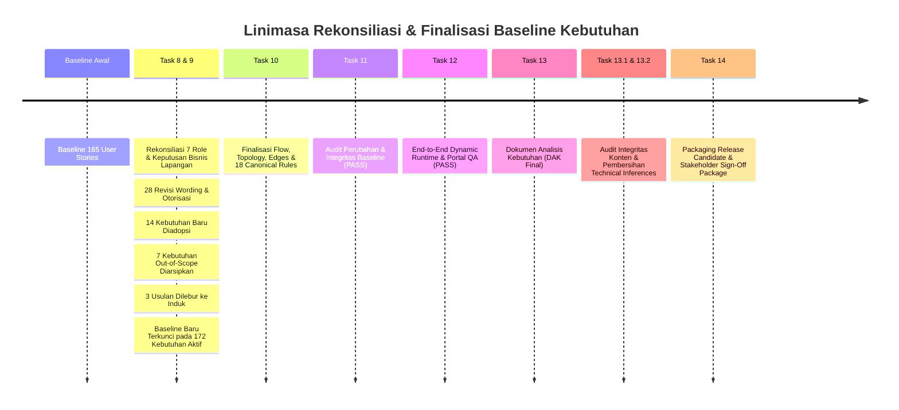

# SIGMA RUBBER NURSERY — REQUIREMENT EVOLUTION & CHANGE HISTORY FINAL

**Version:** 1.0.0  
**Baseline Date:** 7 September 2026  
**Status:** FINAL / FOR REVIEW  

---

## 1. Linimasa Evolusi Baseline Kebutuhan

---

## 2. Ringkasan Kuantitatif Transformasi

* **Baseline Awal (Task 8):** 165 Requirements
* **Requirements Retained (Tetap):** 130 Requirements
* **Requirements Revised (Revisi):** 28 Requirements
* **Requirements New Accepted (Baru):** 14 Requirements (`RN-PWP-006` s/d `RN-SEL-014`)
* **Requirements Deprecated (Arsip):** 7 Requirements (`RN-PRS-004`, `RN-RCV-001`, `RN-OKL-000`, `RN-SEL-002`, `RN-ENT-001`, `RN-EXP-005`, `RN-EXP-006`)
* **Requirements Merged (Melebur):** 3 Requirements (`PROPOSED-012` $\rightarrow$ `RN-RCV-006`, `PROPOSED-013` $\rightarrow$ `RN-SEM-007`, `PROPOSED-018` $\rightarrow$ `RN-EXP-002`)
* **FINAL ACTIVE BASELINE (Task 10-14):** **172 Active Requirements**
